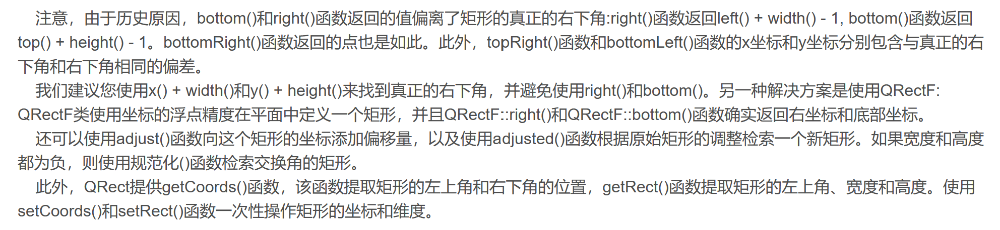
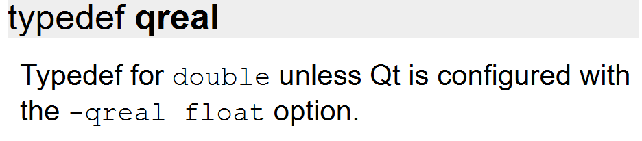
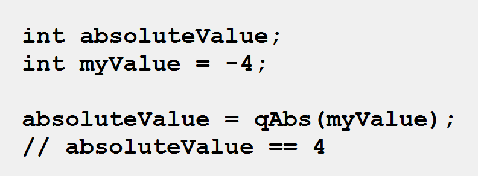
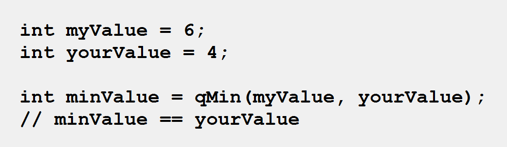
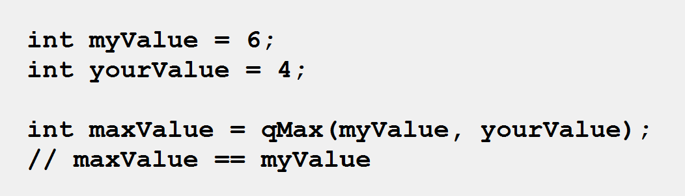
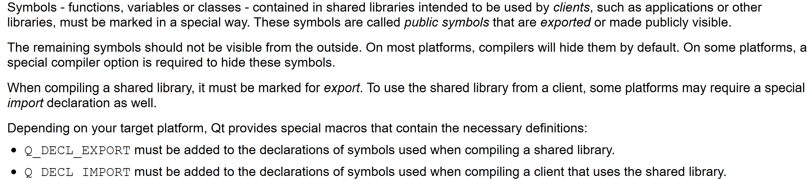

## 对pro文件的补充
1. 在Qt5以上的版本有一个新模块core5compat，需要手动添加，追加以下代码
```cpp
greaterThan(QT_MAJOR_VERSION, 5): QT += core5compat
```
2. ==DESTDIP==可以指定生成文件的路径
```cpp
//指定生成文件的路径
//在Linux中有个命令是PWD，用来显示当前所处的位置
//所以$$PWD的意思就是PRO文件所在的文件夹的位置
//故这里生成的文件的位置是PRO文件的上级目录的bin文件夹中
DESTDIP = $$PWD/../bin
```
3. ==CONFIG==用来指定工程配置和编译参数
```cpp
//warn_off关闭大量警告，默认是打开的，因此这句话加不加都差不多
CONFIG += warn_off


//若是想要打开大量警告，则使用以下代码
CONFIG -+ warn_off
```
## 对.h文件的内容补充
1. 以下代码中，对类型有个==[[#Q_DECL_EXPORT]]==宏，其作用是：**为了导出这个类，生成.dll的同时生成.lib文件。提供给外部接口供其他类使用**
```cpp
#ifdef quc //quc是一个自定义控件模块
class Q_DECL_EXPORT Battery : public QWidget//使用这个宏
#else
class Battery :public QWidget
#endif
```
>摘自QT文档 ：
>根据您的目标平台上，Qt提供了包含必要的定义特殊的宏： 
>==Q_DECL_EXPORT必须被添加到符号的编译一个共享库时使用的声明。（**没看懂**）==
> Q_DECL_IMPORT必须被添加到符号的编译使用共享库的客户机时使用的声明。
## 自定义属性Q_PROPERTY
> 这个宏用于在继承QObject的类中==**声明**==属性。**属性的行为类似于数据成员，但是它们有额外的功能，可以通过==元对象系统==[^疑惑1]访问<font color=red>(这个元对象系统是什么东西？能通过元对象系统访问是什么意思？）</font>**
- 疑惑：为什么这里使用了这个宏声明了之后还需要在后面重新声明？这个宏的存在意义是什么？
- 解答：因为这个宏只是告诉QML：我要使用这个。但是其实还需要重新声明对这个函数进行声明。**需要注意的是，为了确保元对象系统正常工作，所有QObject派生类中使用到元对象系统的内容，都需要使用Q_OBJECT宏声明元数据**
- Q_PROPERTY一定是继承于QObject
```cpp
Q_PROPERTY(
    type name
    READ getFunction  //只读函数，这个不是选项，必须要有
    [WRITE setFunction]  //用于设置属性的值
    [RESET resetFunction]  //设置属性的初始值
    [NOTIFY notifySignal]
    [DESIGNABLE bool]
    [SCRIPTABLE bool]
    [STORED bool]
    [USER bool]
    [CONSTANT]
    [FINAL]  //表明属性不能被派生类重写（我还是不太懂这句话的含义）
)
```
## QTimer定时器
- QTimer不是界面控件，所以在UI中是找不到的，想要使用只能通过纯代码的方法
- 作用：定时特定的时间
```cpp
QTimer *timer = new QTimer(this);//先创建一个定时器
timer->setInterval(100);//设置定时器的时间间隔（定时周期），括号中的单位是ms

connect(timer,SIGNAL(timeout()),xxx,SLOT(xxx()));//将timeout绑定到特定的槽
```
- 这个**timeout**是当定时器的时间超过setInterval设定的时间后发出的==信号==，在timeout信号发出后，定时器重置，重新计时
```cpp
timer->start();//启动定时器
timer->stop();//关闭定时器
```
- **注意：当QTimer的父对象被销毁时，它也会被自动销毁**
```cpp
//start有多种写法，时间设定可以和start一起
timer->start(2000);
```
- ==Qtimer在未被停止的时候可能不会被自动销毁，这篇博客的发表者也发现了这个问题[QTimer的销毁问题](https://blog.csdn.net/Xiamenguoke/article/details/8116205?ops_request_misc=%257B%2522request%255Fid%2522%253A%2522168308118216800188559100%2522%252C%2522scm%2522%253A%252220140713.130102334.pc%255Fall.%2522%257D&request_id=168308118216800188559100&biz_id=0&utm_medium=distribute.pc_search_result.none-task-blog-2~all~first_rank_ecpm_v1~rank_v31_ecpm-1-8116205-null-null.142^v86^insert_down28,239^v2^insert_chatgpt&utm_term=QTimer%E4%B8%80%E5%AE%9A%E8%A6%81%E5%9C%A8%E5%81%9C%E6%AD%A2%E7%9A%84%E6%97%B6%E5%80%99%E9%94%80%E6%AF%81%E5%90%97&spm=1018.2226.3001.4187)==，在项目中，**大佬在析构函数中手动停止了QTimer**，上源码：
```cpp
DeviceButton::~DeviceButton()
{
    //不是说当父对象被销毁的时候它会自动被销毁吗？
    //为什么这里要先将其暂停？
    if (timer->isActive()) {
        timer->stop();
    }
}
```
## QRect和QRectF
- QRect定义了平面矩形，一个矩形在内部是由左上角和右下角表示的==（实际上就是给了两个点的坐标）==，但是通常它所表达到是一个左上角和一个大小
- 一个QRect可以用一组上、左、宽、高四个整数，或者从两个QPoint或者从一个QPoint和一个QSize来构造
```cpp
#include<QRect>

//创建一个无效的矩形，因为没有给这个矩形的有关参数
QRect::QRect();

//构造一个左上角为topLeft，右下角为bottomRight的矩形
QRect::QRect(const QPoint& topLeft,const QPoint& bottomRight);

//构造一个左上角为topLeft并且矩形大小为size的矩形
QRect::QRect(const QPoint& topLeft,const QSize& size);

//构造一个上、左、宽、高分别为top,left,width和height的矩形
QRect::QRect(intleft,inttop,tinwidth,intheight);
```
- **注意：QRectF与QRect没有什么太大的区别，但是不推荐使用QRect**
- ==QRectF的精度是浮点型，而QRect的精度是整型==
## QPoint和QPointF
- QPoint表示一个平面上==整数精度的点坐标==，可以通过x()，y()等函数方便的进行存取操作，另外也重载了大量的运算符，使其可以作为一般的常数一样进行运算。另外其也可以表征为向量，可进行向量的相关运算例如乘除以及长度的计算
- 与QRect和QRectF类似，QPoint和QPointF没有太大的差别，就是精度上的不同，**前者精度是整数，而后者是浮点数**；同时QPointF提供了QPointF和QPoint相互转换的方法
## qreal
- 查看Qt文档我们可以得到以下内容即==qreal是double的别名，除非用户自己配置qreal为float==，还有疑问可以看这篇博客[QT中qreal关键字详解](https://blog.csdn.net/hhrock/article/details/72675544)
## qMax、qMin、qAbs
- qAbs是qAbsoluteValue的缩写，意思是**绝对值**
```cpp
T qAbs(const T &value);  
```
- qMin是获得两个数中的最小值
```cpp
const T & qMin(const T &value1,const T &value2);
```
- qMax是获得两个数中的最大值
```cpp
const T & qMax(const T &value1,const T &value2);
```
## Q_ENUMS与Q_ENUM
- 就是一个枚举类型的宏，跟enum差不多，两个差别好像并不大==(待考证)==
- Q_ENUM:
```cpp
 class MyClass : public QObject
  {
      //为什么每一个声明的类的上方都有这个？
      //是说明这些类都是继承了QObject吗
      //如果是，public QObject的存在只是为了顺应C++语法吗
      Q_OBJECT

  public:
      MyClass(QObject *parent = 0);
      ~MyClass();

      enum Priority { High, Low, VeryHigh, VeryLow };
      Q_ENUM(Priority)
      void setPriority(Priority priority);
      //为什么可以写成这样的函数？
      Priority priority() const;
  };
```
- Q_ENUMS
```cpp
 class MyClass : public QObject
  {
      Q_OBJECT

  public:
      MyClass(QObject *parent = 0);
      ~MyClass();

      enum Priority { High, Low, VeryHigh, VeryLow };
      Q_ENUM(Priority)
      void setPriority(Priority priority);
      Priority priority() const;
  };

```
## Q_DECL_EXPORT
先看看Qt官方文档是怎么说的
> This macro marks a symbol for shared library export (see **Creating Shared Libraries**).

根据提示找到**Creating Shared Libraries**
就是说我们要使用这个类和其共享库的时候就需要使用对类的声明使用这个宏，==使得在生成文件的时候同时导出其共享库==，**例如我自己写了一个类，我需要在生成的程序中使用这个类我就需要将这个类打包导出，这样我们才能在能确保程序不会出错，否则会报错**，例如这段代码
```cpp
#ifdef quc
//quc是一个宏
class Q_DECL_EXPORT IPAddress : public QWidget
#else
class IPAddress : public QWidget
#endif
```
这段代码的意思就是：**如果包含了quc宏，就会启用Q_DECL_EXPORT，如果没有包含quc就不启用**
## Q_OBJECT
不知道大家有没有注意到，在我们的自定义类中，在结构体最顶上的一定有一个Q_OBJECT
```cpp
class EmptyClass{
    Q_OBJECT
    ...
}
```
- 这是因为我们用这个类的时候往往会使用到Qt的**信号与槽**机制
> 当在一个类中使用Q_OBJECT宏时，编译器会自动为该类添加一些特殊的成员函数及其元数据，这些成员函数和元数据用于支持信号与槽的机制。==如果一个类需要使用该机制，那么就必须在类的定义中包含Q_OBJECT宏，否则在运行时将无法进行信号与槽之间的连接==

## QString中的函数arg
这个函数用于重组字符串
- 在下列代码中，用了三个占位符：%1、%2、%3，由于使用了arg()，其中的%1被i所替代，%2被total所替代，%3被fileName替代
```cpp
#include<QString>

QString i;           // current file's number
QString total;       // number of files to process
QString fileName;    // current file's name

QString status = QString("Processing file %1 of %2: %3").arg(i).arg(total).arg(fileName);
```
## C++关键字explicit
这个关键字**专门用于构造函数**，使这个构造函数不能进行隐式转换，并且==只需要在声明时使用此关键字即可==
## installEventFilter（安装事件过滤器）
- 监视发送其他QObject对象的事件，**在事件到达之前对其进行处理，如果在一个对象上安装多个事件过滤器，啧首先激活最后安装的过滤器**，文档原文：
>  The filter can either stop the event or forward it to this object.

- 让我们看看这个函数的源码，有不懂的可以结合这篇博客[installEventFilter、eventFilter函数理解](https://blog.csdn.net/danshiming/article/details/122792144?ops_request_misc=%257B%2522request%255Fid%2522%253A%2522168308067116800211559238%2522%252C%2522scm%2522%253A%252220140713.130102334..%2522%257D&request_id=168308067116800211559238&biz_id=0&utm_medium=distribute.pc_search_result.none-task-blog-2~all~top_click~default-2-122792144-null-null.142^v86^insert_down28,239^v2^insert_chatgpt&utm_term=installeventfilter&spm=1018.2226.3001.4187)
```cpp
class KeyPressEater : public QObject
  {
      Q_OBJECT
      ...

  protected:
      bool eventFilter(QObject *obj, QEvent *event);
  };

  bool KeyPressEater::eventFilter(QObject *obj, QEvent *event)
  {
      if (event->type() == QEvent::KeyPress) {
          QKeyEvent *keyEvent = static_cast<QKeyEvent *>(event);
          qDebug("Ate key press %d", keyEvent->key());
          return true;
      } else {
          // standard event processing
          return QObject::eventFilter(obj, event);
      }
  }
```


[^疑惑1]:Qt的元对象系统（Meta-Object System）是一种在运行时提供C++类的反射机制的框架。它可以在不改变C++编译器的情况下，在类中加入额外的元数据，并使用这些元数据动态创建和调用对象的成员函数和属性。在Qt中，每个QObject及其派生类都有一个元对象（Meta-Object），描述了它的类名、父类名、信号（Signal）和槽（Slot），属性（Property）等成员信息。在程序运行时，QObject及其派生类的实例会被分配一个元对象实例（Meta-Object Instance），它会连接到相应的元对象。这个元对象实例可以用来获取类的信息，以及动态调用信号和槽，设置和获取属性等。Qt的元对象系统为QObject（及其派生类）提供了许多强大的功能，包括信号槽机制、对象持久化、动态属性等。同时它也是Qt元编程（Meta-Programming）的基础，Qt中很多高级特性的实现都离不开元对象系统的支持。