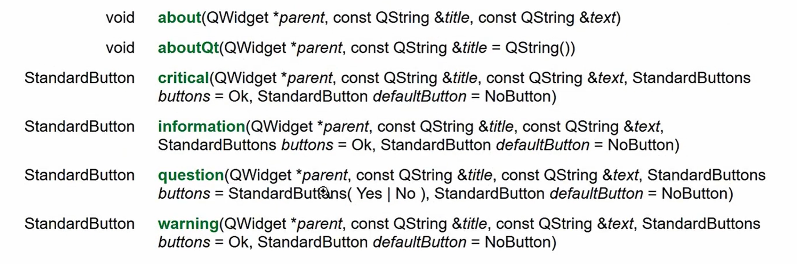
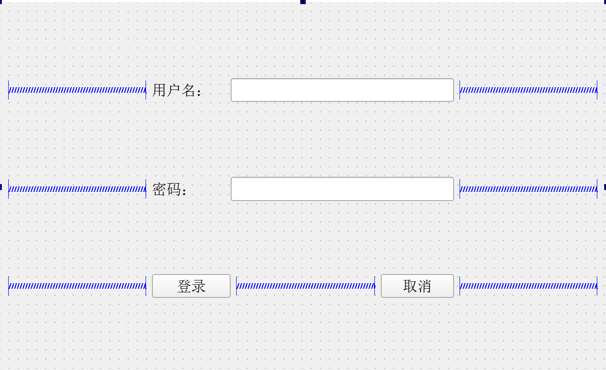
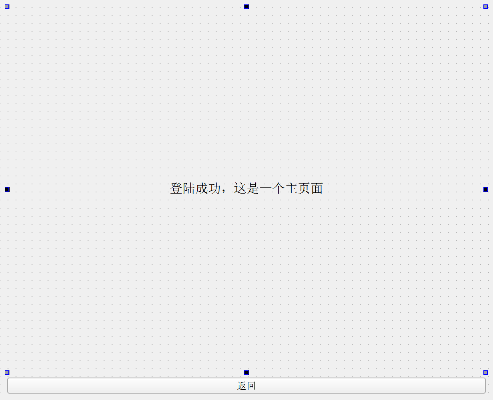

## 二十一、消息对话框
- 拥有的对话框种类
- 示例
```cpp
void MainWindow::on_pushButton_5_clicked()
{
    //错误弹窗
    QMessageBox::critical(this,//父类指针
                          "错误消息对话框",//消息框的标题
                          "程序出现错误"//消息框中打印的字
                          );


    //警告弹窗
    QMessageBox::warning(this,
                         "警告消息对话框",
                         "程序出现警告");


    //消息弹窗
    QMessageBox::information(this,
                             "消息对话框",
                             "程序一切正常",
                             QMessageBox::Ok,QMessageBox::NoButton//可加可不加
                             );


    //消息选择弹窗
    QMessageBox::StandardButton result;
    result = QMessageBox::question(this,
                          "消息选择对话框",
                          "文件已修改，是否保存？",
                          QMessageBox::Yes|QMessageBox::No|QMessageBox::Cancel
                          );
    if(result == QMessageBox::Yes){
        qDebug()<<"正在保存";
    }
    else if(result == QMessageBox::No){
        qDebug()<<"不保存";
    }
    else{
        qDebug()<<"取消操作";
    }
}
```
## 二十二、输入对话框
- QInputDialog：输入文本/整型数据/浮点型数据……对话框
```cpp

void MainWindow::on_pushButton_6_clicked()
{
    //生成输入文字对话框
    bool ok;
    QString text = QInputDialog::getText(this,
                                tr("输入文字对话框"),//对话框标题
                                tr("请输入文字"),//对话框提示文字信息
                                QLineEdit::Normal,//默认输入
                                "demo",//在输入框中默认输入的内容
                                &ok);
    if(ok && !text.isEmpty()){
        ui->plainTextEdit->appendPlainText(text);
    }
}

```
## 二十三、布局概述
- Qt提供了两种组件定位机制：==绝对定位==和==布局定位==
- 绝对定位：需要提供组件的长、高、坐标值
- 布局定位：需要指定使用哪种布局（垂直，水平，网状，表格）
- 布局分类：
    - 系统自带的布局，一般不使用
    - **通常使用的是Widget中的4种布局**
## 二十四、布局使用
- 登录界面绘制
- 子窗口界面绘制
- 登录页面->主页面（页面切换功能1）
```cpp
connect(ui->pushButton,&QPushButton::clicked,this,[=](){
    this->hide();
    this->new_Window->show();
});
```
- 主页面->登陆页面（页面切换功能2）
```cpp
//在from.h中，定义一个信号
signals:
    void back(void);


//在From.cpp（子窗口）中，当返回按钮被点击，发出返回信号
connect(ui->pushButton,SIGNAL(clicked(bool)),this,SIGNAL(back()));


//在Widget.cpp（主窗口）中，当接收到了返回信号，子窗口被隐藏，主窗口显示
connect(this->new_Window,&Form::back,this,[=](){
    this->show();
    this->new_Window->hide();
}
);
```
## 二十五、QLabel标签框
- 创建标签：
```cpp
#include<QLabel>
    
QLabel *label = new QLabel(this);
```
- 显示文本（文字、html）
```cpp
label->setText("这是一个标签");

//也可以显示html
label->setText("<h1><a href=\"www.baidu.com\">百度</a></h1>");
//但是这种超链接点击后是没反应的
//需要手动设置点击链接之后是否自动打开连接
label->setOpenExternaLinks(true);
```
- 显示图片
```cpp
#include<QPixmap>

//首先定义QPixmap对象
QPixmap pixmap;
//然后加载图片
pixmap.load(":/image/boat.jpg");

//将图片设置到QLabel中
label->setPixmap(pixmap);
```
- 显示动图
```cpp
#inlclude<QMovie>

//创建一个QMovie对象
QMovie *movie = new 
//加载动图
QMovie(":/image/mario.gif");

label->setMovie(movie);
//注意要调用start函数才能让gif图动起来
movie->start();
```
## 二十六、QLineEdit文本编辑框
- 创建QLineEdit
```cpp
QLineEdit *lineEdit = new QLineEdit(this);
```
- 编辑文本框
```cpp
//获取编辑框中的内容使用text()
lineEdit->text();

//设置编辑框内容
lineEdit->setText("这是一个文本编辑框");
```
- 设置显示模式
```cpp
lineEdit->setEchoMode(EchoMode mode);


//模式显示方式，按照输入的内容显示
QLineEdit::Normal
//不显示任何内容，此模式下无法看到用户的输入
QLineEdit::NoEcho
//密码模式，输入的字符会根据平台转换为特殊字符
QLineEdit::Password
//编辑时显示字符否则显示字符作为密码
QLineEdit::PasswordEchoOnEdit
```
- 设置上下左右空白区域
```cpp
lineEdit->setTextMargins(100,0,0,0);


//左、上、右、下
void QLineEdit::setTextMargins(int left, int top, int right, int bottom)
```
## 二十七、自定义控件
- 自定义控件一般是重复性使用的窗口或者窗口中的模块
- 解决的问题：将许多重复性使用的窗口或者窗口中的模块封装成自定义控件，可以减少创建次数，仅仅创建一次，==使用时提升==
- 步骤：
    1. 先创建一个Qt设计师页面，对需要的自定义控件进行排布
    2. 在需要使用自定义控件的窗口中，找到Container中的Widget，然后对Widget进行==提升==，**提升为自己的自定义控件**