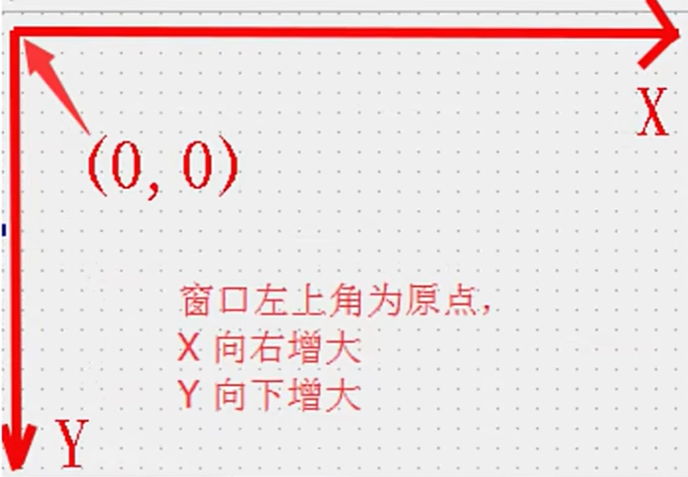
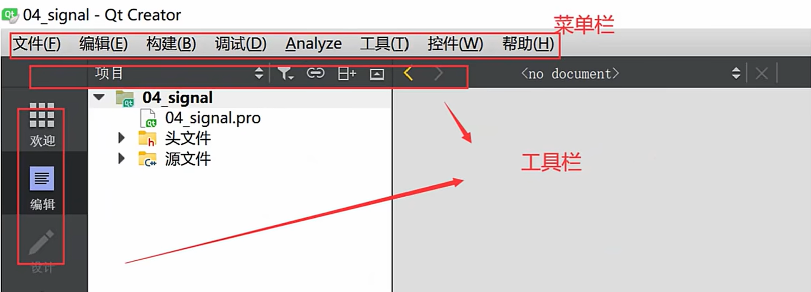
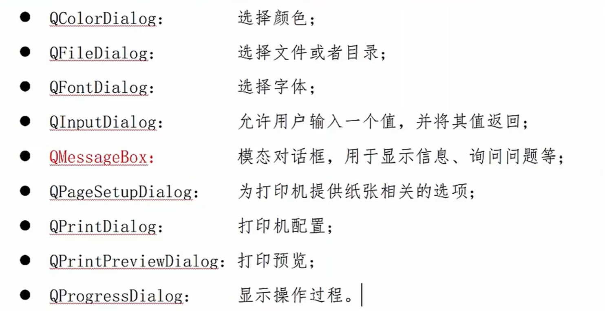

## 一、Qt项目框架以及文件介绍
- pro：工程文件，是qmake自动生成的用于产生makefile的配置文件，用于生成可执行文件，**pro文件部分还有一些补充内容在[[Qt实战对Qt笔记的补充]]中**
```cpp
QT       += core gui  //包含的模块

  

greaterThan(QT_MAJOR_VERSION, 4): QT += widgets  //Qt4以及以前的版本widgets模块是包含在gui模块中的，如果是版本大于4，重新包含widgets模块

  
TARGET = study01  //应用程序名称，生成的exe程序名称（Windows中，Linux中不是exe）

TEMPLATE = app  //模板类型

DEFINES += QT_DEPRECATED_WARNINGS  //定义编译选项，表示的是如果有些功能被Qt标记为过时了，编译器就会发出警告

SOURCES += \  //源文件

        main.cpp \

        mainwindow.cpp \

    widget.cpp \

    dialog.cpp

  

HEADERS += \  //头文件

        mainwindow.h \

    widget.h \

    dialog.h

  

FORMS += \

        mainwindow.ui \

    dialog.ui
```

- main.cpp：
```cpp
#include <QApplication>  //Qt系统提供的标准类名申明头文件

#include"widget.h"  //Qt中一个类对应一个头文件，类名就是头文件名


int main(int argc, char *argv[])

{

    QApplication a(argc, argv);  //QApplication是一个应用程序类（整个后台管理的命脉，处理应用程序的初始化和结束，事件处理调度。注意：不管我们有多少窗口，一个QApplication类就可）


    Widget w;  //实例化对象，调用构造函数

    w.show();  //显示图形界面

  

    return a.exec();  //主事件循环，在exec函数中，Qt接收并处理用户和系统的事件并将它们传递给适当的窗口控件

}
```

- wigth.h：
```cpp
#ifndef WIDGET_H

#define WIDGET_H

  

#include <QWidget>

  

namespace Ui {

class Widget;
}

  

class Widget : public QWidget

{
    Q_OBJECT

public:
    explicit Widget(QWidget *parent = 0);
    ~Widget();

private:
    Ui::Widget *ui;
};

  

#endif // WIDGET_H
```

- wigth.cpp：
```cpp
#include "widget.h"
#include "ui_widget.h"


Widget::Widget(QWidget *parent) :
    QWidget(parent),
    ui(new Ui::Widget)

{
    ui->setupUi(this);
}

  
Widget::~Widget()

{
    delete ui;
}
```
## 二、设置窗口属性
```cpp
    //修改窗口的标题（第一个窗口）
    this ->setWindowTitle("第一个窗口");

    //设置窗口的大小，设置完成可以拉伸
    this->resize(800,600);

    //固定串口大小，设置完成不可拉伸（与设置窗口大小不能同时使用）
    this->setFixedSize(500,500);
```
==如果Qt中中文乱码，工具->选项->文本编辑器->行为->文件编码->UTF-8，新建一个文件就可以了==

## 三、按钮的创建和属性的控制
1. 按钮的创建
    步骤1. 包含头文件(.cpp)及模块(.pro)
```cpp
#include<QPushButton>
QT += widgets
```
    步骤2. 调用类的构造函数创建按钮
```cpp
QPushButton button = new QPushButton;
```
    步骤3. 显示按钮
```cpp
///这个显示方式是另开一个窗口显示按钮
button->show();

//这是按钮的父对象为窗口，这样按钮就在窗口上显示了
button->setParent(this);
```
2. 按钮的属性设置
```cpp
/**************************方法一**********************/
    //设置按钮的内容
    button->setText("第一个按钮");

    //设置按钮的位置
    button->move(100,100);

    //设置按钮的大小
    button->setFixedSize(400,400);
```
---
```cpp
/**************************方法二**********************/
    QPushButton *button2=new QPushButton("这是第二个按钮",this);
```
3.  创建按钮的其他方式及两种创建按钮的方式的区别：
    1. 方式一：窗口默认大小，按钮显示在左上角
    2. 方式二：窗口是根据按钮的大小来创建的
## 四、 对象模型（对象树）
在Qt创建对象的时候会提供一个Parent对象指针，下面来解释这个parent指针到底是干什么的
- QObject是以对象树的形式组织起来的
    - 当你创建一个QObject对象时，会看到QObject的构造函数接收一个QObject指针作为参数，这个参数就是parent，也就是==父对象指针==。这就相当于，==在创建QObject对象时，可以提供一个其父对象，我们创建的这个QObject对象会自动添加到其父对象的**children()列表**==
    - ==当父对象析构的时候，这个列表中的所有对象也会被析构（注意，这里的父对象并不是继承意义上的父类！）==
- QWidget是能够在屏幕上显示的一切组件的父类
    - ==QWidget继承自QObject，因此也继承了这种对象树关系。一个孩子自动地成为父组件的一个子组件。==因此，它会显示在父组件的坐标系统中，被父组件的边界剪裁。例如：当用户关闭一个对话框的时候，应用程序将其删除，那么，我们希望这个属于这个对话框的按钮、图标等应该一起被删除。事实就是如此，因为这些都是对话框的子组件。
    - 当然，==我们也可以自己删除子对象，它们会自动从其父对象列表中删除。==比如，当我们删除了一个工具栏时，其所在的主窗口会自动将该工具栏从其子对象列表中删除，并且自动调整屏幕显示。
- Qt引入对象树，一定程度上解决了内存问题，简化了内存回收
- ***注意：在Qt中，使用的时候尽量在构造的时候就指定parent对象，并且==大胆在堆上创建==***（以下是一个例子）
```cpp
//这段代码是没有问题的
QWidget window;
QPushButton button = QPushButton("退出",&Window);
//因为栈一般先构造的后析构，上面程序是先析构button，同时将button从window的子对象列表中删除
//然后析构window，仅析构window（window无子对象）


//但是，如果使用以下程序就会有问题
//因为栈一般先构造后析构（对比起堆的数据的构造和析构顺序），下面的程序先析构window，这会析构window及window子对象（quit），然后再析构quit
//会导致quit重复析构，程序崩溃
QPushButton quit("quit");
QWidget window;
quit.setParent(&window);
```
## 五、窗口坐标体系
***注意：对于嵌套窗口，其坐标是==相对于父窗口==来说的***
## 六、信号和槽机制
- 理解：观察者模式
- 优点：松散耦合，信号发出端和信号接收端可以毫无关联，如果要关联就用==connect==函数
## 七、connect函数的使用
- 大部分的类都有==槽函数==和==信号==
```cpp
connect(sender,signal,receiver,slot);
//参数：
//1、信号发出者
//2、信号
//3、信号接收者
//4、接收到信号执行任务（槽函数）
```
- 举例：点击窗口内的自定义按钮，关闭窗口
```cpp
 //创建按钮
    QPushButton *button = new QPushButton;
    button->setText("退出按钮");
    button->resize(100,100);
    button->setParent(this);
    
//信号与槽
    connect(button,SIGNAL(clicked()),this,SLOT(close()));

//信号与槽也可以写成
    connect(button,&QPushButton::cilcked,this,&Widget::close);
```
## 八、自定义信号与槽
1. 确定场景
> 老师饿了，学生请客
> 小哥敲门，家人开门
2. 添加两个类，老师类和学生类
3. 在老师类中声明信号，并且在学生类中声明槽函数
```cpp
//teacher.h（信号：一般在signals里面写，返回值void，参数可以存在，仅声明不需要实现，可以重载）
signals:
    void hungury();


//student.h（槽函数：一般在public slots里面写，对于一些高版本的Qt来说，也可以写到public或者全局；返回值void，参数可以存在，需要声明并实现，可以重载）
public slots:
    void treat();

```
```cpp
//student.cpp
void student::treat(){
    qDebug()<<"请吃饭";
}
```
4. 创建对象+信号与槽链接
```cpp
this->tea = new Teacher(this);//括号中的this是指定其父对象
this->stu = new Student(this);
connect(tea,&Teacher::hungury,stu,&Student::treat);
```
5. 触发信号（下课）
```cpp
//widget.h（声明成员函数)
void classOver();


//widget.cpp（定义触发信号的成员函数+调用该成员函数）
void Widget::classOver(){
    emit tea -> hungury();//emit函数用于发送信号
}
```
6. **补充**：
    - 点击按钮请吃饭
```cpp
//方式一
connect(button,&QPushButton::clicked,this,&Widget::classOver);

//方式二（信号连接信号）
connect(button,&QPushButton::clicked,tea,&Teacher::hungury);
```
## 九、重载自定义信号与槽
- 步骤一：重新写信号声明（带参数）
```cpp
void hungury(QSTRing food);
```
- 步骤二：重新写槽函数声明及定义（带参数）
```cpp
void tread(QString food);
void Student::treat(QString food){
    qDebug()<<"请老师吃饭"<<food;
}
```
- 步骤三：由于函数重载了，所以需要利用==函数指针==指向函数地址，然后再做连接
```cpp
void (Teacher::*teachersignal)(QString)=&Teacher::hungury;
void (Student::*studentslot)(QString)=&Student::treat;
connect(tea,teachersignal,stu,studentslot);

//connect也可以写成
connect(tea,SIGNAL(hungury(QString)),st,SLOT(hungury(QString)));
//这个方式是调用Qt提供的两个宏
//这个写法存在一定的问题：如果需要调用的函数名写错了，编译器是不会报错的，这导致我们较难找到程序的问题所在
```
## 十、==信号与槽总结（未理解）==
- 自定义信号槽注意事项：
    1. 发送者与接收者需要是QObject的子类（槽函数全局，lambda除外）
    2. 信号和槽函数返回值都是void
    3. 信号需要声明不需要定义实现，槽函数需要名声也需要定义实现（
    4. 槽函数是普通的成员函数，作为成员函数，会受到public、private、protected的影响
    5. 使用emit在恰当的位置发送信号
    6. 使用connect()函数连接信号和槽
    7. 任何成员函数、static函数、全局函数和Lambda表达式都可以作为槽函数
    8. ==信号槽要求信号和槽的参数一致==，所谓一致，是参数类型一致
    9. 如果信号和槽的参数不一致，允许的情况是：槽函数的参数可以比信号的少，即使如此，槽函数存在的那些==参数的顺序也必须和信号的前面几个一致起来==。这是因为，你可以在槽函数中选择忽略信号传来的数据（也就是==槽函数的参数比信号的少==）
        > 举例：
        >1. 允许signal(QString)和slot(QString)，signal(QString , int)和slot(QString)
        >2. 不允许signal(QString)和slot(QString , int)，signal(int , QString)和slot(QStirng , int)
- **信号与槽的拓展**
    1. 信号与槽可以一对一，也可以一对多（发出信号，槽函数一个一个执行，==顺序不确定==），多对一（任意信号发出槽函数都会执行）
    2. 信号可以连接信号
    3. 槽可以被断开连接（disconnect），槽也可以被取消连接（当一个对象delete了，取消这个对象上的槽）
    4. 使用C++11中的lambda表达式
## 十一、==Lambda表达式（C++11新特性）==
- 概念：C++11中的Lambda表达式用于==定义并创建匿名的函数对象==，以简化编程工作
- 语法：
```cpp
[capture](parameters) mutable->return-type{statement}


1、[]是引出符，capture捕获列表，捕获的是那些到定义Lambda为止时Lambda所在作用范围可见的局部变量
2、(parameters)参数列表，与普通函数的参数列表是一致的。可以使用引用传递和值传递。如果不需要传递参数的话，（）可以一同省略
3、mutable可修改提示符，按值传递捕获列表时（默认仅读权限），加上mutable修饰符后，可以修改按值传递进来的拷贝（注意是能修改拷贝，而不是值本身）
4、->return-type 返回值类型
5、{statement}函数体，内容跟普通函数一致
```
-  注意：
    1. []标识一个Lambda的开始，这部分必须存在，不能省略
    >空    没有使用任何函数对象参数
    >=    函数体内可以使用Lambda所在作用范围所有可见的局部变量，==值传递==
    >&    函数体内可以使用Lambda所在作用范围所有可见的局部变量，==引用传递==
    >a    将a进行值传递
    >&a    将a进行引用传递
    >this    函数体内可使用Lambda所在类中的成员变量
    >a,&b    a按照值传递，b按照引用传递
    2. （）参数列表，如果不需要传递参数的话，（）可以一同省略
    3. 如果使用mutable，参数列表（）==不能省略==（即使参数为空）；==**注意是能修改拷贝，而不是修改值本身**==
    4. 返回值类型，如果不需要，->return-type都可省略
    5. {函数体}，可以使用参数列表，也可以使用捕获列表
    6. 只能使用auto（自动类型推断）进行接收
-  例子
```cpp
auto fun = [](){
    qDebug()<<"Lambda is running";
};
fun();


auto fun = [](int a,int b){
    qDebug()<<"Lambda is running!";
    return a+b;
};
int sum = fun(1,2);
qDebug()<<sum;
```
-  测试参数列表和可修改标识符（如果无mutable，num=a+b会报错；因为==**默认情况下函数体内传递进来的num的拷贝是const的***==）
```cpp
int num  = 100;
auto fun = [num](int a,int b)mutable{
    num = a+b;
    qDebug()<<num;
    return a+b;
}
qDebug()<<num;
fun(100,200);
int m = fun(200,300);
```
-  槽函数一般可用Lambda表达式
```cpp
QPushButton *button = new QPushButton("点击",this);
this->resize(600,400);

connect(button,&QPushButton::clicked,this,[=](){
    qDebug()<<"这个按钮被按下";
}
);
```

## 十二、QMainWindow概述
- QMainWindow是一个为用户提供主窗口程序的类，包含一个菜单栏（menu bar）、多个工具栏（tool  bars）、多个铆接部件（dock widgets）、一个状态栏（status bar）及一个中心部件（central widget）
-  菜单栏（只能有一个）
    1. 菜单栏类：QMenuBar   
        - 除了new，另一种创建菜单栏的方式：通过QMainWindow类的menuBar()函数==获取主窗口菜单栏指针==
        ```cpp
        QMenuBar *menubar = menuBar();
        ```
    1. 菜单类：QMenu
    2. 菜单项：QAciton
    ```cpp
    #include<QMenuBar>
    
    //创建菜单栏
    QMenuBar *menubar = new QMenuBar;
    this->setMenuBar(menubar);

    //创建菜单
    QMenu *menu1 = new QMenu("文件");
    QMenu *menu2 = new QMenu("编辑");
    QMenu *menu3 = new QMenu("构建");

    menubar->addMenu(menu1);
    menubar->addMenu(menu2);
    menubar->addMenu(menu3);

    //创建菜单项
    QAction *action1 = new QAction("打开文件");
    QAction *action2 = new QAction("另存为");
    QAction *action3 = new QAction("关闭文件");

    menu1->addAction(action1);
    menu1->addAction(action2);
    menu1->addAction(action3);
    ```
- 工具栏（可以有多个）
    1. 工具栏：QToolBar
    2. 工具项：QAction
    ```cpp
    #include<QToolBar>
    
    //创建工具栏
    QToolBar *toolbar = new QToolBar(this);

    //将工具栏添加至窗口,并且让其默认悬浮在左侧
    this->addToolBar(Qt::LeftToolBarArea,toolbar);
    toolbar->addAction(action1);
    toolbar->addAction(action2);
    toolbar->addAction(action3);

    //修改工具栏不可移动（默认可上下左右移动）
    toolbar->setMovable(false);

    //设置停靠区域（可以在窗口的左侧或者右侧）

    toolbar->setAllowedAreas(Qt::LeftToolBarArea|Qt::RightToolBarArea);

    //设置工具栏的浮动状态（默认可悬浮窗口）
    toolbar->setFloatable(false);
   ```
- 状态栏（只能有一个）
    -  状态栏：QStatusBar
        ```cpp
        #include<QStatusBar>
        
        //创建状态栏
        //QStatusBar *statusbar = new QStatusBar(this);
        QStatusBar *statusbar = statusBar();

       this->setStatusBar(statusbar);
        ```
        - 状态栏信息分类
            1. 临时信息
            2. 正式信息（一般在状态栏左侧）
            3. 永久信息（一般在状态栏右侧）
        ```cpp
        #include<QStatusBar>
        
        //创建状态栏
        //QStatusBar *statusbar = new QStatusBar(this);
        QStatusBar *statusbar = statusBar();

  
        this->setStatusBar(statusbar);

  
        //增加临时信息，时间的单位是毫秒
        //statusbar->showMessage("页面显示成功",3000);

  
        //正式信息（一般位于状态栏的左侧）
        QLabel *label1 = new QLabel("打开文件",this);
        QLabel *label2 = new QLabel("www.qf.com");

  
        statusbar->addWidget(label1);

  
        //增加正式信息（一般位于状态栏的右侧）
        statusbar->addPermanentWidget(label2);
        ```
    - ==注意：临时信息会覆盖正式信息==
- 铆接部件（浮动窗口）（可以有多个）
    - 铆接部件：QDockWidget
    ```cpp
    #include<QDockWidget>
    
    //创建铆接部件
    QDockWidget *dockwidget = new QDockWidget("first",this);


    this->addDockWidget(Qt::TopDockWidgetArea,dockwidget);
    ```
- 核心部件（中心部件）（只能有一个）
    - 除了以上部件以外，我们可以创建其他部件作为核心部件
```cpp
#include<QTextEdit>

//创建核心部件
QTextEdit *textedit = new QTextEdit("文本编辑器",this);
    
this->setCentralWidget(textedit);
```
## 十三、资源文件
- Qt资源系统是一个跨平台的资源机制，用于将程序运行时所需要的资源以==二进制==的形式==存储于可执行文件内部==。
- 加载图片：
    - 步骤一：右键工程新增资源文件
    - 步骤二：给资源文件增加前缀，方便寻找
    - 步骤三：给资源文件增加资源
    - 步骤四：起别名（选用），方便使用
    - 示例：
        1. 给菜单项加载图片
        ```cpp
        //给菜单项增加图标信息
        //创建一个图标控件
        QPixmap pix;

  
        //选择图片
        pix.load(":/open");

  
        //给菜单项设置图片
        action1->setIcon(QIcon(pix));
        ```
        2. 增加背景图
        ```cpp
        //窗口重新设置大小
        this->setFixedSize(800,600);

  
        //允许绘制
        this->setAutoFillBackground(true);

  
        //创建图片控件
        QPixmap background = QPixmap(":/open").scaled(this->size(800,600));
        //background.load(":/open");


        QPalette palette;
        palette.setBrush(QPalette::Background,QBrush(background));
        this->setPalette(palette);
        ```
## 十四、UI
- ui功能：绘制界面（通过拖拽控件）
## 十五、对话框QDialog
- 概念：对话框是GUI程序中不可或缺的组成部分。很多不能或者不适合放入主窗口的功能组件都必须放在对话框中设置。对话框通常会是一个顶层窗口，出现在程序最上层，用于实现断案其任务或者简洁的用户交互。
- QDialog（及其子类，以及所有的Qt::Dialog类型的类）对于其parent指针都有额外的解释：==如果parent为NULL，则该对话框会作为一个顶层窗口，否则则作为其父组件的子对话框（此时，其默认出现的位置是parent的中心）。==顶层窗口和非顶层窗口的区别在于：**顶层窗口在任务栏会有自己的位置，而非顶层窗口则会共享其父组件的位置。**
- 分类：
    -  模态对话框，就是会阻塞同一应用程序中其他窗口的输入
    - 非模态对话框，在显示对话框的同时，其他的界面可以进行输入
## 十六、标准对话框
- 概念：Qt中内置的一系列对话框
## 十七、自定义对话框
- 模态对话框
```cpp
    #include<QDiglog>

    QDialog dialog;
    dialog.setWindowTitle(tr("Hello,Dialog!"));
    dialog.exec();
```
- 非模态对话框
```cpp
    QDialog *dialog = new  QDialog;
    
    //设置自动销毁,有这个不需要手动delete
    dialog->setAttribute(Qt::WA_DeleteOnClose);
    
    dialog->setWindowTitle(tr("Hello,Dialog!"));
    dialog->show();
```
- 注意：
    1. 对话框创建要在堆上创建
    2. 由于对话框的特性==（无parent）==，可以设置对话框关闭，自动销毁对话框
## 十八、文件对话框
- 打开一个文件
```cpp
#include<QDialog>
#include<QFileDialog>

void MainWindow::on_pushButton_clicked()
{
    QString fileName = QFileDialog::getOpenFileName(
            this,
            tr("打开文件"),
            "./",
            tr("Images(*.png *.jpg *.xpm);;Text(*.txt)")
    );
    //参数：父对象指针，文件对话框的标题，打开文件路径，文件过滤器
    if(!fileName.isEmpty()){
            ui->plainTextEdit->appendPlainText(fileName);
    }
}
```
- 打开多个文件
```cpp
#include<QDialog>
#include<QDebug>
#include<QFileDialog>

void MainWindow::on_pushButton_2_clicked()
{
    //多个文件返回QStringList
    QStringList filesName = QFileDialog::getOpenFileNames(
                this,
                tr("打开文件"),
                "./",
                tr("Images(*.png *,jpg);;Text(*.txt)")
                );    
                //参数：父对象指针，文件对话框的标题，打开文件路径，文件过滤器
    for(int i=0;i<filesName.count();i++){
        qDebug()<<filesName.at(i);
    }
}
```
## 十九、颜色对话框
- QColorDialog::getColor()
```cpp
//点击按钮，生成颜色对话框，选择颜色，设置为编辑器字体颜色
#include<QColor>

void MainWindow::on_pushButton_3_clicked()
{
    //获取现有的调色板数据
    QPalette pal = ui->plainTextEdit->palette();

    //现有文字颜色
    QColor iniColor = pal.color(QPalette::Text);
  
    QColor color = QColorDialog::getColor(iniColor,this,"选择颜色");

  
    //判断选择颜色是否有效
    //如果有效，重新设置编辑器的字体颜色
    //如果无效，什么都不做
    if(color.isValid()){
        //设置调色板
        pal.setColor(QPalette::Text,color);
        ui->plainTextEdit->setPalette(pal);
    }
}
```
- 总结：
    1. 颜色对话框的使用参考帮助文档
    2. getColor生成颜色对话框返回值是一个颜色变量，如果在颜色对话框中选择取消，返回值无效，反之有效
## 二十、字体对话框
- QFontDialog::gerFont生成选择字体的对话框
```cpp
void MainWindow::on_pushButton_4_clicked()
{
    bool ok;
    QFont iniFont = ui->plainTextEdit->font();//获取原有的文本框的字体
    QFont font = QFontDialog::getFont(&ok,//&ok是逻辑变量
                                      QFont("Times",12),//默认是Times型号，大小为12
                                      this);

    if(ok){
        //如果ok==true，说明选择字体有效，反之无效
        ui->plainTextEdit->setFont(font);
    }
}
```
- 总结：
    1. 选择字体对话框只用，参考帮助文档
    2. ==getFont生成选择字体对话框，不能通过返回值判断是否有效==，一般是根据getFont的第一个参数==**逻辑变量**==是否为true

## 二十一、消息对话框
- 拥有的对话框种类
- 示例
```cpp
void MainWindow::on_pushButton_5_clicked()
{
    //错误弹窗
    QMessageBox::critical(this,//父类指针
                          "错误消息对话框",//消息框的标题
                          "程序出现错误"//消息框中打印的字
                          );


    //警告弹窗
    QMessageBox::warning(this,
                         "警告消息对话框",
                         "程序出现警告");


    //消息弹窗
    QMessageBox::information(this,
                             "消息对话框",
                             "程序一切正常",
                             QMessageBox::Ok,QMessageBox::NoButton//可加可不加
                             );


    //消息选择弹窗
    QMessageBox::StandardButton result;
    result = QMessageBox::question(this,
                          "消息选择对话框",
                          "文件已修改，是否保存？",
                          QMessageBox::Yes|QMessageBox::No|QMessageBox::Cancel
                          );
    if(result == QMessageBox::Yes){
        qDebug()<<"正在保存";
    }
    else if(result == QMessageBox::No){
        qDebug()<<"不保存";
    }
    else{
        qDebug()<<"取消操作";
    }
}
```
## 二十二、输入对话框
- QInputDialog：输入文本/整型数据/浮点型数据……对话框
```cpp

void MainWindow::on_pushButton_6_clicked()
{
    //生成输入文字对话框
    bool ok;
    QString text = QInputDialog::getText(this,
                                tr("输入文字对话框"),//对话框标题
                                tr("请输入文字"),//对话框提示文字信息
                                QLineEdit::Normal,//默认输入
                                "demo",//在输入框中默认输入的内容
                                &ok);
    if(ok && !text.isEmpty()){
        ui->plainTextEdit->appendPlainText(text);
    }
}

```
## 二十三、布局概述
- Qt提供了两种组件定位机制：==绝对定位==和==布局定位==
- 绝对定位：需要提供组件的长、高、坐标值
- 布局定位：需要指定使用哪种布局（垂直，水平，网状，表格）
- 布局分类：
    - 系统自带的布局，一般不使用
    - **通常使用的是Widget中的4种布局**
## 二十四、布局使用
- 登录界面绘制
- 子窗口界面绘制
- 登录页面->主页面（页面切换功能1）
```cpp
connect(ui->pushButton,&QPushButton::clicked,this,[=](){
    this->hide();
    this->new_Window->show();
});
```
- 主页面->登陆页面（页面切换功能2）
```cpp
//在from.h中，定义一个信号
signals:
    void back(void);


//在From.cpp（子窗口）中，当返回按钮被点击，发出返回信号
connect(ui->pushButton,SIGNAL(clicked(bool)),this,SIGNAL(back()));


//在Widget.cpp（主窗口）中，当接收到了返回信号，子窗口被隐藏，主窗口显示
connect(this->new_Window,&Form::back,this,[=](){
    this->show();
    this->new_Window->hide();
}
);
```
## 二十五、QLabel标签框
- 创建标签：
```cpp
#include<QLabel>
    
QLabel *label = new QLabel(this);
```
- 显示文本（文字、html）
```cpp
label->setText("这是一个标签");

//也可以显示html
label->setText("<h1><a href=\"www.baidu.com\">百度</a></h1>");
//但是这种超链接点击后是没反应的
//需要手动设置点击链接之后是否自动打开连接
label->setOpenExternaLinks(true);
```
- 显示图片
```cpp
#include<QPixmap>

//首先定义QPixmap对象
QPixmap pixmap;
//然后加载图片
pixmap.load(":/image/boat.jpg");

//将图片设置到QLabel中
label->setPixmap(pixmap);
```
- 显示动图
```cpp
#inlclude<QMovie>

//创建一个QMovie对象
QMovie *movie = new 
//加载动图
QMovie(":/image/mario.gif");

label->setMovie(movie);
//注意要调用start函数才能让gif图动起来
movie->start();
```
## 二十六、QLineEdit文本编辑框
- 创建QLineEdit
```cpp
QLineEdit *lineEdit = new QLineEdit(this);
```
- 编辑文本框
```cpp
//获取编辑框中的内容使用text()
lineEdit->text();

//设置编辑框内容
lineEdit->setText("这是一个文本编辑框");
```
- 设置显示模式
```cpp
lineEdit->setEchoMode(EchoMode mode);


//模式显示方式，按照输入的内容显示
QLineEdit::Normal
//不显示任何内容，此模式下无法看到用户的输入
QLineEdit::NoEcho
//密码模式，输入的字符会根据平台转换为特殊字符
QLineEdit::Password
//编辑时显示字符否则显示字符作为密码
QLineEdit::PasswordEchoOnEdit
```
- 设置上下左右空白区域
```cpp
lineEdit->setTextMargins(100,0,0,0);


//左、上、右、下
void QLineEdit::setTextMargins(int left, int top, int right, int bottom)
```
## 二十七、自定义控件
- 自定义控件一般是重复性使用的窗口或者窗口中的模块
- 解决的问题：将许多重复性使用的窗口或者窗口中的模块封装成自定义控件，可以减少创建次数，仅仅创建一次，==使用时提升==
- 步骤：
    1. 先创建一个Qt设计师页面，对需要的自定义控件进行排布
    2. 在需要使用自定义控件的窗口中，找到Container中的Widget，然后对Widget进行==提升==，**提升为自己的自定义控件**