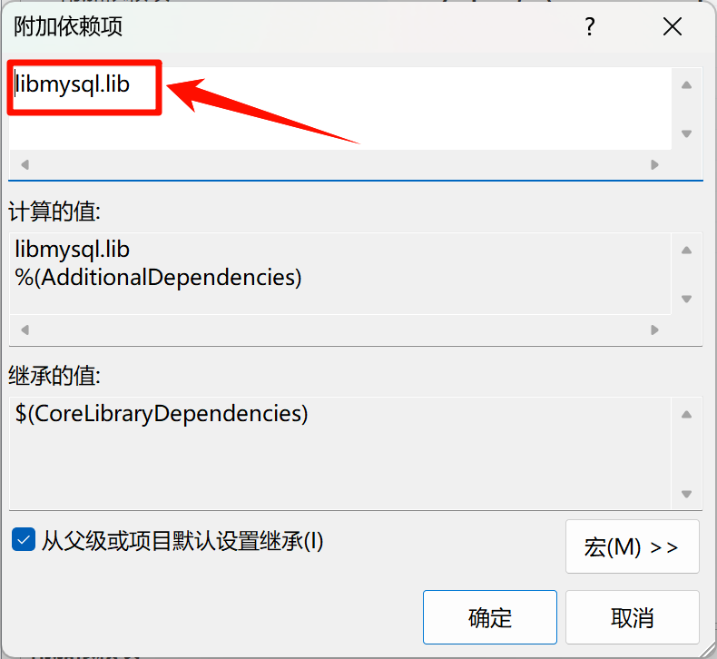

C++在语言层面上没有提供数据库操作，我们需要使用Orcle公司对MySQL提供的接口对其进行操作，这就需要使用外部依赖项，因此我们需要进行一些配置。
## 在VS中进行配置

### 一、 先找到VS的解决方案资源管理器：
![[img/C++连接数据库/VS解决方案资源管理器.png]]
可能新手在关闭了它之后就找不到了，如果我们需要再次找到它，首先需要找到视图：
![[img/C++连接数据库/VS视图.png]]
然后在其下拉菜单中找到**解决方案资源管理器**，单击它就好了：
![[img/C++连接数据库/找到解决方案资源管理器窗口.png]]

### 二、 找到“属性”，进行附加项配置
![[img/C++连接数据库/属性.png]]
找到属性之后，单击进入；
到这里，就要正式开始进行附加项配置了：
找到：**"C/C++" => "常规" => "附加包含目录"**：
![[img/C++连接数据库/C++附加包含目录.png]]
然后就开始”编辑附加包含目录“：
![[img/C++连接数据库/编辑附加包含目录.png]]
按照下图步骤选择，就会成功进入”系统文件资源管理器“：
![[img/C++连接数据库/附加包含目录编写.png]]
然后<b>找到本机中MySQL的安装文件夹，其中能够找到：MySQL Server 8.0（或类似这种），我们所需要的头文件和库文件都在其中</b>：
此处我们找到<b>MySQL Server 8.0/include</b>，将其加入到附加包含目录中：
完成后应该就是上图那样。
接下来，找到：**”链接器 => "常规"**：
![[img/C++连接数据库/附加库目录设置.png]]
选择<b>MySQL Server 8.0/lib</b>，这一步的操作和刚才加载include的操作类似，只是这是加载lib目录，也就是**库目录**：
![[img/C++连接数据库/添加附加依赖项.png]]
然后就是跟刚刚类似的编辑操作：**添加附加依赖项"libmysql.lib"**
这样大致就好了。

### 三、 移植libmysql.dll目录
只是完成刚刚的操作还是没法进行数据库连接的，当我们运行程序的时候会报错，显示：”**无法找到libmysql.dll文件**，我们需要在刚刚的MySQL Server 8.0/lib文件夹中找到这个文件：
![[img/C++连接数据库/libmysql.dll.png]]
将其复制粘贴到<b>本项目的Debug文件夹中</b>，这样就行了，在这里，我这个文件的存放路径即为：**"C:\Users\Lenovo\Desktop\demo\connectMysql\x64\Debug\libmysql.dll"**。
这样就完成了外部依赖项的配置。
