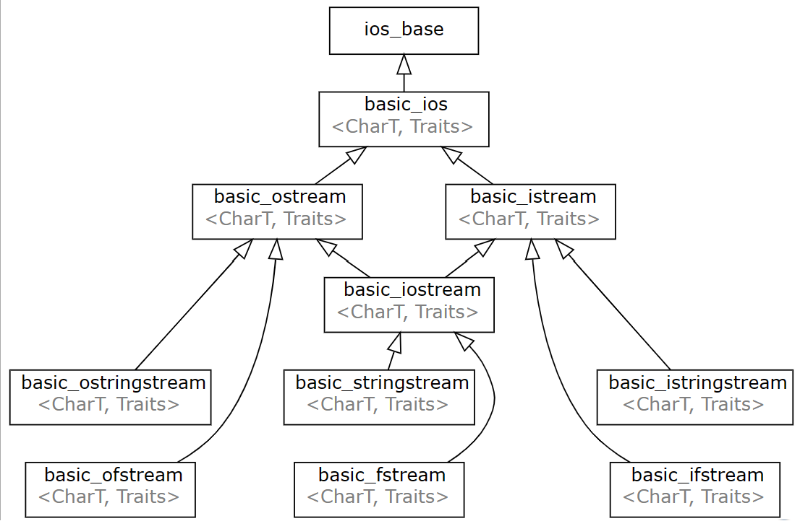
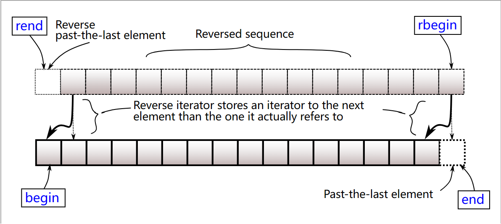

## C/C++的输入输出
在正常情况下（==在同步情况下==），**如果C和C++混用，由于C和C++使用的使用的是同一块缓冲区，在输入输出流中会优先执行C的输入输出操作，再执行C++的输入输出操作**。
但是在取消同步之后，C和C++之间的缓冲区完全独立，因此C和C++输入输出的顺序也是完全独立的了。
### (1) scanf和printf
优点：格式化输入、输出
```cpp
input 15:20 
	scanf("%d:%d,&a,&b");

output 1.00002
	printf("%.5lf",x)
```
注意事项：==**不能开[[#(3) 取消同步流|取消同步流]]**==！！！
### (2) cin和cout
优点：简洁，在**取消同步流的情况**下，一般会比scanf更快
#### \[1] cin
**cin是个istream类型的输入对象**，一般来说我们是这么使用它的：
```cpp
int temp;
std::cin>>temp;
```
这个能够读取基本数据类型，并且将**空白字符**（空格、换行符、制表符）作为分隔符，将输入解析为指定的数据类型，并将解析后的值存储到相应的变量中。即：==cin只读取连续非空格字符==
我们还有一种用法：
```cpp
char temp;
std::cin.get(temp);
```
这种方法**用于读取单个（任意）字符**，这意味着它==可以读取空白字符==！

#### \[2] cout
cout是个**ostream类型的输出对象**，也很常见：
```cpp
std::cout<<"Hello World";
```
它往往会和endl搭配使用，起到换行的作用，但是往往不建议这么做，理由在：[[#(4) 在算法中尽量少使用endl|为什么最好不要用endl？]]。
### (3) 取消同步流
```cpp
ios::sync_with_stdio(0),cin.tie(0),cout.tie(0);
//取消同步流
```
指：==通过取消同步流，你可以独立地操作C++标准输入输出流和C标准输入输出库，它们不再共享同一个缓冲区，各自拥有独立的缓冲区==
1. 提高即时性：取消同步流后，你可以立即在C++输入输出流上进行操作，并且不需要等待缓冲区满或遇到换行符等条件。这可以提高程序的响应性，避免一些不必要的延迟。
2. 灵活性：取消同步流后，你可以使用C++特有的输入输出操作，如std::cin和std::cout，而无需再使用C标准输入输出库的函数（如scanf和printf）。这样可以使代码更符合C++的风格和习惯。

#### \[1] ios是什么？
>  ios是个基类，是istream和ostream的**直接基类**，它提供了一些通用的成员函数和状态函数，用于处理流的基本操作、状态和格式控制。这些成员函数包括用于打开、关闭、读写、格式化和查询流等操作。
>  由于ios本身是一个**抽象基类**，不能直接创建对象或流实例。相反，我们通常会使用其派生类iostream、ifstream、ofstream或者stringstream来创建具体的输入输出流对象

#### \[2] sync_with_stdio()又是什么？
>ios类提供了一个成员函数sync_with_stdio()，用于**设置C的标准输入输出库与C++输入输出流之间的同步状态**。
>默认情况下，C++输出流和C的标准输入输出库是同步的。这意味着它们共享同一个缓冲区。这样做的好处是可以提高性能，避免频繁的系统调用。不过，这也可能导致一些不便，例如在使用C++输入输出流时，需要手动刷新缓冲区才能实时地输出到终端。
>sync_with_stdio()可以用于在C++输入输出流和C的标准输入输出库之间才能进行同步设置的开关。==该函数有个bool参数，ture表示同步，false表示异步，即不进行同步==

#### \[3] 刷新缓存区
当==缓冲区被填满、遇到换行符（endl）、或者使用std::fflush进行手动刷新==时，数据会被发送到目标设备进行显示。

#### \[4] tie()有什么用？
在默认情况下，cin和cout是绑定在一起的，即：**当cout的缓冲区刷新的时候，cin的缓冲区由于绑定的存在也同时进行了刷新**。可以使用如cin.tie()函数将cin与其他流（例如cout）进行解绑。
这对于一些需要及时用户输入的情况非常有用，例如在游戏中等待用户的按键输入。
### (4) 在算法中尽量少使用endl
endl='\\n'+强制刷新缓冲区
其中**刷新缓冲区这个操作非常需要时间，因此尽量少用甚至不用，建议使用”\\n"**。

## 命名空间
在一开始的程序我们写"Hello World"的时候我们就使用了命名空间std，这个是C++的标准库提供的，但是我们也能够自己编写命名空间：
```cpp
namespace Father{
	namespace Child{ ... }
}
//结束的时候不用分号！！！！
```
这就是编写命名空间的格式，只要是符号就能在命名空间中声明、定义。
**命名空间可以有别名**：
```cpp
namespace 别名 = 原名;
```
当我们想要使用命名空间里的符号，引入命名空间或者使用作用域限定符，在我们编写”hello world“的时候其实就用到了这个：
```cpp
//不太规范的代码
#include<iostream>
using namespace std;
int main(){
	cout<<"Hello World"<<"\n";
	return 0;
}
```
这是在全局范围内引用命名空间std，**但是我们是不推荐这么使用的**，我们通常使用作用域限定符来在使用符号的时候进行限定：
```cpp
//规范的代码
#include<iostream>
int main(){
	std::cout<<"Hello World"<<"\n";
	return 0;
}
```
### (1) 匿名命名空间
在一个文件中定义一个命名空间而不给名字，这个命名空间的内容在本文件中可以随意使用。
### (2) 嵌套命名空间
这部分的内容在后面提到了一点：[[#标准库函数bind与占位符]]
在不同命名空间的符号产生冲突的时候，我们需要使用**作用域解析符**进行限定，否则会报错。
### (3) 不推荐使用using声明
在学习初期我们常常使用using namespace std以求方便，但是这种我们要少用或者不用，因为容易产生歧义。
我们应当多使用“**std::**”，有的地方我们甚至还要使用"**::**"（**全局作用域运算符**），将其限制为"::std::"。==在大多数情况下，“std::"和"::std::"是一样的，但是有的时候我们必须要使用后者，也就是==：
>当在**局部作用域**中存在与标准库中的成员同名的局部变量、函数或命名空间时，如果直接使用std::来访问标准库中的成员，编译器会优先查找并选择局部作用域中的同名实体。

这里给个简单的例子：
```cpp
#include <iostream>

// 全局作用域中的变量
int number = 10;  

namespace MyNamespace {
    // 命名空间作用域中的变量
    int number = 20;  
}

int main() {
    // 局部作用域中的变量
    int number = 30;  

    // 访问局部作用域中的变量
    std::cout << number << std::endl;  
    // 访问命名空间作用域中的变量
    std::cout << MyNamespace::number << std::endl;  
    // 访问全局作用域中的变量
    std::cout << ::number << std::endl;  

    return 0;
}
```
那么，什么是局部作用域呢？
### (4) 局部作用域
作用域有很多种：
- 全局作用域
- 命名空间作用域
- 类作用域
- 局部作用域
其中，局部作用域指的是在函数、代码块或语句中声明的标识符可见的范围。局部作用域只在声明它们的函数、代码块或语句中可见。

## IO流
在C++中，IO流是C++用作输入输出操作的，其中基类为ios，这个在先前已经介绍过了，有许多的类继承自ios，例如：iostream，fstream等。
### iostream
iostream其实是由两个部分组成的：istream和ostream，分别是**标准库输入流**和**标准库输出流**。
像我们所熟知的输入输出对象cin和cout就是在iostream中定义的。

#### ostream
它有一个运算符，也就是"<<"，和三个操纵符：endl、ends和flush。我们详细说说这三个操纵符：
1. endl在先前已经说过它的操作其实是：=='\\n'+刷新缓冲区==，只不过这两者是在一起的
2. **ends\=='\0'**，也就是打印一个空字符，它作为字符串的结束标识
3. ==flush的作用就是刷新缓冲区==，我们可以立即为：endl\=='\\n'+flush，只是说后者是分为两步执行
#### istream
他比较简单，它只重载了**输入运算符**“>>”，用于提取字符和字符数组

### fstream
这个头文件用于操作==文件的输入输出==，这里提供一个使用fstream的例子：
```cpp
#include <iostream>
#include <fstream>
#include <string>

int main() {
    // 创建一个输出文件流对象
    std::ofstream outfile;
    // 打开文件，如果文件不存在则创建一个新的文件
    outfile.open("example.txt");

    // 检查文件是否成功打开
    if (outfile.is_open()) {
        // 写入数据到文件
        outfile << "Hello, World!" << std::endl;
        outfile << "This is an example of using fstream in C++." << std::endl;
        outfile << "Here are some numbers: " << std::endl;
        for (int i = 1; i <= 10; i++) {
            outfile << i << " ";
        }
        outfile << std::endl;
        // 关闭文件
        outfile.close();
        std::cout << "File writing is completed." << std::endl;
    } else {
        std::cout << "Failed to open the file." << std::endl;
    }

    // 创建一个输入文件流对象
    std::ifstream infile;
    // 打开文件
    infile.open("example.txt");

    // 检查文件是否成功打开
    if (infile.is_open()) {
        std::string line;
        // 逐行读取文件内容并输出到控制台
        while (std::getline(infile, line)) {
            std::cout << line << std::endl;
        }
        // 关闭文件
        infile.close();
        std::cout << "File reading is completed." << std::endl;
    } else {
        std::cout << "Failed to open the file." << std::endl;
    }

    return 0;
}
```

## 运算优先级
如果一个表达式中的操作符的优先级相同，那他们的==结合律==决定了它们的执行顺序，例如：
- 算数运算符的组合方式是从左到右
- 赋值运算则是从右到左

## C风格的字符串
由于我总是在这块出错，因此单独写一章来说说这个吧，主要以代码演示为主：
```c
#include <string.h>
#include <stdio.h>
#define MSG_SIZE 12
int main() {
  char msg[MSG_SIZE] = "HELLO";
  char add[6] = "WORLD";
  
  char* p = msg + strlen(msg);
  // memcpy(p, add, strlen(add));
  strcpy(p, add);
  printf("%s\n", msg);

  printf("msg's len: %d\n", strlen(msg));

  printf("add's len: %d\n", strlen(add));
}
```
运行上面这段代码，我们能够知道很多细节：
1. 使用``strlen``得到的字符串的长度实际上是要小于字符串数组的长度的，这是因为C风格的字符串尾部有个``\0``作为结尾标识符，它是不算长度的
2. 有时候程序能运行不代表它没错
	- 可以试着将上面代码中的参数进行修改，看看什么时候程序会没法运行？运行的程序将会卡住而不会报错？

## ASCII码
==**字符**==的取值范围是0~255。

ASCLL码中的0~127是标准符号、数字、英文，==汉字用扩展ASCll码表示，取值是128~255，常用的汉字以**双字节**为主，不常用的则可能是3或4字节==。
**小写字母 - 32 = 对应的大写字母**。
'A' = 65

## 进制
#### (1) 二进制
书写时必须以0b（或0B)开头：
- 数字只有0/1
```cpp
int a = 0b101;
int b = -ob110010;
int c = oB100001;
```

#### (2) 十六进制
书写必须以0x（或0X）开头：
- 数字0-9
- 字母A~F（或a~f）
```cpp
int a = 0x2A;
int b = -0XA0;
int c = 0xffff;
```

## 位运算
在计算机中，二进制是计算机的计算根本，位运算其实是二进制运算，**使用进制操作进行计算可以大幅度提升程序的运行效率**。位运算符一共有六种：

|运算符号名称|符号|作用|
|:-:|:-:|:-:|
|与|&|两个数的二进制相对应的位置上数字都为1时，结果才为1|
|或|\||两个数的二进制相对应位置上，只要有一个数字为1，结果就为1|
|非|~|对于一个数的二进制进行操作，将0变为1，1变为0|
|异或|^|两个数的二进制相对应位置上的数不相同为1，否则为0|
|左移|<<|将一个数的二进制所有位向左移指定位数，右边用0填充|
|右移|>>|将一个数的二进制所有位向右移指定位数，左边用**符号位**的值填充|

进制操作我觉得比较难，有时候想不到是真的想不到。
#### 常用的进制操作：
1. 奇偶判断：
	```cpp
	int num;
	cin>>num;
		
	//一般情况：
	if(num % 2==0){ ... }

	//使用位运算
	if(num & 0x1 == 1){ ... }
	//奇数成立，偶数不成立
	```
2. 除以2
	```cpp
	int num;
	cin>>num;

	int temp;
	//一般情况
	temp = num/2;

	//使用位运算
	temp = num >> 1;
	```
## sizeof运算符
sizeof运算符用于求==数据类型==或者==变量==占用的内存空间
```cpp
//用于数据类型
sizeof(数据类型)

//用于变量
sizeof(变量名)
sizeof 变量名;
```
- 注意：
	-  在32/64位操作系统中，同一数据结构类型占用的内存空间可能不一样
	- string不是C++的基本数据类型，用sizeof求它占用的内存的大小没有意义

## long long
long在不同平台的大小不一样

|平台|字节|。|
|:-:|:-:|:-:|
|VS|4|32位|
|Linux|8|64位|

long long的出现将其统一，==**至少**64位==，**即至少和long一样长**。

## 转义字符
- 在C++程序中，使用转义字符的原因有两个：
	- 控制字符没有符号，无法书写，只能用其他的符号代替
	- 某些符号已被C++征用，语义冲突，只能用其他的符号代替

- ==常用==的转义字符：

|代码|语义|
|:-:|:-:|
|\\t|水平制表符|
|\\n|换行||\\r|回车|

## const和constexper
在C++中，const有两种意思：**只读和常量**。但是有时候这会导致程序的二义性或者说编译器对程序员的意思理解不到位，例如下面的代码：
```cpp
//传参数进来的时候
//编译器认为修饰temp的const的意思是只读
void func(const int& temp){
	//但是我们在创建数组的时候需要传入的是常量表达式
	int arr[temp] = {};//这行代码在VS中会报错但是Linux中不会，因为Linux中支持变量作为数组长度

	//编译器正确地认为length是常量
	const length = 10;
	int arr2[length] = {};
}

```
但是，C++11新增的关键字**constexpr**就只有一个意思：**常量表达式**，因此建议：==在需要表达的意思为常量的时候使用关键字constexpr而不是const；在表达意思为只读的时候使用const==。
代码可以修改为如下所示：
```cpp
void func(const int& temp){
	int arr[temp] = {};

	//使用constexpr来声明/定义常量
	constexpr length = 10;
	int arr2[length] = {};
}

```

## **顶层const和底层const**
#### (1) 顶层const
**顶层const表示的是指针本身是一个常量**，更一般的情况是表示任意的对象是常量：
```cpp
const int* p;//p指向一个常量，这也导致了p的值是不可修改的，故这是个顶层const
int const* p;//这是指p始终指向一个int，p的值不可修改，所以也是个顶层const
```
#### (2) 底层const
**底层const表示指针所指向的对象是一个常量**：
```cpp
int ci;
const int* p = &ci;//是一个指向const int的指针
```

## 数据类型转换
在C中，有强制类型转换，我们可以较为随意地对数据类型进行转换：
```cpp
int temp = 100;
std::cout<<std::fixed<<(double)temp<<std::endl;
```
C++中给出了**更为安全且更为严格**的类型转换，其中最常用的是static_cast<>。
### (1) static_cast
先说说语法吧：
```cpp
static_cast<目标类型>(表达式)
```
它的用法和C没什么区别：
```cpp
int temp = 100;
std::cout<<std::fixed<<static_cast<double>temp<<std::endl;
```
在C++中，**任何类型的指针都能隐式的转换为void\*类型**，这个函数的作用也主要是在函数传参中，有时候我们的函数参数需要接受位置类型的指针，因此我们在声明的时候就可以声明为void\*类型，在函数内部再对这个指针的类型进行转换。
==而static_cast不能用于转换不同类型的指针（引用），这时就要使用另一个关键字了：reinterpret_cast==，**但是static_cast能够将void\*转换成其他类型的指针**。
### (2) reinterpret_cast
reinterpret的意思是**重新解释**，能够将一种对象类型转换为另外一种，不管两者之间有没有关系。它的语法跟static_cast一样，但是它有个要求：==目标类型和表达式中必须要有一个是指针（引用）类型==。
### (3) 如何让单个整型转换为字符整形？
这样说可能有点抽象，其实我想表达的是整形0~9转换为字符0~9：
```cpp
int num;
cin >> num;
string str_num = num + '0';
```
这是因为'0'在ASCLL码中的整数值是48。

## 原始字面量（C++11）
- 原始字面量（值）可以直接表示字符串的实际含义，不需要转义和连接。
- 语法
	```cpp
	R"(字符串的内容)"

	//其中的xxx是说明标签，用来增强代码的可读性
	//xxx一定是成对出现的
	R"xxx(字符串的内容)xxx"
	```

## 内联函数
在函数的定义**或者**声明之前添加关键字**inline**。==一般来说推荐在定义之前添加inline关键字==。
内联函数的实质：在程序中拷贝多个函数的副本，使得在进行函数调用的时候不需要由于函数的调用而进行**跳转**，这样就提高了程序的运行效率。
==但是不是说你将这个函数声明/定义为inline它就一定是内联函数了，它究竟是不是内联函数还是要看编译器==。
### 注意事项
- 内联函数节省时间，但消耗内存
- 如果函数过大，编译器可能不将其作为内联函数（声明为inline，但是编译器可能不执行，跟constexpr有点像）
- 内联函数不能递归
	```cpp
		inline int add(int a,int b){
			return a + b;
		}
	```

## 关键字explicit
这个关键字的意思是：**禁止使用隐式转换**。
这里需要区分一下显示和隐式，我们先来看看显示和隐式分别是什么：
```cpp
int num = 10;//隐式调用

int num(10);//显示地调用int的有参构造函数
```
>在C++中，将一个整数值**直接赋值**给一个整数变量是一种隐式类型转换。这是因为C++的标准中定义了一个隐式类型转换规则，可以将一种类型的值隐式地转换为另一种类型的值。

## 关键字extern
==这个关键字在进行多文件编写的时候非常有用，特别是在C语言中，因为C语言的作用域比较简单！==简单来说，<font color="red"><b>它会将变量/函数声明成全局的</b></font>，这样就能够避免很多不小心造成的问题，这里就举例说明一下吧：
```c
/*
	test.h
*/
void talk(char* buf);
```

## 运算符重载
[[运算符重载]]

## 常量指针与指针常量
[[指针#常量指针与指针常量]]

## 函数指针与函数回调\*
[[指针#函数指针与函数回调]]

## 二维数组的函数传参\*
[[指针#二维数组用于函数的参数（行指针） *]]

## 初始化函数memset
这个函数在头文件**string.h**中，它不属于C++而属于C，因此我不太喜欢用，因为C和C++有的时候混用会导致代码不好理解，并且会存在一些未定义的问题。随着C++的版本越来越高，它跟C之间的差距也变得越来越大。
上面都是些题外话，接下来我们说说这个函数要怎么使用：
```cpp
//这样使用这个函数之后，数组中的所有元素都进行默认初始化
//但是如果第二个参数不是0，我就不知道了
memset(需要清空的内容,
	   0/*（我也不知道为什么填0）*/,
	   sizeof(需要清空的内容的类型));
```
### 注意事项
1. 先看一段代码
```cpp
struct m_st{
int* p;
};

int main(){
	m_st stt;
	stt.p = new int[100];
	
	//用memset初始化结构体
	memset(&stt,0,sizeof(m_st));
	//这样写的意思是把p置为0

	delete[] stt.p;
}
```
在这段代码中，我们在new出了p之后，对结构体进行了初始化，这就导致==p指向的内存是0==，在C++中，我们只有通过指针来操控分配的内存，现在指针为NULL，说明我们==对分配的内存失去了控制，而且由于在程序运行完之前没有delete[]，故分配的内存未被释放，因此造成了内存泄漏==。
- 在没有动态分配内存之前，是可以使用memset函数去清空结构体的
- 但是在动态分配内存之后就不可以了，否则会造成内存泄漏
对这段代码进行修改：
```cpp
struct m_st{
	int *p;
};

int main(){
	m_st stt;
	stt.p = new int[100];

	//将数组中的内容置为0，注意是内容！而不是地址！
	memset(stt.p,0,100*sizeof(int));
	delete [] stt.p;
}
```
这里要注意的就是memset的写法，这么写清空的是数组中的内容。
2. 由于C++的历史遗留问题，**第二个参数的传参使用的是八进制**，在不熟悉或者不确定情况下，最好还是不要使用除0以外的数字。

## 共同体union
- 将struct关键字变为union
- ==一次只能存储一种数据格式==
- 注意事项：
	- 共同体占用的内存大小是它最大的成员占用的内存大小（内存对齐）
	- 全部的成员使用同一块内存
	- ==共同体中的值为最后被赋值的那个成员的值==
	- 匿名共同体没有名字，可以在定义的时候创建匿名共同体变量，也可以嵌入结构体中
```cpp
//这个共同体储存的数据可以是这三个数据中的一种
union exmp{
	int a;
	double b;
	char c[10];
};

int main(){
	exmp data;
	cout<<"sizeof(data)=="<<sizeof(data)<<emdl;
}
```
这段代码的结果是16，这就是因为内存对齐，需要是8的整数倍，如果是char\[17]，结果将会是24。

## 枚举enum
枚举的声明跟类有点像
```cpp
enum color{
	yellow,
	blue,
	red
};
int main(){
	color cl = yellow;
}
```
注意事项：
- cl的值只能是yellow、blue、red中的一个，不能是其他的值
- 枚举量的值默认从0开始，往后依次+1，且必须是整数
- cl不能赋值，只能使用yellow、blue、red
- 枚举的定义域与自变量的相同
- 可以将整型强制转换成枚举型
```cpp
color cl = color(1);//等同于color cl = blue;
```
枚举类往往放在类中，作为嵌套类进行使用。

## 引用的本质
**引用是指针常量的伪装**[[指针#指针常量]]
这个很容易就能证明：
```cpp
#include<iostream>
using namespace std;

int main() {
	int a = 1;
	int* const c_a = &a;
	int& c_b = a;

	cout << "&a=" << &a << endl;
	cout << "c_a=" << c_a << endl;
	cout << "&c_b=" << &c_b << endl;
}
```
## 类
[[类]]

## static——静态
### (1) 全局函数/变量使用static
这里先给出一段C++代码：
```cpp
#include<iostream>
using namespace std;

stasic void Print_H(){
	cout<<"Hello World\n";
}

int main(){
	Print_H();
}
```
这个函数的功能仅仅是打印一行"Hello World"，但是它被声明为**静态的**，这会与它不声明有什么区别呢？
这个主要影响的是分离式编译：**static对函数进行修饰后，就说明这个函数的作用域仅仅是在当前文件**。就比如我在.h文件中声明了一个函数，而在相应的文件中想要对它进行实现，此时由于使用了分离式编译，这个函数就不能使用static，如果使用了static，我就必须要在.h文件中定义这个函数。
### (2) 类的成员函数/变量使用static
[[类#类的静态成员]]

## extern——外部声明（外部链接）
在上面我们说了**static**关键字是将其作用域限定在本文件中，而其他文件没法使用；而跟它相对的关键字就是**extern**，有了它，说明这个**全局变量**或者**全局函数**是只能有一个的，==如果在多个文件中同时定义了一个同名函数，并且这个函数使用了extern进行声明，那就会出错==。
这个关键字在C语言中很重要，在C++中，它没有被删除，但是在很多时候我们用不上它了：==因为在C语言中，我们只有通过extern才能避免冲突，但是C++中新增了命名空间，并将结构体升级成了类==。

## 编译预处理
C++程序编译的过程：预处理 -> 编译（优化、汇编） -> 链接
**预处理指令（宏预处理操作符）**：
- 包含头文件：\#include
- 宏定义：\#define（定义宏）、\#undef（删除宏）
- 条件编译：\#ifdef、\#ifndef
### (1) include
- \#include<文件名>：**直接从编译器自带的函数库目录中寻找文件**
- \#include"文件名"：**先从自定义的目录中寻找文件**，如果找不到，再从编译器自带的函数库目录中寻找文件
==include实际上是进行了一个复制粘贴操作==。
### (2) 宏定义指令
==宏可以只有名字没有内容==
- 无参数的宏：
	```cpp
	#define 宏名 宏内容
	```
- 有参数的宏：（使用内联函数代替它，效果更好）
	```cpp
	#define MAX(x,y) ((x)>(y) ? (x) : (y))
	```
- C++编译器提供的常用宏：
	```
	当前源代码文件名：__FILE__
	当前源代码函数名：__FUNCTION__
	当前源代码行号：__LINE__
	编译的日期：__DATE__
	编译的时间：__TIME__
	编译的时间戳：__TIMESTAMP__
	当C++编译程序时候，__cplusplus就会被定义
	```
#### 更多宏定义操作
宏定义能玩出花来，这里说说我遇到的但可能不是很常用的宏预处理操作符：
- \#：将参数转换成字符串，可以立即为就是一个toString()操作
	```cpp
	#define PRINT(var) printf(#var"=%d\n", var)

	const int a = 10;
	PRINT(a);
	```
	其中的宏定义就是将PRINT()==替换==成printf()，在printf中有#var，就是将PRINT(var)中的var接受后变换成对应的字符串，这个代码放在程序中运行的结果是：
	```shell
	a=10
	```
- \#\#：将相邻的两个**标识符**连接为一个标记，要注意是标识符！也就是说并不是将两个变量连接在一起！
	```cpp
	#define CONTANT(a,b) a##b

	int a1 = 40, a2 = 4;
	std::cout << CONTANT(a,1);
	```
	这段代码的输出结果是a1的值，也就是：
	```shell
	40
	```
- \\：在定义宏的时候可能会在一行的末尾加上一个反斜杠，它的意思是==将下一行的内容连接至本行==，因为在宏定义中，若是不使用这个反斜杠进行连接操作，我们只能将所有的宏定义相关内容写在一行，这样的话会非常影响代码的可读性。

附上遇到以上所有宏定义预处理操作符的代码：
```cpp
#define LOG_BASE(level, format, ...)\
    do{\
        Log* log = Log::Instance();\
        if(log->IsOpen() && log->GetLevel() <= level){\
            log->write(level, foramt, ##__VA_ARGS__);\
            log->flush();\
        }\
    }while(0);
```

### (3) 条件编译
- ifdef：如果宏名存在，使用程序段一，否则使用程序段二：
	```cpp
	#ifdef
		程序段一
	#else
		程序段二
	#endif
	```
- ifndef：如果宏名不存在，使用程序段一，否则使用程序段二：
	```cpp
	#ifndef
		程序段一
	#else
		程序段二
	#endif
	```
### (4) pragma once
这个预处理指令是确定这个头文件只被包含了一次，以此来避免头文件的重复引用。

## 关键字extern
说到了编译链接就不得不提关键字**extern**了：
>它用于声明一个全局变量或函数，表示这个变量或函数是在其他文件中定义的。它的作用是告诉编译器，在当前文件中虽然没有定义该变量或函数的具体实现，但其实现是在其他文件中存在的。

==在声明全局变量或者全局函数的时候使用这个关键字就能避免**重定义**的发生==。

## iterator——迭代器

#### (1) 迭代器类型简介
|迭代器名字|英文名|作用|
|:-:|:-:|:-:|
|插入迭代器|insert iterator|这些迭代器被绑定到一个容器上，可用来向容器插入元素|
|流迭代器|stream iterator|这些迭代器被绑定到一个容器上，可用来向容器插入元素|
|反向迭代器|reverse iterator|这些迭代器向后而不是向前移动。除了forward_list之外的标准库容器都具有反向迭代器|
|移动迭代器|move iterator|这些专用的迭代器不是拷贝其中的元素，而是移动它们|

#### (2) 插入迭代器
>插入迭代器一种==迭代器适配器==，它接受一个**容器**，生成一个迭代器，能实现向给定容器添加元素。

insert iterator（插入迭代器）有三种类型：

|迭代器适配器类型|作用|
|:-:|:-:|
|back_inserter|创建一个使用push_back的迭代器|
|front_iterator|创建一个使用push_front的迭代器|
|inserter|创建一个使用insert的迭代器。==此函数接受第二个参数，这个参数必须是一个指向给定容器的迭代器。元素将被插入到给定迭代器所表示的元素之前==|
- 注意：**迭代器适配器并不是一个完整的数据类型，而是用来改变或拓展现有迭代器行为的工具。**

## string——字符串
string的内部是用char实现的，其原理类似vector，string的变量声明与定义和内置数据类型没什么区别：
```cpp
std::string temp = string("Hello");
//隐式调用string的有参构造函数
//讲Hello转换为一个临时对象
//并将这个临时对象赋值给temp

std::string temp("Hello");
//显示调用string的有参构造函数
//使用Hello对temp进行初始化
```
例如"\\n"的字符存入需要2个char，"\\"的作用仅仅是转义计算机会视其为字符正常储存，只是在输出的时候会进行改变。
在string中，有一个属性npos，它表示可以存储的最大数据量，这个数很大很大（其实就是unsigned long long的最大值）：
```cpp
std::cout<<string::npos<<std::endl;
```
这行代码仅仅是说明有这个属性，它的大小不重要。
### (1) string的常用操作
|方法|作用|时间复杂度|
|:-:|:-:|:-:|
|empty()**（C++17）**|判断容器是否为空||
|to_string()|将整型或浮点型转换为string||
|to_wstring()|to_string()的**宽字符**版本|
|stoi(s, p, d)|将string类型转换为int类型||
|stoul(s, p, d)|将string类型转换为unsigned long类型||
|stol(s, p, d)|将string类型转换为long类型||
|stoull(s, p, d)|将string类型转换为unsigned long long类型||
|stoll(s, p, d)|将string类型转换为long long类型||
|getline()|从输入、输出流中读取数据||
|resize()|用于更改string的长度||
|eraer()|删除string的元素或者子串||
### (2) 数值转换
函数==to_string()==将整型或浮点型转换为string：
```cpp
int num = 10;
//这个函数只接收一个参数
std::string temp = to_string(num);
```
to_wstring()则是其**宽字符**版本。

除了能将整型或浮点型转换为字符串，也可以将字符串转换为相对应的整型和浮点型，用的就是[[#(1) string的常用操作|string的常用操作]]表格中的stoi等函数。
单是这么看我们不知道传参中的s、p、d是什么意思，我们通过分析stoi的声明来看看它们是什么：
```cpp
int stoi( const std::string& str,
		  std::size_t* pos = nullptr,
		  int base = 10 
		);
```
**可知：s就是string，即：要进行转换的字符串；p为position，用于指定字符串的结束位置；b为base，也就是进制数，默认为10，即10进制**。
可以发现，它能够提供结束位置，但是却没让我们传入起始位置，说明：==这个函数的字符串转换是从字符串的起始位置开始至结束位置==，若是没有指定结束位置，默认为整个字符串。
### (3) 字符串拼接
库中已经对“+”进行了重载，因此我们使用”+“就能完成字符串的拼接：
```cpp
using namespace std;

string str1 = "Hello ";
string str2 = "World";

cout<<str1 + str2<<endl;
```
通过这串代码我们不难发现：**空字符也能正确的被保存在string中**。
### (4) size()和length()函数的区别
sting的size()和length()其实没有任何区别，通过查看源码发现它们的定义都是完全一致的。**size()和length()的返回值都是字符串的字符长度，而且需要注意的书：字符串末尾的“\\n”是不包含在其中的**。
```cpp
#include<iostream>
#include<string>

int main(){
	std::string temp("西施 18岁");
	std::cout << temp.size() << "\n";
	std::cout << temp.length();
}
```
运行这段代码，可以发现二者的输出结果都是9，这也可以验证之前的结论。

### (5) string的迭代器
==string是字符序列，不是一个标准的容器==，但是能够使用迭代器操作：
```cpp
std::string str;
std::string::iierator str_begin = str.begin();
std::string::iterator str_end = str.end();
```
因此同样可以使用**范围for**来简化遍历操作：
```cpp
std::string str;
for(auto temp : str){ ... }
```
此时，auto是char类型。
==这里我就有疑惑：为什么是char而不是string::iterator?==

### (6) std::getline
一般情况下，我们使用输入流对象cin获取数据，是以空格'\\t'作为分结束符，而getline()==默认情况下是以'\\n'作为结束符==，除此之外，getline()存在于**std**和头文件**string**中。这里来看看它的声明：
```cpp
std::istream& getline(std::istream& is, std::string& str, char delim);
```
一般来说它只有两个参数：因为==第三个参数用于指明**结束符**==。需要注意的是：如果在输入流中没有指定的结束符，它将会一直读取至末尾：
```cpp
#include<iostream>
#include<string>
#include<locale>
int main(){
	std::string res;
	getline(std::cin,res);

	std::cout << res << std::endl;
}
```
但是不知道为什么，有时候它无法储存中文，会出现乱码问题，这时我们能够通过代码显式地指定字符码：
```cpp
#include<locale>
std::locale::global(std::locale("zh_CN.UTF-8"));  // 设置中文本地化环境
```

### (7) resize()和erase()
这个函数在更改string长度的时候非常有用，它有两个版本：
```cpp
void resize(size_t n);
void resize(size_t n, char c);
```
先说传入的参数n吧，它有两种情况：
- 若是n\<str.size()，它就会将字符串**截断**，将其长度更改为n
- 若是n>str.size()，它就会将字符串的长度**扩充**为n

在第二种情况下，我们就能传入第二个参数了：将扩充部分的字符填充为c。
==除了resize()，还有个删除函数**erase**有着类似的作用==，这里来看看erase的声明：
```cpp
std::string& erase(size_t pos = 0, size_t count = npos);

std::string& erase(iterator first, iterator last);
```
先说第一种情况：一个参数pos代表字符串开始删除的位置，这个位置默认从0开始；count则是需要删除的元素的个数。
第二种情况：传入的是两个迭代器，根据名字应该很容易就能看懂，这里就不多说了。

### (8) substr()
```cpp
string substr(int pos, int n);
```
该函数用于获取字符串的子数组，这里主要说关于它的越界问题。

在写某道题的时候，由于我一直在关注越界问题，这导致我浪费了很多时间和文章在无用的事情上：
```cpp
#include <iostream>
#include <string>
using namespace std;

signed main() {
	string s = "Hello";
	try{
		cout << s.substr(4, 10);
	}
	catch(const out_of_range&e){
		cout << "发生越界!\n";
	}
}
```
运行这段代码：
```txt
o
```
观察输出，我们不难知道：
<font color="red"><b>若是pos+n越界了，该函数会自动进行一个截断操作，并且不会抛出任何异常！</b></font>因此，在使用该函数的时候，只需要注意``pos``不会越界就可以了。

## array——静态数组
我们以往使用的都是内置数组，例如：
```cpp
int arr[10] ={};
```
array的存储方式和数组一样，或者说：==它的底层就是一个内置数组==。它同样高效，并且提供了很多便携操作：
- 作为一个STL，它能够使用迭代器，因此它也就能够支持范围for循环
- 它支持比较运算符
- ==它大小固定==，跟内置数组一样

### (1) array的常用操作
|方法|作用|时间复杂度|
|:-:|:-:|:-:|
|at()|访问指定元素，**同时进行边界检查**||
|\[]|访问指定元素||
|front()|访问array中的第一个元素||
|back()|访问array中的最后一个元素||
|data()|直接访问底层数组||
|empty()|判断array是否为空||
|size()|返回array容纳的元素||
|max_size()|返回array可储存的元素的数量（返回可容纳的最大元素数||
|fill()|以指定的值填充array||
|swap()|交换内容||

### (2) at()和\[]的区别
==at()和[]的作用都是访问指定元素==，只是说at()还有边界检查，而\[]没有边界访问。若是使用at()发现元素不在数组中，它会抛出异常**std::out_of_range**。

### (3) data()
data()可以直接访问array的底层数组，若是array不为空，说明其中有元素，它的返回值是==array的底层数组中首元素的指针==。
示例代码如下：
```cpp
#include<array>
#include<iostream>

int main(){
	std::array<int ,10> arr;
	arr.fill(1);
	
	int* temp = arr.data();
	for(int i=0; i < 10; i++){
		std::cout <<*(temp + i) <<" ";
	}
}
```
其中用到了fill()，它将会在接下来进行说明。

### (4) fill()
fill()的作用是用于填充array，但是它==只能接收一个参数，它使用这个参数将array中的**所有**元素进行填充==。在上一节中使用了这个函数[[#(3) data()]]

## stack——栈
栈是很常用的一种数据结构，在C++中，它存在于头文件**stack**中，常用是因为它的特点：**先进后出，后进先出**。在C++中，它的底层==默认数据类型是std::deque，但是我们也能指定它使用std::vector、std::list等容器，但是有要求：必须有函数back()、push_back()以及pop_back()==。

### (1) stack的常用操作
|方法|作用|时间复杂度|
|:-:|:-:|:-:|
|top()|访问栈顶|O(1)|
|empty()|查看容器是否为空|O(1)|
|size()|返回容器中元素的个数|O(1)|
|push()|向栈顶插入元素|O(1)|
|pop()|删除栈顶的元素|O(1)|
|swap()|交换两个容器的元素（**我还没用过**）|根据底层容器而定，常为O(1)|

### (2) 指定stack的底层容器
一般情况下，我们默认stack的底层容器是使用deque，也就是双端队列，但是我们也可以去指定它的底层容器：
```cpp
std::deque<int>
std::deque<int, std::vector<int>>//指定底层容器为vector<int>
std::deque<int, std::list<int>>//指定为list
```

### (3) pop()
删除栈顶元素，注意：**它只是”删除“栈顶元素，它没有返回值**。想要访问栈顶只能使用top()。
虽然pop()的作用是“删除“栈顶元素，但是==实际上这个元素没有被删除，只是我们访问不到了==，这个元素真正被删除只有在数据区被销毁的时候。
## deque——双端队列
deque和vector很相似：
1. 它们都是线性存储容器
2. 它们的大小都能够动态调整
3. 都支持迭代器
### (1) deque的常用操作
|方法|作用|时间复杂度|
|:-:|:-:|:-:|
|empty()|检查容器是否为空|O(1)|
|size()|返回容纳的元素数||
|max_size()|返回可容纳的最大元素数|O(1)|
|shrink_to_fit()|通过释放未使用的内存减少内存的使用||
|clear()|清除内容|O(1)|
|insert()|插入元素||
|emplace()|在指定位置原位构造，可以减少不必要的开销||
|erase()|删除元素||
|push_back()|在deque的末尾添加元素||
|emplace_back()|在deque的末尾原位构造||
|pop_back()|删除deque的末尾元素||
|push_front()|在deque的首部插入元素||
|emplace_front()|在deque的首部原位构造||
|pop_front()|删除deque的首部元素||
|resize()|更改deque中可存储的元素的个数||
|swap()|交换内容||

### (2) insert和push_back()、front_back()的区别
它们三个本质上都是起到插入作用，但是它们插入的位置有所不同：
- insert()：需要传入迭代器用于指定位置：
	```cpp
	iterator insert (iterator position, const value_type& val);
	template <class InputIterator>
	void insert (iterator position, InputIterator first, InputIterator last);
	void insert (iterator position, size_type n, const value_type& val);
	```
	上面是insert()的声明，很明显它使用迭代器指定需要插入的元素和插入位置。
- push_back()和front_back()：这两个都只能在规定位置添加元素：前者是在deque末尾，后者是在deque首部。

### (3) push_back()和emplace_back()的区别
上面我们说到emplace_back()是：==末尾原位构造==，那么，什么是原位构造呢？我们这里先说说push_back()。
我们使用push_back()的时候其实是创建了一个**临时变量**：
```cpp
std::vector<int> arr;
//其实是创建了一个值为1的临时变量
arr.push_back(1);
```
这样程序就会有额外开销，那么==emplace_back()就是不创建这个临时变量，它使用了[[#std::move()|完美转发]]技术==，所以上面这段代码我们就能够优化一下：
```cpp
std::vector<int> arr;
arr.emplace_back(1);
```
这段代码优于使用push_back()的代码。
但是！==因为emplace_back()使用的是**完美转发**技术，如果我们传入一个变量，在这个变量重新赋值之前我们就不能够再去访问它了==，这是完美转发导致的。
在[[#(1) deque的常用操作|deque的常用操作]]中，能注意到有个**函数emplace()**，它的作用就是原位构造，但是我们不会直接调用它，而是我们在使用emplace_back()和front_back()的时候，它会在内部调用。

### (4) shrink_to_fit()
这个函数的作用是：==缩减容器的规模==，但是==**它只是个建议**==，也就是说：并不是我们调用了这个函数，它的规模就一定会发生变化；即：它并不保证一定会释放所有的额外内存。
当然，在绝大多数时候我们不用手动调用它，它会由编译器在合适的时候自动调用。

## vector——向量/容器
### (1) vector的常用操作
| 方法 | 作用 | 时间复杂度 |
| :--: | :--: | :--: |
| push_back() | 在数组尾部添加元素 |  |
| erase(iterator) | 删除迭代器指定位置的元素，并且返回删除的元素的下一个有效元素的迭代器 |  |
| pop_back() | 删除末尾的元素 |  |
| back() | 返回最后一个元素的引用（可以直接理解为访问最后一个元素） |  |
| data() | 获取指向存储在向量中元素数组的第一个元素的指针 |  |

### (2) vector的创建
我们在初学C++的时候使用的数组都是内置数组，它虽然很快捷，但是不够便利，因此C++11STL中增加了array，使得数组也能够使用**迭代器**，同时没有什么效率问题。
在C++中，如果没有充分的语言来使用其他的容器，一般都使用vector作为默认容器。
我们可以怎么去创建vector呢？
```cpp
#include<vector>
#include<iostream>

int main(){
    int n; // vector的规模
    std::cin >> n;
    int m; // 用于初始化vector的数值
    std::cin >> m;
	std::vector<int> arr(n, m);

    for(auto temp : arr){
        std::cout << temp << " ";
    }
}
```
最常见的vector的创建方式我们已经太熟悉了，这里就不多说了，这里给出的代码是==指定vector的大小和初始化其元素的值，一看便懂，不懂的跑一跑也懂了==。
### (3) earse()
这个函数需要传入一个（或两个）**迭代器**，将指定的元素（或范围）删除，并且==这个函数的返回值是被删除元素的之后的下一个有效元素的迭代器==。这里给出一段代码：
```cpp
#include<iostream>
#include<vector>
using namespace std;
int main() {
	vector<int> arr = { 1,2,3,4,5,6,7,8,9 };
	for (const auto& temp : arr) {
		auto it = arr.begin();
		cout << temp << " ";
	}
	cout << endl;
	cout << "sizeof(arr) = " << sizeof(arr) << "\n";

	auto temp = arr.begin() + 1;
	temp = arr.erase(temp);
	cout << "删除元素之后，迭代器指向：" << *temp << "\n";

	for (const auto& temp2 : arr) {
		cout << temp2 << " ";
	}
	cout << endl;
	cout << "sizeof(arr) = " << sizeof(arr) << "\n";
}
```
我们发现：在删除了第二个元素之后，arr的size仍然为32。同时，此时迭代器temp的位置为元素3的位置，并且vector中用于计算容器中元素数量的计数器刷新元素个数。
#### 注意：
在上面代码中，我们使用了sizeof(std::vector)，企图这样来知道其所存储的内容所占用的内存大小，但是这样是错误的。我们需要知道：==vector本身是开辟在栈上的，只是它所存储的数据是开辟在堆上的==，我们sizeof(std::vector)返回的是它本身的大小。

### (4) data()
在上面的表格中我们说了，它的作用是：==获取指向vector中第一个元素的指针==，虽然我们知道，跟内置数组一样，向量名获取向量的第一个元素的地址是一样的效果，但是我们仍然推荐使用data()：
```cpp
vector<int> arr;
int* fi_ptr = arr.data();
```
这个fi_ptr的值和arr、&arr\[0]是一样的，但是此种情况会有隐藏的问题：arr中并没有元素，因此可能会出错，但是data()不存在这个问题，如果vector为空，它将会返回一个空指针。

## map——映射
map使用的是**红黑树**用于查找，封装在头文件**map**中。
先用代码说说map是怎么使用的吧：
```cpp
#include<map>
std::map<key,value> temp = {key1,value1};
```
map的元素为**pair**，它跟map有点像：
```cpp
std::pair<key,value> temp = {key1,value1};
```
并且，map也提供了迭代器，由于其内部的实现使用的是双向链表，因此其迭代器也是双向迭代器。
在先前我们已经说了==map的底层是基于红黑树实现的，因此存进map的值需要能够明确地进行大小比较==。所以在使用自定义类型的时候，==如果要让我们的自定义数据类型作为map的键，**至少**需要重载<运算符==。
#### (1) map的基本操作
|方法|作用|时间复杂度|
|:--|:--|:--|
|insert({key , value})|向map中插入一个键值对pair<key, value>|O(logn)|
|erase(key)|删除map中的指定的键值对|O(logn)|
|find(key)|查找map中指定键对应的键值对的迭代器|O(logn)|
|count(key)|查找键的数量，在普通map中，由于键唯一，故只返回0、1|O(logn)|
|operator\[key]|查找map中指定键对应的值|O(logn)|
|size()|返回map中键值对的数量|O(1)|
|clear()|清空map中所有的键值对|O(n)|
|empty()|判断map是否为空|O(1)|
|begin()|返回map中第一个键值对的迭代器|O(1)|
|cbegin()|前者的const版本||
|rbegin()|指向“起始”的逆向迭代器||
|end()|返回map中最后一个键值对的下一个位置的迭代器|O(1)|
|cend()|前者的const版本||
|rend()|指向“尾节点的下一个节点“的逆向迭代器||
|emplace()|原地构造函数||

#### (2) pair——map的元素
经过上面的表述，已经知道了pair是map的元素，它储存的是**键值对**，在头文件**utility**中定义，但是==在C++11以及更高版本的C++标准中，std::map在使用的时候会隐式地包含头文件utility，所以现在我们无需手动包含utility就能使用std::pair了==。在pair中，我们可以使用first和second来分别表示key和value：
```cpp
std::pair<const std::string,int> student("西施",18);
std::cout  << "student.first = " << student.first << '\n';
std::cout << "student.second = " << student.second;
```
所以我们想要操作map其实是对pair的一系列操作。
map有三种额外类型：key_type，mapped_type和value_type：

|额外类型|它是什么？|
|:-:|:-:|
|key_type|此容器的关键字类型，也就是key|
|mapped_type|关键字的关联类型，也就是value|
|value_type|map的类型，其实就是pair\<const key_type, mapped_type>|

可能会注意到：**为什么map的value_type的键使用了const修饰**？这是因为map的键是不允许修改的，将其修饰为const也就避免了误操作。
#### (5) map的迭代器
map也是支持迭代器的，跟大多数STL中的模板类一样，虽然map的元素是pair，但是它的迭代器并不是pair类型，而是：
```cpp
std::map<key_type, mapped_type>::iterator
```
这个也很好理解，我也就不再赘述了。

#### (4) insert()
insert()有很多需要注意的地方，我们先看看insert的声明吧：
```cpp
//实际上有很多，不止这一个
pair<iterator, bool> insert(const value_type& value);
```
根据先前的内容，可以知道==insert()传入的是一个pair，同时它返回一个pair，但是返回的这个pair并不是之前传入的pair了==！那么这个pair究竟是什么呢？
它的**first是个迭代器**，second是一个布尔值，那么问题来了：first的迭代器指向谁呢？这里用一段代码来测试下：
```cpp
std::map<std::string, int> girl = {};
std::pair<std::string, int> temp = { "西施", 18 };

auto res = girl.insert(temp);

std::cout << "res.first->first = " << res.first->first << "\n";
std::cout << "res.first->second = " << res.first->second;
```
输出的结果为：
```shell
西施 18
```
并且可以得到res的类型为：std::pair\<std::map\<std::string, int>::iterator, bool>。
因此，可以得出结论：==如果insert()插入成功，这个迭代器将会指向这个成功插入的元素，同时bool设为true；若是插入失败，说明在map中已有这个关键字，则会指向map中，键与想要插入的元素的键相同的对象，bool设为false==。
在上面的代码中，我们是创建了一个std::pair的变量后，再将其用于insert()函数传参，但是更多情况下，我们是使用std::pair的**非成员函数**：**std::make_pair()**，以此来避免创建多余的变量占用栈的空间，对上面的代码进行修改：
```cpp
std::map<std::string, int> girl = {};

//make_pair不是pair的成员函数
//所以需要使用std来指定命名空间
auto res = girl.insert(std::make_pair("西施", 18));

std::cout << "res.first->first = " << res.first->first << "\n";
std::cout << "res.first->second = " << res.first->second;
```
这才是我们更常用的形式。

#### (5) find()与count()
find和count都是map中的查找元素的函数，但是它们的作用不太一样，我们分别看看二者的声明：
```cpp
iterator find(const Key& key);

size_type count(const Key& key) const;
```
可以发现，虽然二者都起到了查找的作用，但是二者的返回值截然不同：==前者是一个迭代器而后者是一个size_type（可以说就是size_t，一种无符号整型）；find()返回的迭代器就是我们根据键值查到的那一个，如果它不在map中，则返回的迭代器等同于end()，由于在map中，每个键只对应一个值，所以count()的返回值只有0、1两种可能==。
#### (6) erase()
这是删除函数，能够删除指定的元素或指定范围内的元素。照例先看声明：
```cpp
size_type erase(const Key& key);
iterator erase(iterator pos);
iterator erase(iterator first, iterator last);
```
这里我们写一段代码，试试第二种删除（因为第一种很好理解，第三种跟第二种本质上是一样的）：
```cpp
#include<iostream>
#include<map>
#include<iterator>

int main() {
	std::map<std::string, int> gl = {
		{"西施",18},
		{"貂蝉",19},
		{"如花",20}
	};

	//用auto会省事很多，我这么写是为了能更好地体现它的数据类型
	//target指向要删除的元素
	std::map<std::string, int>::iterator target = gl.begin();
	std::cout << target->first << " " << target->second << "\n";
	
	//temp是指向target的下一个元素的迭代器
	auto temp = target;
	temp++;
	std::cout << temp->first << " " << temp->second << "\n";

	//erase_res接收删除target之后返回的迭代器
	std::map<std::string, int>::iterator erase_res = gl.erase(target);
	std::cout << erase_res->first << " " << erase_res->second << "\n";
}
```
我们看看运行的结果是什么：
```cpp
如花 20
西施 18
西施 18
```
可以发现，temp和erase_res指向同一个元素。
总结出来就是它有三个类型，也就是上述，我们一个个进行分析：
1. 传入一个键，删除这个键所对应的键值对，返回一个size_type，表示删除元素的个数，在普通map中只可能是0、1。
2. 传入一个迭代器，删除指定的迭代器，返回被删除元素的下一个元素的迭代器。
3. 传入两个迭代器，删除这两个迭代器之间的元素（包括第一个迭代器和最后一个迭代器指向的元素），并返回删除后的下一个元素的迭代器。
#### (7) 随机访问\[]
把它单独提出来肯定是它有特别的地方。在数组中我们就支持**随机访问**（即下标访问），map它也支持，并且访问方式很简单：==跟数组差不多，只是将里面的元素变为map的键==，这里给个实例：
```cpp
#include<iostream>
#include<map>

int main(){
	std::map<std::string, int> gl = {
		{"西施",18},
		{"貂蝉",19},
		{"如花",20}
	};

	std::cout << "西施的年龄是：" << gl["西施"] << "\n";
}
```
运行这段代码，输出为：
```shell
西施的年龄是：18
```
那么有个问题：如果我要用下标访问不在map中的元素呢？是不是会失败？我们也试试，就接着上面的代码写：
```cpp
std::cout << "杨玉环的年龄是：" << gl["杨玉环"] << "\n";
```
发现程序没有报错！居然能正常运行！：
```shell
杨玉环的年龄是：0
```
这就是map的特殊之处了：==在map中使用随机访问，传入想要查找的键，如果这个键存在，则返回它相对应的值；若是不存在，则创建一个新的键值对，其对应的值进行值初始化==。
根据这个特点，在执行了gl\["杨玉环"]之后，我们理应是能在map中找到它的：
```cpp
std::map<std::string, int>::iterator temp = gl.find("杨玉环");
std::cout << temp->first << " " << temp->second << "\n";
```
运行之后发现确实如此。
#### (8) emplace()
先看看它的源码：
```cpp
template< class... Args >
std::pair<iterator, bool> emplace( Args&&... args );
```
它的作用是：**原位构造**元素并插入map中。它的作用其实和之前说的insert()一样，但是它比insert()更高效：==emplace()是直接构造元素，而insert需要构造std::pair类型的临时变量后再进行插入操作==。
使用insert()添加元素：
```cpp
#include<iostream>
#include<map>

int main() {
	std::map<std::string, int> opt;

	//方法一：显示构造
	opt.insert(std::make_pair<std::string, int>("西施", 18));

		//方法二：隐式转换构造
	opt.insert(std::make_pair("貂蝉", 19));

	for (std::pair<std::string, int> temp : opt) {
		std::cout << "name = " << temp.first << ",age = " << temp.second << '\n';
	}
}
```
使用emplace()添加元素：
```cpp
#include<iostream>
#include<map>

int main() {
	std::map<std::string, int> opt;
	opt.emplace("西施", 18);
	opt.emplace("貂蝉", 19);

	for (std::pair<std::string, int> temp : opt) {
		std::cout << "name = " << temp.first << ",age = " << temp.second << '\n';
	}
}
```
这两段代码的效果是完全一样的，==只是使用emplace()更加的便捷、高效==。
## set——集合
set的底层实现也是<font color="red"><b>红黑树</b></font>，它和map的区别只有一点：==map的元素是元组（pair）==，而它只是普通数据结构。


## priority_queue——优先队列
<font color="red">优先队列、栈、队列都属于<b>容器适配器</b>，也就是说，它只是对已有的数据结构的一种包装</font>，优先队列的实现通常是基于``vector``的，具体的原理可以看[《Hello算法》](https://www.hello-algo.com/chapter_heap/heap/)一书。

优先队列其实就是数据结构中的**堆**，它是一种完全二叉树，C++中的实现也是如此。
在默认情况下，优先队列是一个**大顶堆**，也就是最大的元素是在堆顶，但是我们可以通过指定它的比较函数来使其变为**小顶堆**，先看看其构造函数：
```cpp
template<
    class T,
    class Container = std::vector<T>,
    class Compare = std::less<typename Container::value_type>
> class priority_queue;
```
第一个参数是指的它的元素类型，第二个参数指定其容器类型，第三个参数则是指定其谓词，需要其严格弱序，例如：
```cpp
priority<int, vector<int>> q;
```
表示：
1. 元素类型是``int``
2. 容器类型是``vector<int>``

其实对于整个排序我都不是很理解，所以我看了一下官方文档是怎么说的：
> 对满足比较 (Compare) 的类型的对象运用函数调用操作的返回值，当转换成 bool 时，若此类型所引入的严格弱序关系中，该调用的第一实参先于第二实参，则生成 true，否则生成 false.

这段话其实我一直都不是很理解，到现在都还有疑惑，所以我以我的理解去解释一下。

在翻看了``sort``的``cmp``要求之后，发现``sort``的描述跟优先队列的是一样的，既然底层原理一样，为什么会出现截然不同的两种结果呢？

所以我怀疑，他想表达的东西如下：<font color="red"><b>默认``lhs``小于``rhs``，然后在此条件下，去规定a和b的优先级</b></font>，虽然我不知道不知道实际上是不是想表达的这个意思，但是至少我再遇到它应该是不会出错了。

但是我现在又在想：==若是我现在是自定义数据结构，也满足这一点吗？==
所以我写了小段测试代码，验证了我的结论是正确的：
```cpp
#include <functional>
#include <iostream>
#include <queue>

using namespace std;

class Temp {
public:
    int value;
    bool operator<(const Temp& two) {
        return this->value < two.value;
    }
};

int main() {
    priority_queue<Temp, vector<Temp> > q; // 默认应该是大顶（因为我重载了小于符号，应该是可以满足弱序的对比要求了）

    for(int i = 0; i < 10; i++) {
        Temp temp;
        temp.value = i;
        q.emplace(temp);
    }

    while(!q.empty()) {
        auto temp = q.top();
        cout << temp.value << " ";
        q.pop();
    }

    cout << endl;
}
```
其中我注意到，此处的重载小于运算符必须是``const``修饰的，我一开始以为是使用了this导致的，因为this是指针常量，但是发现实际不是这样。至于这个为什么需要使用``const``修饰其实是因为：
1. 比较大小本身就不应该对变量进行修改，使用``const``更好地保证了这一点
2. ``priority_queue``导致的，==优先队列是只是一个**容器适配器**，所以它对元素有``const``属性进行修饰，因此在进行对比的时候，使用的函数也是对应的``const``版本==

> 容器适配器（Container Adapter）是 C++ 标准库中的一种特殊类型的容器，它们并不直接存储元素，而是通过封装其他容器来提供特定的接口和功能。容器适配器提供了一种简化的接口，以便用户可以更方便地使用特定的数据结构。![[img/容器适配器.png]]

### 多种建堆方式
#### 1. 使用Lambda表达式
```cpp
auto cmp = [&](const pair<int, int>& l, const pair<int, int>& r){
	return l.first * r.second > l.second * l.first; // l更小，优先级更大
};

priority_queue<pair<int, int>, vector<pair<int, int>>, decltype(cmp)> q(cmp);
```
但是其中就出现了我不是很理解的一个地方：==为什么使用了``decltype``？这个运算符的作用是什么？它是自动推导，为什么我直接输入``bool``又是错误的？==

这是因为lambda表达式没有我想想的这么简单（由编译器确定，在代码中是无法表示的，只能通过自动类型推导），[[#(2) decltype|decltype]]也不仅仅是推测表达式的返回值，这说明我对**谓词**这个概念还不是很明确，同时也不是很明白到底什么是**仿函数**，这个可能是模板的知识点了，我还基本不了解。

#### 2. 利用已有的容器和直接创建
```cpp
priority_queue<int> q;
```
这种是使用的STL库的默认行为，在此写法下，该堆默认是**大顶堆**，若是想将其改为小顶堆，需要将整个构造进行完全展开：
```cpp
priority_queue<int, vector<int>, greater<int>> q;
```

还有一点需要注意：很奇怪的是，它的创建不能直接使用普通函数：
```cpp
// 错误写法
bool cmp(const int& l, const int& r) {
    return l > r; // 小顶堆
}   

int main() {
    priority_queue<int, vector<int>, bool> q(cmp);
}
```
假如我现在就想使用这个普通函数``cmp``呢？需要先用函数包装器进行一个包装：
```cpp
bool cmp(const int& l, const int& r) {
    return l > r; // 小顶堆
}   

int main() {
    std::function<bool(const int&, const int&)> cmp_function = cmp;
    priority_queue<int, vector<int>, decltype(cmp_function)> q(cmp_function);
}
```
当然，使用包装也行，直接写出这个函数的类型，使其能够被编译器理解、调用：
```cpp
bool cmp(const int& l, const int& r) {
    return l > r; // 小顶堆
}   

int main() {
	priority_queue<int, vector<int>, bool(*)(const int&, const int&)> q(cmp);
}
```
<font color="red"><b>为什么需要这么写，这我目前还解释不清楚，先留个坑吧</b></font>，这部分的报错也很叫人迷糊：
```txt
D:/CodeKits/mingw32/include/c++/14.2.0/bits/predefined_ops.h:158:30: error: expression cannot be used as a function
  158 |         { return bool(_M_comp(*__it1, *__it2)); }
      |                       ~~~~~~~^~~~~~~~~~~~~~~~
```

## tuple——元组
C++种的元组和Python中的元组基本是一样的，==它可以用于存储一组类型完全不同的元素==，用法跟``pair``还是有点类似的，就是一个包装器。

创建``tuple``的方式就一种，使用``make_tuple``：
```cpp
tuple a = make_tuple(1, 0.24, "da");
```
它只是一个包装器，而不是一个容器，因此它不能使用迭代器和范围for循环等：
```cpp
tuple a = make_tuple(1, 0.24, "da");

auto [x, y, z] = a;
cout << x << ' ' << y << ' ' << z << endl;
```
这段代码中使用了C++17的**结构化绑定**，若是不支持结构化绑定的话，想要访问``tuple``的元组，就需要使用``get``方法：
```cpp
tuple a = make_tuple(1, 0.24, "da");

cout << get<0>(a) << ' ' << get<1>(a) << ' ' << get<2>(a) << endl;
```
亦或是使用``tie``对齐进行绑定（类似于结构化绑定）：
```cpp
tuple a = make_tuple(1, 0.24, "da");

int a;
double b;
string c;
tie(a, b, c) = a;
cout << x << ' ' << y << ' ' << z << endl;
```
详细见[C++ refrence](https://zh.cppreference.com/w/cpp/utility/tuple)。

## 迭代器失效
在C++中，迭代器失效是一个大问题，而我其实没有搞明白这一块，有的容器使用时往往不需要担心迭代器失效问题，但又有很多容器需要注意这一问题，在[C++reference](https://zh.cppreference.com/w/cpp/container)中说明了多个容器的迭代器失效问题：![[img/迭代器失效.png]]
但是我没法很好的总结它的规律，图片中更好的说明了其失效原理和使用条件。

根据[可解性与有效性](https://zh.cppreference.com/w/cpp/iterator#.E5.8F.AF.E8.A7.A3.E5.BC.95.E7.94.A8.E6.80.A7.E4.B8.8E.E6.9C.89.E6.95.88.E6.80.A7)中的解释：![[img/迭代器的可解性与有效性.png]]迭代器失效可能是==导致其迭代器因位置更改而失效导致的==，所以在思考一个操作是否会使得一个迭代器失效可以从此入手。

### 关联容器的迭代器失效问题
可以看到，==关联容器一般在插入时会导致迭代器失效问题，但删除不会==，我对这点不是很理解，这点很明确的是和C++ STL底层的实现逻辑有关。


关联容器中，底层原理分为两种：
1. **红黑树**实现：``set``、``multiset``、``map``和``multimap``
2. **哈希表**实现：``unordered_map``、``unordered_set``（``unordered_multimap``我不确定是不是）

哈希的实现是将同类元素放进一个桶中，学过其原理的就能知道，哈希会计算**负载因子**，根据负载因子的值对其进行重排列（若是负载因子超过某个阈值，就认为桶少了，需要重新分配以添加桶的数量，然后将之前的数据重新分配到新桶中），也就是之前那张图中的：插入导致**重散列**（但是我不是很明白为什么``unordered_map``它不存在这个问题，原理上也是有，但是图中显示其无重散列）。

哈希表的具体实现是怎么样的我不是很清楚，所以我大胆猜测底层是有一个标记位置，用于标记一个桶是否有效，或者是其它的机制，如使用指针指向桶之类的，因此在删除元素的时候不会使得迭代器失效。

而红黑树在删除节点的时候，只需要更改树种的迭代器的指向，因此在删除的时候只需要更改被删除的节点的相关节点的指针，这点在``erase``操作中进行了实现，因此我们也不需要担心在删除时的迭代器失效问题；同理，在插入的时候也是不会对整个树的节点产生影响。

## 自动类型推断
#### (1) auto
<font color="red">auto其实并不是一种数据类型</font>，它只是通过对它进行初始化的表达式来推断表达式的类型，因此，我们在==用auto声明一个变量的时候必须对它进行初始化==：
```cpp
auto temp = 1;
//正确，推断为一个int，并赋值为1

auto error_temp;
//错误，这是个错误的声明，auto不是个数据类型
//会显示：无法推导"auto"类型（需要初始值设定项）
```
- ==当变量不是指针或者引用类型时，推导的结果中不会保留const、volatile关键字==
- ==当变量是指针或者引用类型时，推导的结果中会保留const、volatile关键字==
###### auto的限制
auto并不是万能的，在很多情况下我们不能使用它，<font color="red">因为很多地方我们需要在编译器就确定数据类型，但是auto是在运行时确定的</font>：
1. 不能用作函数形参。因为auto要求必须要初始化，而函数传参是只有在调用函数的时候才会传值：
	```cpp
	void func(auto a,auto b){
		std::cout<<a<<b<<"\n";
	}
	```
2. auto不能用于**类的非静态成员变量**。因为类的非静态成员变量的初始化发生在对象的构造期间，而==构造函数的参数和初始化列表需要指定类型==。更深入的理解一下：==因为类的构造函数是在程序的编译期就确定的==，而auto变量的类型是在程序运行时根据初始化表达式的类型确定的。
	```cpp
	class Example {
	public:
	    auto value = 42;
	    // 错误！非静态成员变量不能使用auto进行类型推断

	    Example() { ... }
	};
	```
3. 不能使用auto定义数组。这个原理跟刚刚的差不多，也是因为数组的大小和类型都需要在编译期确定，但是auto是在运行时才确定类型。
	```cpp
	auto arr = new int[5]; // 错误！不能使用auto关键字定义数组

	int main() {
	    ...
	    delete[] arr;
	    return 0;
	}
	```
4. 不能使用auto推到模板参数。模板参数也是在编译期确定的，跟刚刚一样。
#### (2) decltype
我们先说语法吧：
```cpp
decltype(expression)
//expression：表达式
```
**这是一个运算符而不是一个函数**，它接收一个参数，这个参数为一个表达式，==它推断这个表达式的类型，而不实际计算该表达式==。
要注意：这个运算符只能用于表达式的类型推断而不能用于变量/函数的声明！
这个运算符有什么用呢？在C++11中，推出了**返回类型后置**，它主要的作用就在这：[[#返回类型后置]]。

> [!2024.11.23补充]

它的使用没有我想想的这么简单，我到现在也不是很清楚它到底是什么，可以看看[cpp refrence](https://en.cppreference.com/w/cpp/language/decltype)中的解释，重提这个问题是在``priority_queue``的建堆中：[[#两种建堆方式]]，其中使用该表达式用于推导一个lambda表达式的类型。

这里需要知道很重要的一点：<font color="red"><b>Lambda表达式不是想想中的这么简单，它的类型我们是没法直接进行描述的，其类型是编译器生成的匿名类型，想要获取其类型只能通过类型推导，如auto和decltype，除此之外别无他法</b></font>。

#### (3) auto和dacltype的区别
1. 推导方式：
	- auto==根据初始化表达式推导类型==。
	- decltype根据表达式推导类型，不实际计算表达式的值。
2. 使用场景：
	- auto常用于简化变量声明和模板编程中的类型推导。
	- decltype常用于==需要精确控制类型或在编译时获取**表达式类型**==的场景。
3. 复杂度：
	- auto更简单，通常用于变量声明。
	- decltype更复杂，常用于模板编程和函数返回类型推导。

## 返回类型后置
一般来说，我们编写一个函数需要提前定义函数的返回类型，前面我们提到了C++11新给了关键字[[#1. auto|auto]]和[[#2. decltype|decltype]]，这两个结合起来就是C++11新特性：返回类型后置。
```cpp
auto printNum(int a, int b) -> decltype(a + b)
{ ... }
```
在这段代码中，我们使用了返回类型后置，并使用auto接收decltype推断出的返回类型。
需要注意的是：**其中的a，b可以是这个函数中的形参，也可以是函数外的变量，只是说这个变量必须要先于这个函数存在**。并且虽然看起来，这个函数的返回值类型是在运行时确定的，但是实际并非如此。==函数的所有信息其实都在编译期就已经确定了==，不管有多么花里胡哨，就算使用了模板也是这样。
在C++14中，我们可以直接使用auto进行返回类型推断而无需使用decltype()：
```cpp
auto printNum(int a,int b){ ... }
```

## 标准库函数bind与占位符
这个函数在头文件**functional**中，我对这个头文件的内容知之甚少，先说说它怎么用吧：
```cpp
#include<functional>
using namespace std;
using namespace std::placeholder;

//随便创建一个函数
void sayHello(int num1, int num2){
	cout << "Hello World" << "\n";
	cout << "num1 = " << num1 << "\n";
	cout << "num2 = " << num2 << "\n";
}

int main(){
	auto temp = bind(sayHello, _1, 2);
	temp(1);
}
```
这个就是一段简单的代码，我们看看它的输出：
```shell
Hello World
1
2
```
其中，注意到在使用bind的时候有一个"\_1"，**属于"\_n"，"\_n"叫占位符,其中n是一个整数**。
>这个_n在命名空间placeholder中，而placeholder又在头文件std中。但是要注意的是：不能只写一个使用std，也要显式的使用命名空间std::placeholder。
>这里我就有个疑惑：==我不是已经写了using namespac std了吗，为什么在写这个的时候没包含它的子命名空间placeholder呢？==
>结果：**经查，在使用嵌套命名空间时，使用母空间并不会包含子空间中的符号，而需要使用作用域解析运算符或者逐级使用using namespace来访问嵌套命名空间中的==符号==**。也就是说，在using母命名空间的时候其实并没有using子命名空间，还需要我们手动包含。

在上面的内容中提到了一个名词：符号，什么是符号呢？
>符号：符号是指程序中使用的各种名称，包括变量、函数、类、常量等。每个符号都有一个唯一的标识符，用来在代码中引用它们。

这里再用一段代码解释一下[[#(2) 嵌套命名空间|嵌套命名空间]]吧：
```cpp
#include <iostream>

namespace parent {
    int value = 42;

    namespace child {
        int value = 99;
    }
}

int main() {
    std::cout << parent::value << std::endl; // 输出 42

    using namespace parent;
    std::cout << value << std::endl; // 输出 42

    std::cout << child::value << std::endl; 
    // 错误，需要使用作用域解析运算符

    using namespace parent::child;
    std::cout << value << std::endl; // 输出 99

    return 0;
}
```
这段代码就清楚的展示了嵌套命名空间的使用需要指定，特别是当符号出现冲突的时候。
回到正题：这个bind的作用就是能够实现更灵活的函数操作，它叫做**函数对象工具**，除了它还有一个**function**（我现在还没遇到），它们都在标准命名空间std中。

## std::move

## initializer_list
这是C++11提出的一种新的类型，==它一般用于函数传参==，存在于头文件**initializer_list**和标准库std中：==用于以**初始化列表**的形式传递一组相同类型的值**给函数或对象构造函数**==。它可以避免使用可变参数列表，或者手动传递数组指针，从而减少了代码的复杂性。
它的使用很简单，只有三个函数（方法）：

|   方法    |     作用      | 时间复杂度 |
| :-----: | :---------: | :---: |
| empty() |  判断容器是否为空   | O(1)  |
| begin() | 返回容器首元素的迭代器 |       |
|  edn()  | 返回容器尾后的迭代器  |       |

需要注意的是：==在C++11的时候，它不支持cbegin()、cend()等操作，仅仅有上面三个能够使用==。
这里用代码演示一下：
```cpp
#include<initializer_list>
#include<iostream>

//简单的求和函数
int sum(std::initializer_list<int> ini_list){
	int total = 0;
	for(auto temp = ini_list.begin(); temp != ini_list.end(); temp++){
		total += *temp;
	}
	return total;
}

int main(){
	//调用sum函数，注意传参的时候传入的是“初始化列表”
	int res = sum({1, 2, 3, 4, 5});
	std::cout << "res = " << res << std::endl;
}
```
一般情况下，它在传参时使用“{ }”进行初始化，但是由于程序有时候可能会出现**二义性**，此时就需要再使用“( )"来避免它。例如：
```cpp
//这里是随便给的例子，只是表达如何使用( )来消除程序的二义性
std::vector<int> v({1, 2, 3, 4, 5});
```

## 动态分配内存
C++中的new用于在堆中分配一块新的内存，delete则用于释放分配的内存：
```cpp
int* a = new int;

delete a;
```
一定要记住：释放的内存一定要delete，如果一直不delete，堆中的内存也会越来越少，也就产生了所谓的**内存泄漏**。
需要注意的是：
```cpp
int* a = new int;
int* a = new int();
```
这两句的作用是一样的，都是在堆上创建一块内存空间，但是后者使用了默认初始化，也就是说后者创建后，指针所指向的对象的值为0，而前者是一个未定义的值。这里给出一段示例代码：
```cpp
#include<iostream>
using namespace std;

int main() {
	int* temp = new int;
	int* temp2 = new int();
	std::cout << *temp << std::endl;
	std::cout << *temp2 << std::endl;
}
```
输出的结果为：
```shell
-842150451
0
```

#### 堆没内存了？定位new！
堆所能分配的内存大小是有限的，并不是说我们能够无限制的索取，当堆中没有足够的内存进行分配的时候，就会抛出一个错误，类型为==bad_malloc==,当然我们还有一种办法，对new进行一个限制，让它不会抛出错误：
```cpp
int* arr = new(nothrow) int;
```
这种被限制的new就叫做**定位new**。
==如果new没有成功分配内存，它将会返回一个空指针（nullptr）==，所以我们在使用这个指针的时候，先要进行一个判断，看看它是否是个空指针：
```cpp
int *arr = new(nothrow) int;
if(arr!=nullptr){ ... }
```

## **智能指针**
另外一篇应该会有不一样的理解[[C++智能指针smart_pointer]]。
由于使用new之后我们还是需要进行手动释放，但是我们常常忘记或者在不该delete的地方delete了，这就会导致程序出错，因此推出了==智能指针==，让程序管理内存，会自动对它的内存进行释放（在析构智能指针的时候同时delete对象），这样就能避免很多人为的问题：
### (1) 三种智能指针
这三种智能指针都在头文件**memory**中：
1. unsigned_ptr：可以有多个指针指向同一个对象，其中包含了一个计数器
2. unique_ptr：独占指向的对象
3. weak_ptr：指向shared_ptr所管理的对象

### (2) 智能指针的设计思路
- 智能指针是类模板，在栈上创建智能指针对象
- 将普通指针交给智能指针对象
- 智能指针对象过期时，调用析构函数释放普通指针的内存

==（其实还有个auto_ptr，但是在C++17中移除了，这里也就不说了）==

### (3) unique_ptr
它的意思是**独享**，也就是==一个unique_ptr对象只对一个资源负责==，当它析构的时候，指向的对象所分配的内存也随之释放。
因此，它在定义的时候禁用了**拷贝构造函数**和**复制构造函数**。
```cpp
unique_ptr& operator=( const unique_ptr& ) = delete;
constexpr unique_ptr( std::nullptr_t ) noexcept = delete;
```
但是使用的时候有几点需要注意：<font color="red"><b>指针和智能指针是两种类型！！！</b></font>因此，我们不能直接使用智能指针接收new出来的对象：
```cpp
#include<iostream>
#include<memory>

int main(){
	// 正确
	std::unique_ptr<int> ptr(new int(5));

	// 正确，C++14的写法
	std::unique_ptr<int> ptr2 = std::make_ptr<int>(int(5));

	// 错误，不能直接使用智能指针接收直接new出来的对象
	std::unique_ptr<int> ptr3 = new int(10);

	// 错误，拷贝构造函数是已被删除的函数
	// 在VS中会显示该函数已被删除
	std::unique_ptr<int> temp_ptr(ptr);
}

```
它的底层原理其实也很简单：==他的内部只有一个指针，这个指针指向的是它初始化时所指定的对象==：
```cpp
#include <iostream>
#include <ostream>
#include <memory>

class AA{
public:
    // 利用友元进行运算符重载
    friend std::ostream& operator<<(std::ostream& os, const AA& temp);

    AA(){
        this->val = 0;
        std::cout << "调用了AA的构造函数" << std::endl;
    }
    AA(const int&& value){
        std::cout << "调用了AA的初始化构造函数" << std::endl;
        this->val = std::move(value); 
    }
    ~AA(){
        std::cout << "调用了AA的析构函数" << std::endl;
    }
    int showVal() const{
        return this->val;
    }


private:
    int val;
};

// 需要注意ostream是命名空间std的成员
// 并且我上面没有手动使用std::
// 需要注意的点：被const声明的变量只能使用const声明的成员函数
std::ostream& operator<<(std::ostream& os, const AA& temp){
        os << temp.showVal();
        return os;
    }

int main(){
    AA* temp = new AA(100);
    std::cout << *temp << std::endl;
    std::unique_ptr<AA> auto_ptr(temp);
    std::cout << "main函数运行中" << std::endl;
}
```
通过输出语句的顺序，我们就能够理解它的原理：
```sh
调用了AA的初始化构造函数
100
main函数运行中
调用了AA的析构函数
```
它其实就是==在智能指针进行析构的时候，其析构函数中再调用了其所指向对象的析构函，以此来释放所分配的内存==。
智能指针重载了**输入输出运算符**，因此我们==可以像使用普通指针一样去使用智能指针==。
这里需要注意一个问题：不要用同一个指针（也叫**裸指针**或者**原始指针**）去初始化不同的unique_ptr对象。这个原因也很简单，就是重复释放内存的，跟深浅拷贝一样。
#### unique_ptr的几种初始化方法
这里我就直接给出代码吧：
```cpp
#include <memory>
using namespace std;
int main(){
	unique_ptr<int> ptr1(new int(100)); // 分配内存并初始化

	unique_ptr<int> ptr2 = make_unique<int>(100); // C++14标准

	int temp = 100;
	unique_ptr<int> ptr3(temp); // 用已存在的地址初始化
}
```
若是unique_ptr维护的是一个**数组指针**，那就稍微有点不同了：
```cpp
std::unique_ptr<int[]> arr_ptr(new int[10]);
```

#### 获取unique_ptr的地址
在C++20之前，unique_ptr没有重载**输出运算符**，所以我们不能像使用普通指针那样输出智能指针所指向的地址：
```cpp
#include <memory>
#include <iostream>
int main(){
	std::unique_ptr<int> ptr(new int(5));
	// 错误：unique_ptr不支持输出运算符
	std::cout << ptr;
}
```
想要获取其指向的地址，需要使用其成员函数==get()==：
```cpp
#include <memory>
#include <iostream>
int main(){
	std::unique_ptr<int> ptr(new int(5));
	// 错误：unique_ptr不支持输出运算符
	std::cout << ptr.get() << std::endl;
	std::cout << *ptr << std::endl;
}
```
由于==智能指针为了模拟**原始指针**，而重载了"\*"运算符和"->"运算符，因此我们能够像原始指针一样去使用它==。

#### unique_ptr的使用
这里需要重点强调的是unique_ptr作为参数进行函数传递的时候，我们都知道函数传参有两种方式：**值传递**和**引用传递**。
前面我们说到：==由于unique_ptr是独享的，因此它禁用了**拷贝构造函数**和**复制构造函数**==，正是因此，unique_ptr在作为参数传递的时候只能使用引用传递：
```cpp
#include <memory>
#include <iostream>

void func(std::unique_ptr<int> ptr){
	std::cout << ptr.get() << "中，存储的数据是：" << *ptr << std::endl;
}

int main(){
	std::unique_ptr<int> ptr = std::make_unique<int>(100);
	func(ptr);
}
```
上面这段函数会报错，正式因为使用的是值传递，只需要将函数传参变为传引用即可：
```cpp
void func(std::unique_ptr<int>& ptr){}
```
除此之外还有另一种方法：==传递unique_ptr的原始指针==，这时我们就需要使用get()方法了，这时候程序就要改成这样：
```cpp
#include <memory>
#include <iostream>

void func(int* ptr){
	std::cout << ptr << "中，存储的数据是：" << *ptr << std::endl;
}

int main(){
	std::unique_ptr<int> ptr = std::make_unique<int>(100);
	func(ptr.get());
}
```
##### release()
unique_ptr还有个不是那么常用的成员函数：**release()**，==这个函数用于释放被管理对象的所有权，返回其原始指针==：
```cpp
#include <memory>
#include <iostream>
int main(){
	std::unique_ptr<int> ptr(new int(100));
	std::cout << "ptr被release之前：" << ptr.get() << std::endl;
	int* ptr_release = ptr.release();
	std::cout << "ptr被release之后：" << ptr.get() << std::endl;
	std::cout << "ptr_release = " << ptr_release << std::endl;
	std::cout << *ptr_release;
}
```
程序运行结果为：
```poweroff
ptr被release之前：0xfd1c30
ptr被release之后：0
ptr_release = 0xfd1c30
100
```
可以发现：==在unique_ptr使用了release()之后，它被赋值为一个nullptr，但是它在堆中分配的内存并没有被释放，只是交给了一个普通指针维护，此时我们要切记：**我们需要手动delete上面代码中的ptr_release**，毕竟它的内存还在使用==。

##### reset()
**reset**()也是unique_ptr的成员函数，它的作用是：==释放unique_ptr原本维护的指针，并将其指向一个新的指针==：
```cpp
#include <iostream>
#include <memory>
int main(){
	std::unique_ptr<int> ptr(new int(100));
	// ptr_get指向ptr初始的原始指针
	int* ptr_get = ptr.get();
	
	// 使用reset()重设指向
	ptr.reset(new int(10));
	
	std::cout << "*ptr_get = " << *ptr_get << std::endl;
	std::cout << "new value of ptr is：" << *ptr; 
}
```
运行后发现：
```powershell
*ptr_get = 17505392
new value of ptr is：10
```
原本的地址存储的数据变成了一个不确定的值，说明空间已经被释放了，并且unique_ptr重新维护了一块内存空间。

#### 将unique_ptr赋值为nullptr
我们都知道普通指针可以被赋值为nullptr，智能指针也有这个特点，并且它还有一个很有趣的现象：==当它被赋值为nullptr的时候，原对象会被销毁==：
```cpp
#include <iostream>
#include <memory>

class Exmp{
public:
	Exmp(){
		std::cout << "调用了Exmp的构造函数" << std::endl;
	}
	~Exmp(){
		std::cout << "调用了Exmp的析构函数" << std::endl;
	}
};

int main(){
	std::unique_ptr<Exmp> ptr(new Exmp());
	std::cout << "ptr赋值前：" << ptr.get() << std::endl;

	ptr = nullptr;
	std::cout << "ptr赋值后：" << ptr.get() << std::endl;
}
```
我们来看看程序的输出：
```powershell
调用了Exmp的构造函数
ptr赋值前：0x10f1c30
调用了Exmp的析构函数
ptr赋值后：0
```
其实这也不难理解：
> 给 std::unique_ptr 赋值为 nullptr 的时候，它所持有的对象会被销毁，这是因为 std::unique_ptr 的设计意图就是为了拥有独占所有权，其所持有的对象只能由它负责销毁。
> 当我们给 std::unique_ptr 赋值为 nullptr 时，实际上是在告诉 std::unique_ptr 不再拥有它所持有的对象，因此 std::unique_ptr 的析构函数会被调用，并且它会删除原始的对象。

### (4) shared_ptr
std::shared_ptr底层和std::unique_ptr差不多，但它底层==增加了一个**计数器**，用于计算共有多少个shared_ptr共享同一个对象；并且shared_ptr没有像unique_ptr一样删除**拷贝构造函数**和**赋值构造函数**==，
```cpp
#include <memory>
#include <iostream>
int main(){
	std::shared_ptr<int> ptr = std::make_shared<int>(5);
	
	std::cout << "ptr = " << ptr.get() << std::endl;
	std::cout << "共有" << ptr.use_count() << "个shared_ptr指向" << ptr << std::endl;
	
	std::shared_ptr<int> ptr2 = ptr1;
	std::cout << "共有" << ptr.use_count() << "个shared_ptr指向" << ptr << std::endl;
}
```
知道了unique_ptr，shared_ptr就很好理解了。
现在我们来看看shared_ptr的常用方法：
- get()：和unique_ptr中的一样，获取指向底部管理着的对象的地址
- use_count()：获取当前shared_ptr中的计数器

### (5) weak_ptr
<font color="red"><b>这部分去看另一篇文章吧，那里说得更清楚一点。</b></font>
[[C++智能指针smart_pointer]]

## 多线程
[[C++多线程]]