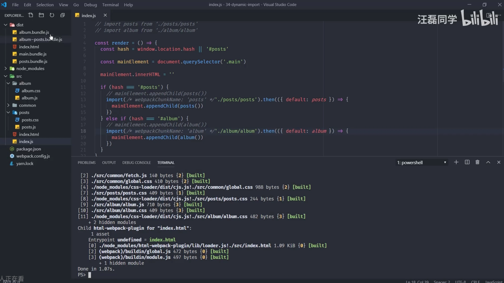

# webpack 的详细解释

## 安装 webpack

```js
 npm install webpack webpack-cli --dev
```

## 配置文件


## webpack 的开发体验

```js
npm webpack-dev-server --open
// 边编译边打包，浏览器自动更新
//跨域则反向代理
```

## 生成 sourcce Map

开始时打包文佳正确找到错误

## 每次打包会更新页面，浏览器自动刷新，导致原来在网页写的编辑器里的内容丢失，为了解决，出现 HMR(模块热更新)

在运行过程中实时替换某个模块，而运行状态不受影响
HMR 集成于 `dev-server --hot`，在配置文件启动 hmr，加对应的 plugins，启动 npm webpack-dev-server --open,
`css` 文件可以热更新是因为 `css` 修改样式直接添加或者覆盖，有规律性，在 loader 里自动处理的热更新，而 js 无规律
但为什么用 vue 或者 react 就没有手动处理热更新，因为这些是框架，每种文件遵循规则，通过脚手架创建的项目都继承了 HMR 方案，就无需手动处理。

**这里是原生 js 写，所以需要手动 hmr，框架开发不用**
**用 hmrapi 还是要启动 hotOnly**

```js
//main.js
import add from "./add";
add(1, 2);
//手动添加hmr
if (module.hot) {
  module.hot.accept("./add", () => {
    console.log("add模块hmr了，这里要手动操作");
  });
}
这些带包后，不会全部打包进dist
```

## 根据不同 mode 环境 配置不同 webpack

1. 用 if 判断开发于生产

```js
module.exports = (env, argv) => {
  const config = {
    mode,
    entry,
    output,
    module,
    plugins,
  };
  if (env === "production") {
    //生产环境
    config.mode = "production";
    config.devtool = false; //禁用sourcemap
    config.plugins = {
      ...config.plugins,
      new CleanWebPlugin(),//开发禁用
      new CoptWebpackPlugin(['public'])//开发禁用
    };
  }
  return config;
};
```

2. 三个配置文件，一个 common，一个 production，一个 developmen

```js
// npm install webpack-merge
const common = require("./webpack.common"); //公共webpack
const merge = require("webpack-merage");
module.exports = merge(common, {
  mode: "production",
  plugins: {},
});
```

## Tree Shaking

前端是使用 ESMoules

```js
// 摇掉代码中未引用部分，在 production 中自动开启
usedExports: true, //只导出外部使用过的成员
minimize: true, //代码压缩
concatenateModules: true, //尽可能将所有模块合并输出到一个函数，减少体积
```

## sideEffects

模块执行时，是否导出成员外所作的事情

```js
--- component
  ---index.js(import,button,div)
  ---button.js(export)
  ---div.js(export)
---index.js(import button from(./component))
//此时虽然只导入button，但还是会打包index所有的button和div
webpack中sideEffects: true, //开启按需导入
在对应的package.json，sideEffects:'false'
```

## 代码分割，分包，代码分割

1. 多入口打包

```js
entry: {
  index: "./src/index";
  albuml'./src/album'
}
output:{
  filename:'[name].bundle.js'
}
plugins:{
  new HTMLwebpackPlugin({
    title:'',
    template:'./src/index.html'
    filename:'index.html',
    chunks:['index']
  })
}
```

- 提取公共模块

```js
splitChunks: {
      chunks: "all", //所有公共模块提取单独bundle中
    },
```

2. 动态导入

- 实现按需加载，自动分包，魔法注释
  

## 提取 css 文件

**MiniCssExtractPlugin**提取 css
**OptimizeCssAssetsWebpackPlugin**压缩 css

- 文件名设置 HASH

```js
new MiniCssExtractPlugin({
  filenaem: "[name]-[chunkhash].bundle.css",
});
```
