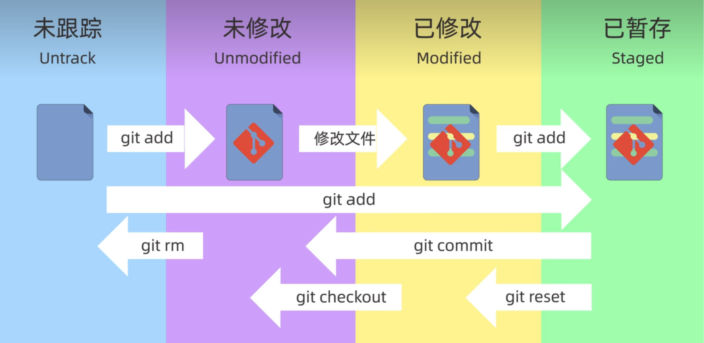

## git学习网站
https://learngitbranching.js.org/

## git初始配置
```shell
git config --global user.name "Jasper Yang"
```
保存用户名和密码，就不用每次重复输入：
```shell
git config --global credential.helper store
```
查看git的配置信息：
```shell
git config --global --list
```
### 具体配置信息
- 省略（Local）：本地配置，只对本地仓库有效
- --global：全局配置，对所有仓库有效
- --system：系统配置，对所有用户生效

usr.name就是说配置的是用户名。
当需要配置邮箱则改一点就行：
```shell
git config --global user.email geekhall.cn@gmail.com
```
后面的就是邮箱地址。

## 新建版本库（仓库）
- 创建仓库
	```shell
	git init
	```
	上面的方法是本地创建仓库，我们也能使用git clone来克隆一个本就存在的仓库。

## git的工作区域和文件状态
### 工作区域
1. 工作区（.git所在的目录）：也就是电脑上的本地文件
2. 暂存区（.it/index）：用于保存即将提交到Git仓库的修改内容
3. 本地仓库（.git/objects）：通过git init创建的仓库

### 文件状态
- 未跟踪（untrack）
- 未修改（Unmodified）
- 已修改（Modified）
- 已暂存（Staged）

上图中展示了各种指令的作用，因为这里也就不再赘述了。

#### git的基础文件指令
```shell
git status        # 查看仓库的状态
git add           # 添加到暂存区
git rm --cached   # 将已经添加到暂存区的文件取出
git commit (-m)  # 提交
                  # -m用于指定文件的备注信息等
                  # 这个信息会被提交
git log           # 查看提交的日志信息
git reset         # 用于回退版本
```
需要注意的是，==commit只会提交暂存区中的文件==

## git基础指令
### 1. 版本提交
```git
git commit
```
该命令用于在当前所处的**分支**上提交新版本。
但是git不会盲目得将所有的内容全部重新提交，它会与上一个版本进行比较，如果有更新，就会在其基础上进行更新。

### 2. 分支创建
```git
git branch <name>
```
该命令用于==创建一个分支==，该分支的根节点是创建分支时所处的根节点。


### 3. 分支切换
```git
git checkout <name>
```
先前我们已经使用了git branch对分支进行了创建，现在我们就可以使用git checkout进行分支切换了，因为git commit等操作是对当前分支进行操作。

### 4. 分支合并
#### (1) git merge
```git
git merge
```
这里用图来理解下：
![[图片资源/git分支合并1.png]]现在有两个分支，main和bugFix，现在我们根据“**星号**”的位置，可知现在我们处于main分支上。
此时我们使用**git merge bugFix**：
![[图片资源/git分支合并2.png]]

#### (2) git rebase
```git
git rebase
```
> git rebase其实就是取出一系列的提交记录，“复制”它们，然后在另一个地方逐个放下去。

![[图片资源/git分支合并3.png]]现在我们处于bugFix分支上，bugFix分支是基于C1的修改，main所处的C2分支也是基于C1的修改，现在使用**git rebase main**对分支进行合并：
![[图片资源/git分支合并4.png]]
需要注意的是：==C3节点并没有消失==。
坦白点说：<font color="red"><b>当你在bugFix分支上运行git rebase main命令时，实际上是将bugFix分支上的提交记录复制并重新应用到main分支上。这意味着Git会先找到bugFix分支与main分支的最近共同祖先，然后将bugFix分支自该祖先以来的提交记录依次复制并在main分支上重新应用。这样可以使得bugFix分支的提交历史与main分支保持在一条直线上，同时整合bugFix分支的改动到main分支上</b></font>。
所以我理解这个语句为：==将根节点重新设定为main所指向的节点==。

### 5. 在git的提交树上移动
#### (1) HEAD
HEAD是当先所在分支的符号引用——也就是指向你正在其基础上进行工作的提交记录。
==HEAD总是指向当前分支上的最后一次提交记录==。
HEAD在通常情况下是指向分支名的。

#### (2) 分离的HEAD
分离的HEAD==指向了某个具体的提交记录而不是分支名==。
在教程中使用的checkout进行切换，切换的目标是对应节点的**哈希值**。
节点的哈希值，我们能够使用**git log**进行查看：
```git
git log
```

#### (3) 相对引用
git中，我们能通过相对引用，从一个易于记忆的节点或者HEAD进行计算：
- **^**：向上移动一个提交记录
- **~\<num>**：向上移动num个提交记录，例如：~3

这里给出两个示例：
```git
HEAD^^
main~3
```

#### (4) 强制修改分支位置
```git
git branch -f main HEAD~3
```
上面的命令会将main分支强制指向HEAD的第3级parent提交。

#### (5) 撤销变更
Git中撤销变更的方式很多，主要的命令有两个：**git reset**和**git revert**，这两个是有区别的。
reset在本地好用，就是版本回退，但是如果是在分布式协作的时候就需要使用revert了，它不是直接回退，而是将更新一个版本，这个版本与需要回退的版本一样。
```git
git reset
git revert
```
==需要配合参数使用==，表示需要回退多少个版本：
```git
git reset HEAD~1
```

### 6. 整理提交记录
```git
git cherry-pick
```
该指令用于将节点复制到目前分支上。
这跟之前的rebase有点类似。
==cherry-pick适用于知道节点hash值的情况==。

### 7. 交互式rebase
交互式rebase其实就是rebase使用参数"**-interactive**"，缩写为"**-i**"，其余与之前rebase的一样。
```git
git rebase -i main~4
```
它会将main~4的一系列指令进行一个复制操作，然后它会弹出一个UI对话框，其中可以选择拖拽更换节点位置，或者使用pick对节点进行一个“删除”，这样它不会对该节点进行复制。

### 8. 设定里程碑
**里程碑**将==固定指向某个节点==，因此也叫做里程碑。
```git
git tag version1 C1
```
这会将节点C1命名为version1，那么现在version1就表示C1。

### 9. 添加标签
这个标签就是==对该节点的描述==：
```git
git describe <ref>
```
其中ref可以是任意可以表示该节点的方法，不管是tag、hash值和HEAD都行。
使用后会有一个输出，格式如下：
```git
<tag>_<numCommits>_g<hash>
```
- tag：离ref最近的标签
- numCommits：ref和tag相距多少个commit
- hash：给定的ref的hash值，若是ref有标签，则输出标签

## 绑定远程仓库
我们可以使用clone指令和remote指令绑定远程仓库，例如在Github和Gitee创建的。
```git
git clone <url>

git remote <url>
```
这两个指令相对来说比较复杂，建议看看官方的git教程。

## 克隆远程仓库
我们常常把代码托管在远程仓库，当我们想要==拉取自己或者别人的远程仓库的时候，我们通常会使用clone指令==：
```git
git clone <url>
```
这样就能将仓库中的所有文件全部完整的拉取下来，包括原本的分支情况和标签等等信息。
==这些信息都会存储在该文件夹的**.git**中。

## 同步远程仓库
当本地仓库的内容发生了修改，我们想要将修改后的内容推送到远程仓库中，这时候，我们就需要==将我们已经修改好的内容进行一个**推送**（push）==，因为是将本地已经修改好的内容推送，理所应当的==是这个被修改了的文件在本地应该处于commit状态==，然后我们就能使用git push进行同步了。
```git
git push [-option]
```

## 使用远程仓库覆盖本地仓库
首先此时我们先要确定本地仓库已经和远程仓库连接了：
```git
git remote -x
```
使用这个指令可以看到远程仓库源。
然后将远程仓库的内容拉取到本地：
```git
git fetch origin
```
但是，==这样拉取到本地的内容不会自动合并==，于是我们需要合并代码：
1. 首先切换到想要进行覆盖的远程分支：
	```git
	git checkout <remote-branch-name>
	```
	这样，工作区就被切换到需要进行覆盖的远程分支了。
2. 对本地仓库进行重设：
	```git
	git reset --hard origin/<remote-branch-name>
	```
3. 然后将本地进行覆盖后的内容推送到远程仓库：
	```git
	git push origin <remote-branch-name> --force
	```
	这段代码会==会强制推送本地仓库内容到远程仓库，覆盖远程分支==。