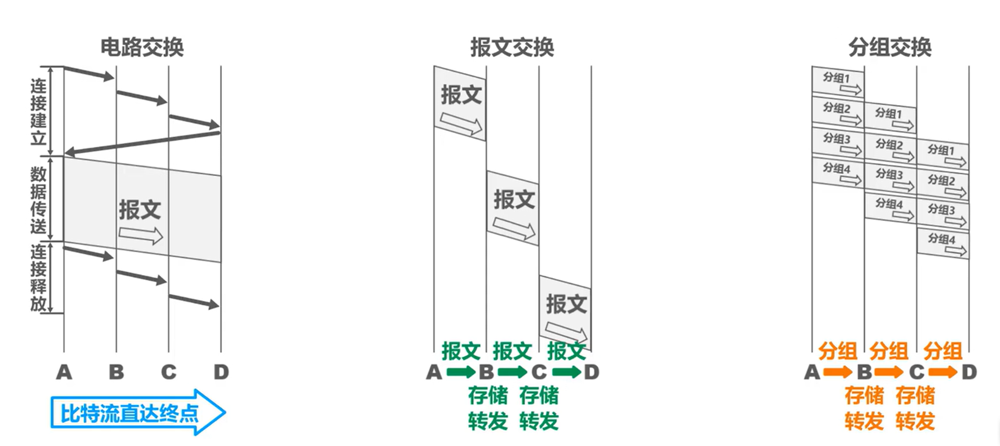
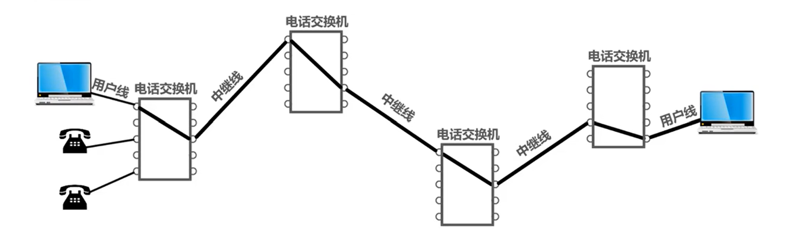
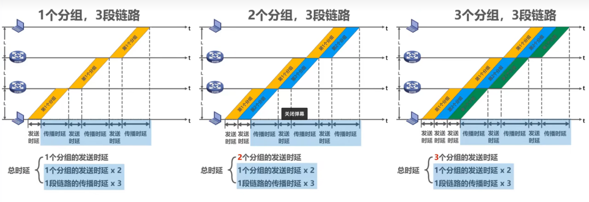
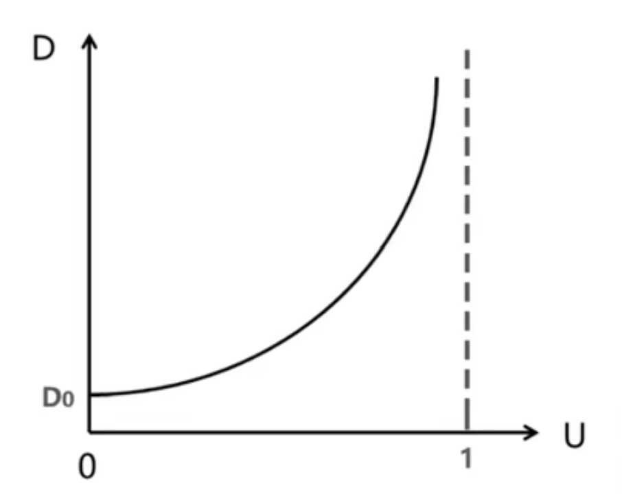
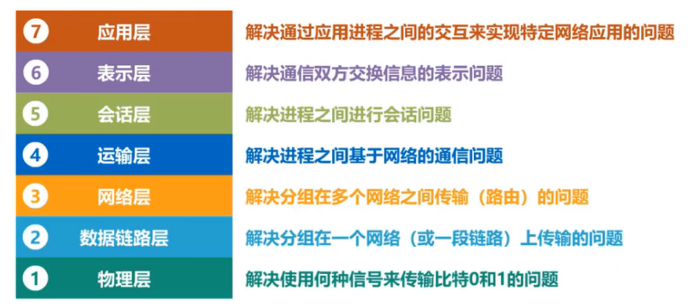
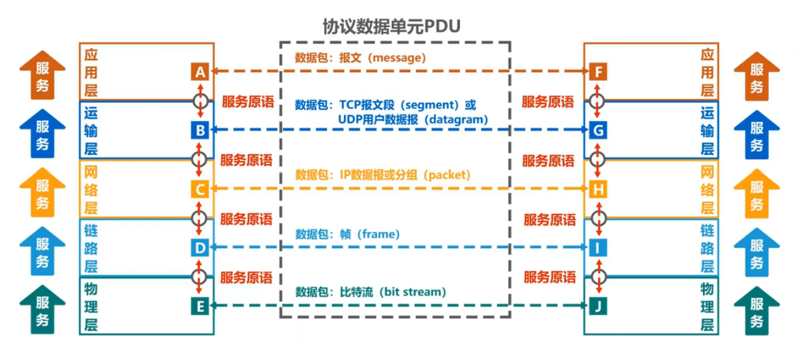

# 第一章
## 1.2  网络、互联网和因特网
- 网络由若干==**结点**==和连接这些结点的==**链路**==组成
- 互联网：多个网络通过路由器互连起来形成的==网络的网络==
- 世界上最大的互联网：因特网（Internet）
- internet与Internet不一样，前者是一个通用名词，而后者专指因特网
- ISP（因特网服务提供商、网络服务提供商）
	1. 主干ISP
	2. 地区ISP
	3. 本地ISP
	4. ……
- IXP：使两个==同层次==的网络直接相连而不需要上层ISP提供服务
- 因特网的组成
	- 边缘部分：由所有连接在因特网上的==主机==组成。这部分是==用户直接使用==的，用来进行==通信==（传送数据、音频或视频）和==资源共享==
	- 核心部分：由==大量网络==和连接这些网络的==路由器==组成。这部分是==为边缘部分提供服务==的（提供连通性和交换）
## 1.3  三种交换方式

#### 电路交换

- 电路交换的三个步：
	1. 建立连接（分配通信资源）
	2. 通话（一直占用通信资源）
	3. 释放连接（归还通信资源）
- ==当使用电路交换来传送计算机数据时，其线路的传输效率往往很低==
- 优点：
	1. 通信时延小
	2. 有序传输
	3. 无冲突
	4. 适用范围广
	5. 实时性强
	6. 控制简单
- 缺点：
	1. 建立连接时间长
	2. 线路独占，使用效率低
	3. 灵活性差
	4. 难以规格化
#### ==分组交换==
- 需要发送的数据叫做==**报文**==
- 发送报文之前，将报文划分成==等长数据段==，在每段数据段的前面，加上==首部（首部由必要的控制信息组成）==，这就成为了一个==**分组**==
- 各成分需要完成的任务：
	- 发送方：构造分组，发送分组
	- 路由器：缓存分组，转发分组
	- 接收方：接受分组，还原报文
- 优点：
	1. 无需建立连接
	2. 线路利用率高
	3. 简化了存储管理（==相对于报文交换而言==）
	4. 加速传输
	5. 减少出错概率和重发数据量
- 缺点：
	1. 引起了转发时延
	2. 需要额外传输的信息量增大
	3. 对于数据报服务，存在失序、丢失或者重复分组的问题；对于虚电路服务，存在呼叫建立、数据传输和虚电路释放三个过程
#### 报文交换
类似于分组交换，但是需要路由器有很大的缓存空间，因为是将整个报文直接发送
- 优点：
	1. 无需建立连接
	2. 动态分配线路
	3. 提高线路可靠性
	4. 提高线路利用率
	5. 提供多目标服务
- 缺点：
	1. 引起了转发时延
	2. 需要较大的缓存空间
	3. 需要传输额外的信息量
- **例：要传输的报文共x（bit），从源点到终点共经过k段链路，每段链路的传播时延为d（s），带宽为b（bit/s）。在电路交换时，电路的建立时间为s（s）。在分组交换时，报文可被划分为若干个长度为p（bit）的数据段，添加首部后即可构成分组，假设分组首部的长度以及分组在各结点的排队等待时间忽略不计。问：在怎样的条件下，电路交换的时延比分组交换的要大？**
## 1.4  计算机网络的定义和分类
#### 计算机网络的定义
- 计算机网络的精确定义并未统一
- 最简单的定义：一些==互==相==连==接的、==自治==的计算机的==集合==
	- 互连：是指计算机之间可以通过有线或无线的方式进行数据通信
	- 自治：是指独立的计算机，它有自己的硬件和软件，可以单独运行使用
	- 集合：至少需要两台计算机
- 计算机网络的较好的定义：计算机网络主要是由一些==通用的、可编程的硬件互连==而成的，而这些硬件并非专门用来实现某一特定目的（例如：传输数据或视频信号）。这些可编程的硬件能够用来==传送多种不同类型的数据==，并能==支持广泛的和日益增长的应用==
#### 计算机网络的组成
- 软件
- 硬件
- 协议
#### 计算机网络的分类
- 按技术交换分类：
	- 电路交换网络
	- 报文交换网络
	- 分组交换网络
- 按使用者分类：
	- 公用网
	- 专用网
- 按传输介质分类：
	- 有线网络
	- 无线网络
- 按覆盖范围分（==其实还是看使用的技术==）
	- 广域网WAN
	- 城域网MAN
	- 局域网LAN
	- 个域网PAN
- 按拓扑结构分
	- 总线型网络
	- 星形网络
	- 环形网络
	- 网状形网络
## 1.5  计算机网络的性能指标
#### 速率
- 比特：
	- 计算机中==**数据量的单位**==，也就是信息论中信息量的单位，一个比特就是二进制数字中的一个1或0
	- 常用数据量单位：
		- 8 bit = 1 Byte
		- KB = 210 B
		- MB = K • KB = 210•210 B = 220 B
		- GB = K • MB = 210 • 220 B = 230 B
		- TB = K • GB = 210 • 230 B = 240 B
- 速率：
	- 连接在计算机网络上的主机在数字信道上传送**比特**的速率，也被称为==比特率==或==数据率==
	- 常用数据率单位：（注意大小写）
		- bit/s（b/s，bps）
		- ==k==b/s = 103b/s（bps）
		- ==M==b/s = k•kb/s = 103 • 103 b/s = 106 b/s（bps）
		- ==G==b/s = k•Mb/s = 103 • 106 b/s = 109 b/s（bps）
		- ==T==b/s = k•Gb/s = 103 • 109 b/s = 1012 b/s（bps）
- **例：有一个待发送的数据块，大小为100MB，网卡的发送速率为100Mbps，则网卡发送完该数据块需要多长时间？**
$$ 
{100MB \over 100Mbps} = {MB \over Mbps} 
= {2^{20}B \over 10^6b/s}
= {2^{20}•8b \over 10^6b/s}
= 8.388608s
$$
#### 带宽
- 带宽在模拟信号系统中的意义：（原本的意义）
	- ==信号==所包含的各种不同频率成分所占据的==**频率范围**==
	- 单位：Hz（kHz，MHz，GHz）
- 带宽在计算机网络中的意义：
	- 用来表示网络的==通信线路==所能传送数据的能力，因此网络带宽表示在单位时间内能从网络中的某一点到另一点所能通过的“==最高数据率==”
	- 单位：b/s（kb/s，Mb/s，Gb/s，Tb/s）
#### 吞吐量
- 吞吐量表示在==单位时间内通过某个网络（或信道、接口）的数据量==
- 吞吐量被经常用于对现实世界中的网络的一种测量，以便知道实际上到底有多少数据能够通过网络
- 吞吐量==受网络的带宽或额定速率的限制==
#### 时延

###### 计算方法结论：

- 网络时延：
	- 发送时延
	$$
	{分组长度(b) \over 发送速率(b/s)}
	$$
	- 传播时延
	$$
	\begin{aligned}
	&{信道长度(m) \over 电磁波传播速率(m/s)} \\
	\\
	&自由空间= 3×10^8m/s\\
	&铜线：2.3×10^8m/s\\
	&光纤：2×10^8m/s
	\end{aligned}
	$$
	- 处理时延（一般不方便计算）
		- 处理时延
		- 排队时延
- **例：数据块长度为100MB，信道带宽为1Mb/s，传送距离为1000km，计算发送时延和传播时延**
$$
	\begin{aligned}
	&发送时延={分组长度(b) \over 发送速率(b/s)}\\
	&={100×2^{20}×8(b) \over 10^8(b/s)}\\
	&=838.8608(s)\\
	&传播时延={信道长度(m) \over 电磁波传播速率(m/s)}\\
	&= {1000×10^3(m) \over 2×10^8(m/s)}\\
	&=0.005(s)
	\end{aligned}
	$$
#### 时延带宽积
$$
	时延带宽积=传播时延×带宽
	$$

- 若发送端连续发送比特，则在所发送的第一个比特即将到达终点时，发送端就已经发送了时延带宽积个比特
#### 往返时间（RTT）
- 发送端将信息发送到接收端并且受到接收端发送的确认接收的信息所需要的时间，即==通信双方交互一次所耗费的时间==
#### 利用率
- 利用率：
	- 信道利用率：用来表示某信道有百分之几的时间是被利用的（有数据通过）
	- 网络利用率：**全网络的信道利用率的加权平均**
- 根据排队论，当某信道的利用率增大时，该信道引起的时延也会迅速增加
- 因此，==信道利用率并非越高越好==
- 如果令D0表示网路空闲时的时延，D表示网络当前的时延，那么在适当的假定条件下，可以用下面的简单公式来表示D、D0和利用率U之间的关系
	- 当网络利用率达到50%时，时延就要加倍
	- 当网络利用率超过50%时，时延急剧增大
	- 当网络的利用率接近100%时，时延就趋于无穷大

$$
	D={D_0 \over 1-U}
	$$

#### 丢包率
- 丢包率即分组丢失率，是指在一定的时间内，传输过程中==丢失的分组数量与总分组数量的比率==
- 丢包率具体可分为接口丢包率、节点丢包率、链路丢包率、路径丢包率、网络丢包率等
- 丢包率时网络运维人员非常关心的一个网络性能指标，但对于普通用户来说往往并不关心这个指标，因为他们通常意识不到网络丢包
- 分组丢失主要有两种情况：
	- 分组在传输过程中出现==误码==，被结点丢弃
	- 分组到达一台队列已满的分组交换机时被丢弃，在通信量较大时就可能造成==网络拥塞==
- 丢包率反映了网络的拥塞情况：
	- 无拥塞时路径丢包率为0
	- 轻度拥塞时路径丢包率为1%~4%
	- 严重拥塞时路径丢包率为5%~15%
## 1.6  计算机网络体系结构
#### 常见的计算机网络体系结构
- OSI体系结构（==法律==上的体系结构）
- TCP/IP体系结构（==事实==上的体系结构）

- 原理体系结构
	- 其实就是将TCP/IP的网络接口层细分为==数据链路层==和==物理层==
#### 计算机网络体系结构分层的必要性
- ==计算机网络是个非常复杂的系统==
- ”==分层==“可将庞大而复杂的问题，转化为若干较小的局部问题。而这些较小的局部问题就比较易于研究和处理
#### 计算机网络体系结构中的专业术语
- 实体：任何可发送或接收信息的==硬件==或==软件进程==
- 对等实体：收发双方==相同层次中的实体==
- 协议：控制两个对等实体进行==逻辑通信（只是假设出来的通信，实际并不存在）==的规则的集合
- 协议的三要素：
	- 语法：定义所交换信息的格式
	- 语义：定义收发双方所要完成的操作
	- 同步：定义通讯双方的时序关系
- 在协议的控制下，两个对等实体间的逻辑通信使得本层能够向上一层提供服务
- 要实现本层协议，还需要使用下面一层提供的服务
- 协议是“==水平的==”，协议是“==垂直的==”
- 实体是看得见相邻下层所提供的服务，但并不知道实现该服务的具体协议。也就是说，下面的协议对上面的实体是“==透明==”的
- 服务访问点：在同意系统中==相邻两层的实体交换信息的逻辑接口==，用于区分不用的服务类型
	- 数据链路层的服务访问点为帧的“类型”字段
	- 网络层的服务访问点为IP数据报首部中的“协议字段”
	- 运输层的服务访问点为“端口号”
- 服务原语：上层使用下层所提供的服务必须通过下层==交换一些命令==，这些命令称为服务原语
- 协议数据单元PDU：==对等层次之间传送的**数据包**==称为该层的协议数据单元
- 服务数据单元SDU：==同一系统内，层与层之间交换的数据包==称为服务数据单元

## 第二章
[计算机网络第二章](计算机网络/计算机网络（第二章）.md)