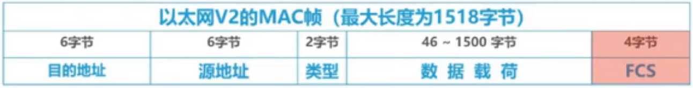
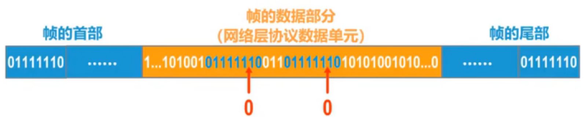
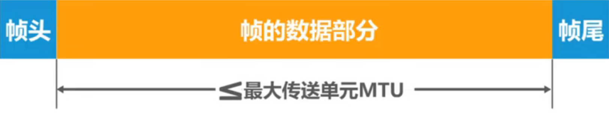
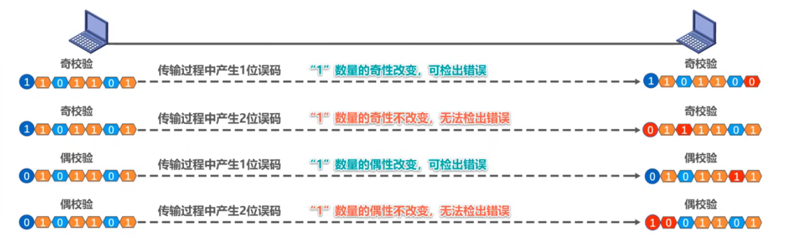
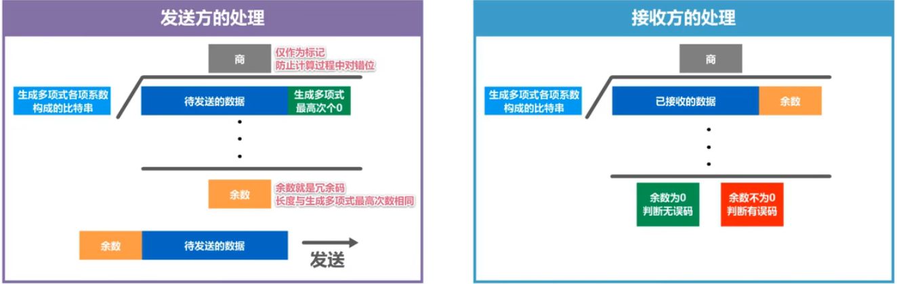
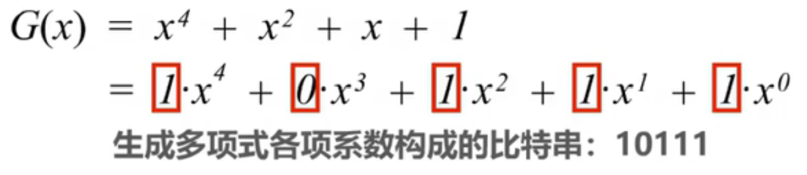
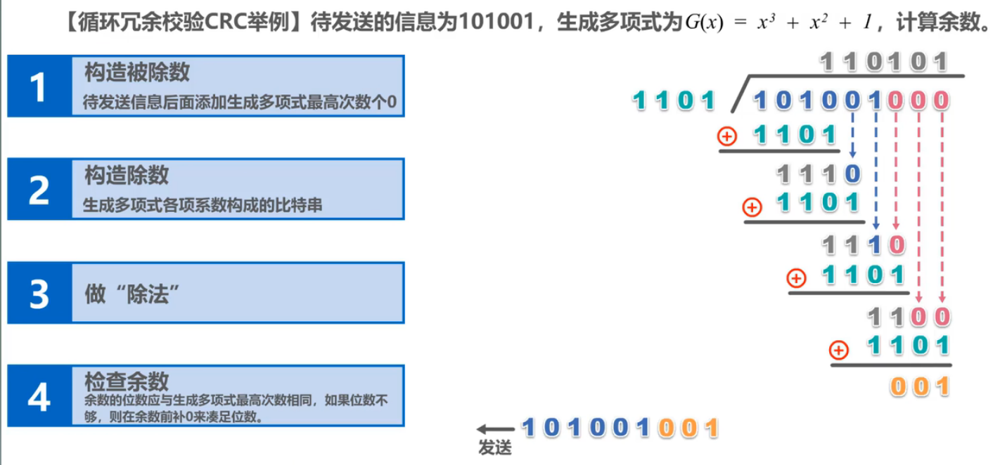
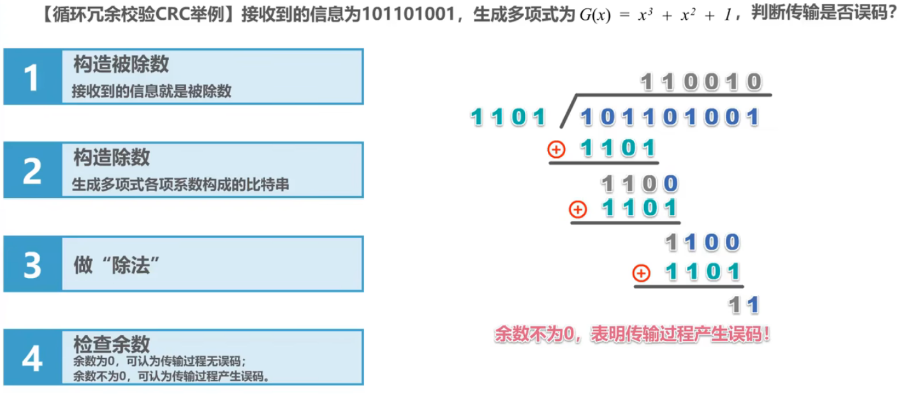
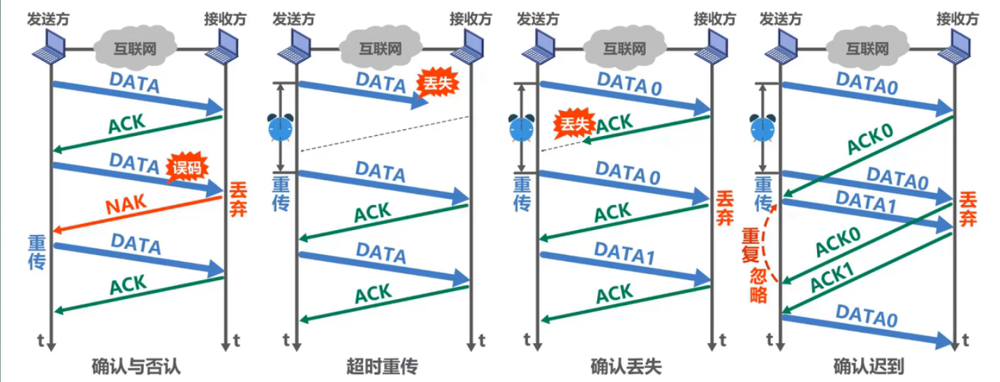
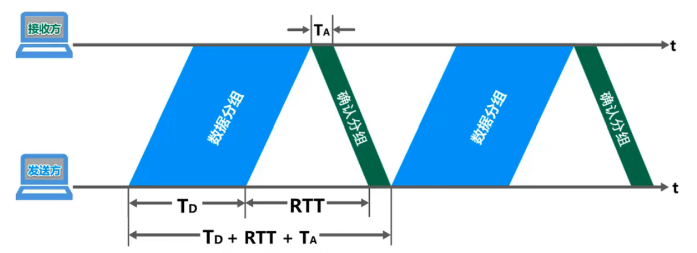

# 第三章
## 3.1  数据链路层概述
- ==链路==（Link）就是从一个结点到相邻结点的一段物理线路，而中间没有任何其他的交换节点
- ==数据链路==（Data Link）是指把实现通信协议的硬件和软件加到链路上，就构成了数据链路
- 数据链路层以==帧==为单位传输和处理数据
- 数据链路层的三个重要问题：
	- 封装成帧：将上层交付的==网络层协议数据单元==添加==帧头和帧尾==，使其封装成帧
	- 差错检测：发送方在发送帧之前，基于待发送的数据和检错算法计算出==检错码==，并将其封装在==帧尾==；接收方主机在接收到数据之后通过检错码和检错算法就可以判断帧在传输过程中是否出现了误码
	- 可靠传输：==尽管误码是不能完全避免的，但若能实现发送方发送什么，接受方就能接收到什么，就称为可靠传输==
## 3.2  封装成帧
- 封装成帧是指数据链路层给上层交付的协议数据单元添加帧头和帧尾使之成为帧
	- 帧头和帧尾中包含有重要的控制信息
	- 帧头和帧尾的作用之一就是==帧定界==（并不是每一种协议都有帧定界）
- 透明传输：是指==数据链路层对上层交付的传输数据没有任何限制==，就好像是数据链路层不存在一样
	- 面向字节的物理链路使用==字节填充==（或称==字符填充==）的方法实现透明传输；即在数据中，出现的每一个帧定界符和转义字符前添加一个转义字符
	- 面向比特的物理链路使用比特填充的方法实现透明传输；即：每出现5个1就在后面添加一个0，在接收数据的时候将添加的0剔除即可（==零比特填充法==）
- 为了提高帧的传输效率，应当使==帧的数据部分的长度尽可能大些==
- 考虑到差错控制等多种因素，每一种数据链路层协议都规定了帧的数据部分的长度上限，即==最大传送单元MTU==（Maximum Transfer Unit）
## 3.3  差错检测
- 实际的通信链路都不是理想的，比特在传输过程中可能会产生差错：1可能变成0，而0也可能变成1。这称为==比特差错==
- 在一段时间内，传输错误的比特占所传输总比特总数的比率称为==误码率BER==（Bit Error Rate）
- 使用==差错检测码==来检测数据在传输过程中是否产生了比特差错，使数据链路层所要解决的重要问题之一
#### 奇偶校验
- 在待发送的数据后面==添加1位奇偶校验位==，使整个数据（包括所添加的校验位在内）中==”1“的个数==为奇数（奇校验）或偶数（偶校验）
#### 循环冗余校验CRC（Cyclic Redundancy Check）

- 收发双方约定好一个==生成多项式==G(x)
	- 常用的生成多项式
	$$ 
	\begin{aligned}
	&CRC-16=x^{16}+x^{15}+x^2+1\\
	&CRC-CCITT=x^{16}+x^{12}+x^5+1\\
	&CRC-32=x^{32}+x^{26}+x^{23}\\
	\end{aligned}
	$$
	- ==算法规定生成多项式必须包含最低项==
- 发送方基于待发送的数据和生成多项式计算（==使用**模2除法**==）出差错检测码（==冗余码==），将其添加到传输数据的后面一起传输
- 接收方通过生成多项式来计算是否生成了误码
- ==检错码==只能检测出帧在传输过程中出现了差错，但并不能定位错误，因此==无法纠正错误==
- 要想纠正传输中的差错，可以使用冗余信息更多的==纠错码==或==前向纠错==。但纠错码的开销比较大，在==计算机网络中较少使用==
- 循环冗余校验==CRC==有很好的检错能力（==漏检率非常低==），虽然计算比较复杂，但非常==易于用硬件实现==，因此被==广泛应用于数据链路层==
- 在计算机网络中通常采用==检错重传方式来纠正传输中的差错==，==或者仅仅是丢弃检测到差错的帧==，这取决于数据链路层向其上层提供的是可靠传输服务还是不可靠传输服务
- 例：
- 例2：
## 3.4.1  可靠传输的基本概念
- 使用==差错检测技术==（例如循环冗余校验CRC），接收方的数据链路层就可检测出帧在传输过程中是否产生了==误码==（比特错误）
- 数据链路层向上层提供的服务类型：
	- ==不可靠传输服务==：==仅仅丢弃有误码的帧==，其他什么也不做
	- ==可靠传输服务==：想办法实现==发送端发送什么，接收端就接收到什么==
- **一般情况下**，==有线链路==的误码率比较低，为了减少开销，并==不要求数据链路层==向上提供==可靠==传输服务。既是出现了误码，可靠传输的问题由其上层处理
- ==无线链路==易受干扰，误码率比较高，因此==要求数据链路层==必须向上层提供==可靠==传输服务
- ==比特差错==只是传输差错中的一种
- 从整个计算机网络体系结构来看，传输差错还包括==分组丢失、分组失序==以及==分组重复==（**注意这里使用的是分组，说明传输差错不仅仅局限于数据链路层的比特差错**）
- 分组丢失、分组失序以及分组重复这些传输差错，一般不会出现在数据链路层，而会出现在其上层
- ==可靠传输服务不仅局限于数据链路层==，其他各层均可选择实现可靠传输
- 可靠传输的实现比较复杂，开销也比较大，是否使用可靠传输取决于应用需求
## 3.4.2  可靠传输的实现机制
- 实现机制：
	- 停止-等待协议SW
	- 回退N帧协议GBN
	- 选择重传协议SR
- ==这三种可靠传输实现机制的基本原理并不仅限于数据链路层，可以应用到计算机网络体系结构的各层协议中==
## 3.4.3  停止-等待协议SW（Stop-and-Wait）

- **注意：确认迟到中的最后一次传输的DATA0是不同于第一次传输的DATA0的分组**
- **如果在数据链路层使用”停止-等待”协议，由于数据链路层的往返时间比较确定，一般不会出现“确认迟到“的情况，因此，可以不用给确认分组信号**
- ==注意事项：==
	- 接收端检测到数据分组有误码时，将其丢弃并等待发送方的超时重传。但对于误码率较高的点对点链路，为使发送方==尽早重传==，也可==给发送方发送NAK分组==
	- 为了让接收方能够判断收到的数据分组是否是重复的，需要给==数据分组编号==。由于停止-等待协议的停等特性，==只需要1个比特编号==就够了，即编号0和1
	- 为了让发送方能够判断所受到的ACK分组是否是重复的，需要给==ACK分子编号==，所用比特数量==与数据分组编号所用比特数量一样==。数据链路层一般不会出现ACK分组迟到的情况，因此在==数据链路层实现停止-等待协议可以不用给ACK分组编号
	- 超时计时器设置的==重传时间==应仔细选择。一般可将重传时间选为==略大于“从发送方到接收方的平均往返时间”
		- 在数据链路层点对点的往返时间比较确定，重传时间比较好设定
		- 然而在运输层，由于端到端往返时间非常不确定，设置合适的重传时间有时并不容易

- 个人总结：
	- 在发送端发送Data后，接收方会返回ACK/NAK作为信号
	- 具有超时重传机制
	- 会给数据分组DATA带上**序号**，以此来避免数据重复
	- ACK也会带上**序号**，避免确认数据的重复
	- 上面所说的序号只需要占用一个bit，这是因为SW的停等特性，它只需要0和1就能避免重复问题
	- 数据链路层可以不给ACK序号
	- 重传时间需要精心选择：==”略大于从发送方到接受方的平均往返时间“==

- 停止-等待协议的信道利用率$$
	信道利用率U={T_D \over T_D+RTT+T_A}
	$$
	- ==当往返时延RTT远大于数据帧发送时延TD时（例如使用卫星链路），信道利用率非常低==
	- 若出现重传，则对于传送有用的数据信息来说，信道利用率还要降低
	- 为了克服停止-等待协议信道利用率很低的缺点，就产生了另外两种协议，即后退N帧协议GBN和选择重传协议SR
## 3.4.3  回退N帧协议GBN（Go_Back_N）
该协议也被称为**滑动窗口协议**：
![[img/回退N帧协议原理.png]]
1. 采用3bit给分组编序号，即序号0~7
2. **发送窗口**的尺寸WT的取值（==因为编号是从0开始的==）：
$$
1<W_T<=2^3-1
$$
3. **接收窗口**的尺寸WR的取值：
$$
W_R=1
$$
- 累计确认：
	- 接收方==不一定==要对收到的数据分组==逐个发送确认==，而是可以在收到几个数据分组后（由具体实现决定），==对按序到达的最后一个数据分组发送确认==，ACKn标识序号为n==以及==以前的所有数据分组都已正确接收
![[img/GBN错误情况.png]]
- 若是出现了差错，在传输过程中出现了误码，将==最后一个确认接收的分组的确认分组发送n次，在本例中，是发送4个ACK4==
- 若是发送方==收到了重复的确认分组==。就知道分组在传输的过程中出现了差错，因此，==无需等待超时计时器就能够开始重传==

> 当通信线路信号不好时，GBN效率不比SW高

![[img/GBN总结.png]]

## 3.4.4 选择重传协议（SR）

- **回退N帧协议**的接收窗口尺寸==WT只能等于1==，因此==接收方只能按顺序接收正确到达的数据分组==
- 一个数据分组的误码就会导致后续多个数据分组不能被接收方按序接收而丢失（尽管它们无乱序和乱码，即是：正确的）。这必然会造成发送方对这些数据分组的超时重传，显然是对通信资源的极大浪费
- 为了进一步提高性能，可设法只重传出现误码的数据分组。因此。接收窗口的尺寸==WR不应再等于1（而应大于1）==，以便==接收方先收下失序但无误码并且序号落在接收窗口内的那些数据分组==，等到所缺分组收齐后再一并送交上层，这就是**选择重传协议**
- 注意：选择重传协议为了使发送方仅重传出现差错的分组，接收方==不能再采用累计确认==，而需要对每个正确接收到的数据分组进行==逐一确认==

![[img/选择重传协议原理.png]]
- 发送方的发送窗口尺寸WT必须满足：
	$$
	1<W_T<=2^{(n-1)}
	$$
	其中==n是构成分组序号的比特数量==：
	- 若WT=1：与停止-等待协议相同
	- 若WT>2(n-1)：造成接收方无法分辨新、旧数据分组
- 接收方的接收窗口尺寸WR必须满足：
	$$
	1<W_R<=W_T
	$$
	若是不满足，就会出问题：
	- 若W_R=1，与回退N帧协议相同
	- 若W_R>W_T：无意义

## 3.5 点对点协议PPP（Point-to-Point Protocol）
- 点对点协议PPP是目前使用最广泛的点对点==数据链路层协议==![[img/PPP协议.png]]

- PPP协议为在点对点链路传输各种协议数据报提供了一个标准方法，主要由以下三部分构成：
	- 各种协议数据报的封装方法（封装成帧）
	- 链路控制协议LCP：用于建立、配置以及测试数据链路的连接
	- 套网络控制协议NCPS：其中的每一个协议支持不同的网络层协议
- PPP帧：![[img/PPP帧具体内容.png]]
- PPP的透明传输：![[img/PPP的透明传输.png]]
	- 异步链路：通过使用不同部件和电信号，使数据流动更加灵活，可以根据需要进行数据的部分传输和处理
	- 同步链路：同步电路使用时钟信号来同步数据的传输和处理，数据以bit为单位进行操作（需要在传输的数据中加入**时钟信号**）
- 透明传输——面向字节的异步链路（字节填充法）：![[img/透明传输——面向字节的异步链路.png]]
	- 发送方的处理：
		- 出现的每一个7E（PPP帧的定界符）字节转变成2字节序列（7D,5E）
		- 出现的每一个7D（转义字符）字节转变成2字节序列（7D,5D）
		- 出现的每一个ASCII码控制字符（数值小于0x20的字符），则在该字符前面插入一个7D字节，同时将该字符的编码加上0x20
	- 接收方的处理：进行**反变换**即可恢复出原来的帧的数据部分
- 透明传输——面向比特的同步链路（比特填充法）：![[img/透明传输——面向比特的同步链路.png]]
	- 发送方的处理：对帧的数据部分进行扫描（一般由硬件实现）。只要发现5个连续的比特1，则立即填充1个比特0
	- 接收方的处理：对帧的数据部分进行扫描（一般由硬件实现）。只要发现5个连续的比特1，就把其后的1个比特0删除
- PPP的差错检测：![[img/PPP的差错检测.png]]
- 接收方每收到一个PPP帧，就进行CRC检验。若CRC检验正确，就收下这个帧；反之，就丢弃这个帧。==使用PPP的数据链路层向上不提供可靠传输服务==
- PPP的工作状态：![[img/PPP的工作状态.png]]

## 3.6.1 媒体接入控制的基本概念
- 共享信道要着重考虑的一个问题就是如何协调多个发送和接收站点对一个共享传输媒体的占用，即**媒体接入控制MAC**(Medium Access Control)，也叫**MAC协议**![[img/总线型传输出现数据碰撞.png]]
- 媒体接入控制的方法：![[img/媒体接入控制的方法.png]]

## 3.6.2 媒体介入控制——静态划分信道
- 信道复用：![[img/信道复用.png]]
	- 复用（Multiplexing）是通信技术中的一个重要概念。复用就是通过一条物理线路同时传输多路用户的信号
	- 当网络中==传输媒体的传输容量大于多条单一信道传输的总通信量时==，可利用复用技术在一条物理线路上建立多条通信信道来充分利用传输媒体的带宽
- **频分复用FDM**：频分复用的所有用户同时占用不同的频带资源并行通信![[img/频分复用.png]]
- **时分复用TDM**：时分复用的所有用户在不同的时间占用同样的频带宽度![[img/时分复用.png]]
- **波分复用WDM**：![[img/波分复用.png]]
- **码分复用CDM**：
	- 码分复用CDM是另一种共享信道的方法。实际上，由于该技术主要用于多址接入，人们更常用的名词是**码分多址CDMA**(Code Division Multiple Access)
	- 同理，频分复用FDM和时分复用TDM同样可用于多址接入，相应的名词是**频分多址FDMA**(Frequency Division Multiple Access)和**时分多址TDMA**(Time Division Multiple Access)
	- 在本课程中，我们不严格区分复用与多址的概念。可简单理解如下：
		- 复用是将单一媒体的频带资源划分成很多子信道，这些子信道之间相互独立，互不干扰。从媒体的整体频带资源上看，每个子信道只占用该媒体频带资源的一部分
		- 址（更确切地应该称为多点接入）处理的是动态分配信道给用户。这在用户仅仅暂时性地占用信道的应用中是必须的，而所有的移动通信系统基本上都属于这种情况。相反，在信道永久性地分配给用户的应用中，多址是不需要的（对于无线广播或电视广播站就是这样）
		- 某种程度上，FDMA、TDMA、CDMA可以分别看成是FDM、TDM、CDM的应用
	- 在CDMA中，每一个比特时间再划分为m个短的间隔，称为**码片（Chip）**。通常m的值是64或128
	- 使用CDMA的每一个站被指派一个唯一的**m bit码片序列(Chip Sequence)**
		- 个站如果要发送比特1，则发送它自己的mbit码片序列；
		- 个站如果要发送比特0，则发送它自己的mbit码片序列的二进制反码
	- 码片序列的挑选原则如下：
		1. 分配给每个站的码片序列必须各不相同，实际常采用**伪随机码序列**
		2. 分配给每个站的码片序列必须**相互正交**（规格化内积为0）：==令向量S表示站S的码片序列，令向量T表示其他任何站的码片序列。两个不同站S和T的码片序列正交，就是向量S和T的规格化内积为0==
		$$
		{S}\cdot{T}=\frac{1}{m}\sum{S_iT_i=0}
		$$
	- 例1：![[img/码分复用例1.png]]
	- 例2：![[img/码分复用例2.png]]
	- 例3：![[img/码分复用例3.png]]

## 3.6.3 媒体介入控制——动态接入控制——随机接入
**载波监听 多址接入/碰撞检测CSMA/CD（Carrier Sense Multiple Access/Collision Detection)**
- 每个词的解释：
![[img/载波监听多址接入碰撞检测.png]]
- **争用期（碰撞窗口）**：![[img/CSMACD争用期.png]]
- **最小帧长**：
	- ==以太网规定最小帧长为64字节==，即512比特（512比特时间即为争用期）
		- 如果要发送的数据非常少，那么必须加入一些填充字节，使帧长不小于64字节
	- 以太网的==最小帧长确保了主机可在帧发送完成之前就检测到该帧的发送过程中是否遭遇了碰撞==
		- 如果在争用期（共发送64字节）没有检测到碰撞，那么后续发送的数据就一定不会发生碰撞
		- 如果在争用期内检测到碰撞，就立即中止发送，这时已经发送出去的数据一定小于64字节，因此凡长度小于64字节的帧都是由于碰撞而异常中止的无效帧
- **最大帧长**：![[img/CSMACD最大帧长.png]]
- **截断二进制直属退避算法**：![[img/截断二进制直属退避算法.png]]
	- 若连续多次发生碰撞，就表明可能有较多的主机参与竞争信道。但使用上述退避算法可==使重传需要推迟的平均时间随重传次数而增大==（这也称为==动态退避==），因而==减小发生碰撞的概率==，有利于整个系统的稳定
	- ==当重传达16次仍不能成功时==，表明同时打算发送帧的主机太多，以至于连续发生碰撞，则==丢弃该帧==，并向高层报告
	- **该算法用于计算退避时间**
- **信道利用率**：![[img/CSMACD信道利用率.png]]
  - 帧接收流程：![[img/CSMACD帧接收流程.png]]
  - 例1：![[img/CSMACD例1.png]]

## 3.6.3 媒体介入控制——动态接入控制——随机接入
**载波监听 多址接入/碰撞避免CSMA/CA（Carrier Sense Multiple Access/Collision Avoidance)**
- ==在无线局域网中，仍然可以使用载波监听多址接入CSMA==，即在发送帧之前先对传输媒体进行载波监听。若发现有其他站在发送帧，就推迟发送以免发生碰撞。
- ==在无线局域网中，不能使用碰撞检测CD==，原因如下：
	- 于无线信道的传输条件特殊，其信号强度的动态范围非常大，无线网卡上接收到的信号强度往往会远远小于发送信号的强度（可能相差百万倍）。==如果要在无线网卡上实现碰撞检测CD，对硬件的要求非常高==
	- 使能够在硬件上实现无线局域网的碰撞检测功能，但由于无线电波传播的特殊性（==存在隐蔽站问题==），==进行碰撞检测的意义也不大==![[img/CSMACA隐蔽站问题.png]]

==（摆烂了！！！）==