# 第二章
## 2.1  物理层的基本概念
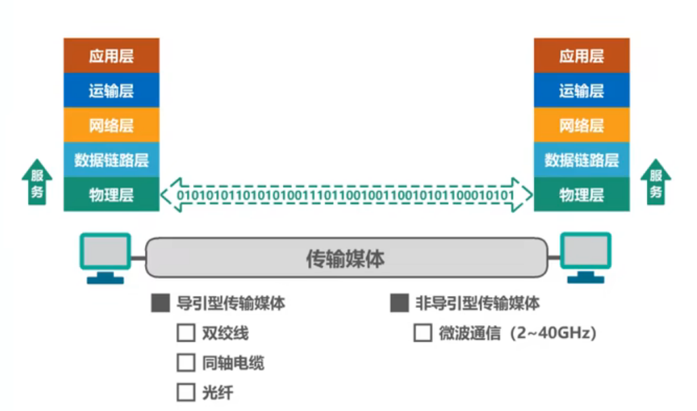
- 物理层考虑的是怎样才能在连接各种计算机的传输媒体上传输数据比特流
- 物理层为了数据链路层屏蔽了各种传输媒体的差异，使数据链路层只需要考虑如何完成本层协的协议和服务，而不必考虑网络具体的传输媒体是什么
#### 物理层协议的主要任务
- 机械特性：指明接口所用接线器的==形状==和==尺寸==、==引脚数目==和==排列、固定==和==锁定==装置
- 电器特性：指明在接口电缆的各条线上出现的==电压的范围==
- 功能特性：指明某条线上出现的某一电平的==电压表示何种意义==
- 过程特性：指明对于不同功能的各种可能==事件的出现顺序==
## 2.2  物理层下面的传输媒体（了解内容）
#### 导引型传输媒体
- 同轴电缆
- 双绞线
	- 绞合的作用：
		- 抵御部分来自外界的电磁波干扰
		- 减少相邻导线的电磁干扰
- 光纤
	1. 多模光纤
		- 由于色散（模式、材料、波导色散），光再多模光纤中传输一定距离后必然会产生信号失真（==脉冲展宽==）
		- 因此，多模光纤只适合==近距离传输==（建筑物内）
		- 发送光源：发光二极管
		- 接收检测：光电二极管
	2. 单模光纤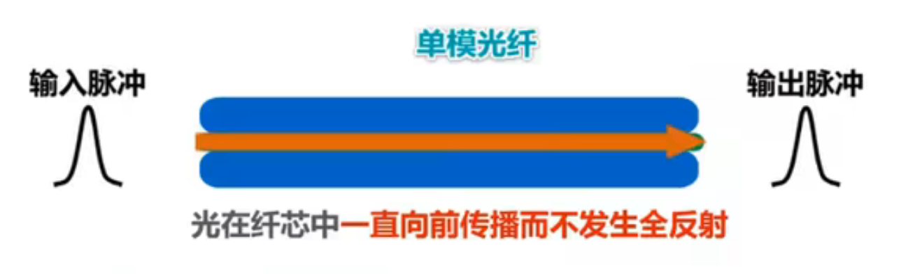
		- ==没有模式色散==，在1.31微米波长附近材料色散和波导色散大小相等符号相反，两者正好抵消
		- 单模光纤适合==长距离传输==且衰减小，但其制造成本高，对光源要求高
		- 发送光源：激光发射器
		- 接收光源：激光检波器
- 电力线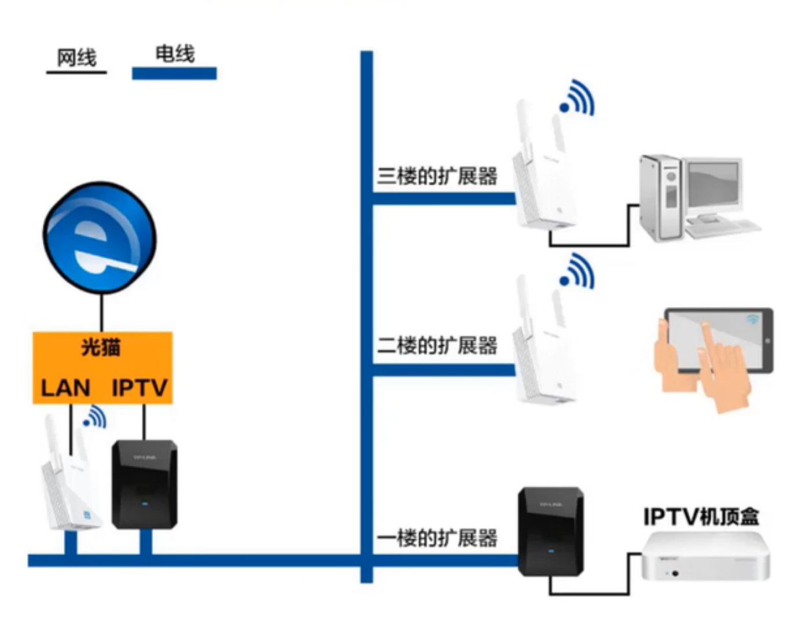
#### 非导引型传输媒体
- 无线电波
- 微博
- 红外线
- 可见光
## 2.3  传输方式
#### 串行传输与并行传输
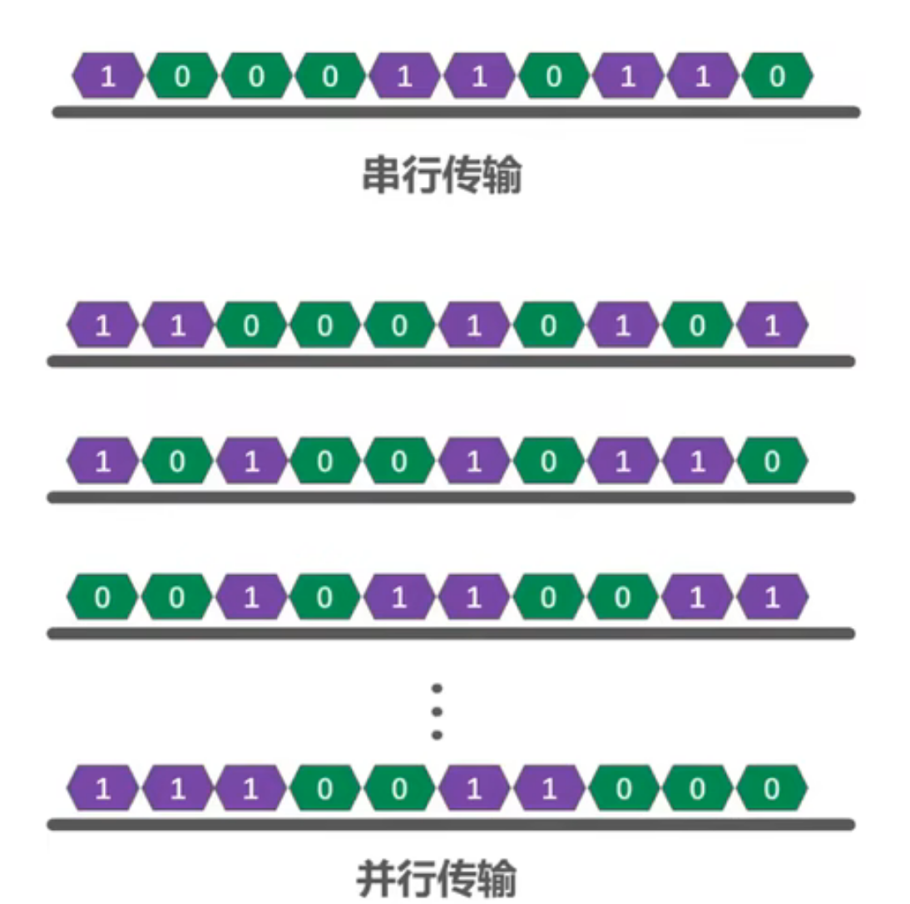
- 串行传输：数据是一个比特一个比特一次发送的，发送端和接收端之间只需要一条线路
- 并行传输：一次发送n个比特而不是一个比特，发送端和接收端之间需要有n条传输线路，故传输速率是串行传输的n倍

#### 同步传输与异步传输
- 同步传输：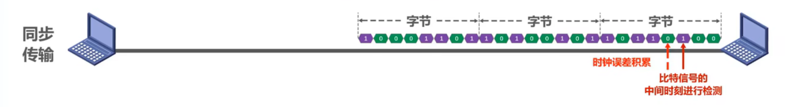
	- 收发双方时钟同步的方法：
		- 外同步：在收发双方之间添加一条单独的时钟信号线
		- 内同步：发送端将时钟同步信号编码到发送数据中一起传输（例如曼彻斯特编码）
- 异步传输：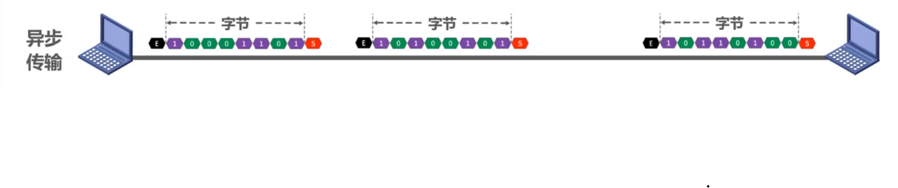
	- ==字节之间异步（字节之间的时间间隔不固定）==
	- 字节中的每个比特仍然要永不（各比特的持续时间是相同的）
#### 单工、半双工、全双工通信
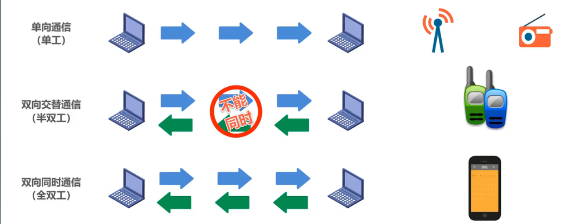
## 2.4  编码与调制
- 编码：数字信号或者模拟信号转变为==数字信号==在==数字信道==中传输
- 调制：将数字信号或模拟信号转变为==模拟信号==在==模拟信道==中传输
- 码元：在使用时间域的波形表示数字信号时，==代表不同离散数字的基本波形==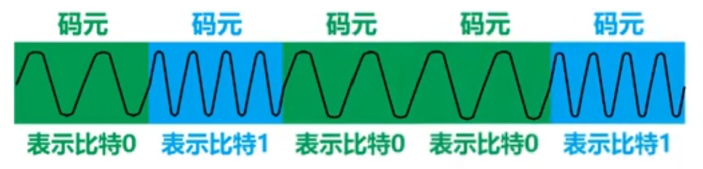
- 调制速率：==反映信号波形变换的频繁程度==
#### 常用编码：
- 不归零编码（NRZ）：==（存在同步问题）==
	- 需要==额外一根传输线来传输时钟信号==，使发送方和接收方同步
	- 对于计算机网络，==宁愿利用这跟传输线传输数据==，而不是传输时钟信号
- 归零编码（RZ）：（==自同步，编码效率低==）
	- ==每个码元传输结束后信号都要”归零“==，所以接收方只要在信号归零后进行采样即可，不需要单独的时钟信号
	- 实际上，归零编码相当于把时钟信号用”归零“方式编码在了数据之内，这称为”==自同步==“信号
	- 但是，归零编码中大部分的==数据带宽==，都用来传输”归零“而==浪费==掉了
- 曼彻斯特编码：（==传统以太网采用==）
	- ==码元中间时刻的跳变即表示时钟，又表示数据==
- 差分曼彻斯特编码：（==比曼彻斯特编码变化少，更适合较高的传输速率==）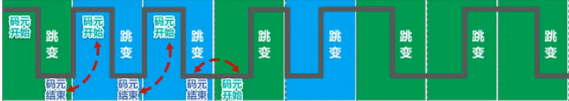
	- ==跳变仅表示时钟==
	- ==码元开始处电平是否发生变化表示数据==
#### 基本调制方法（二元制）
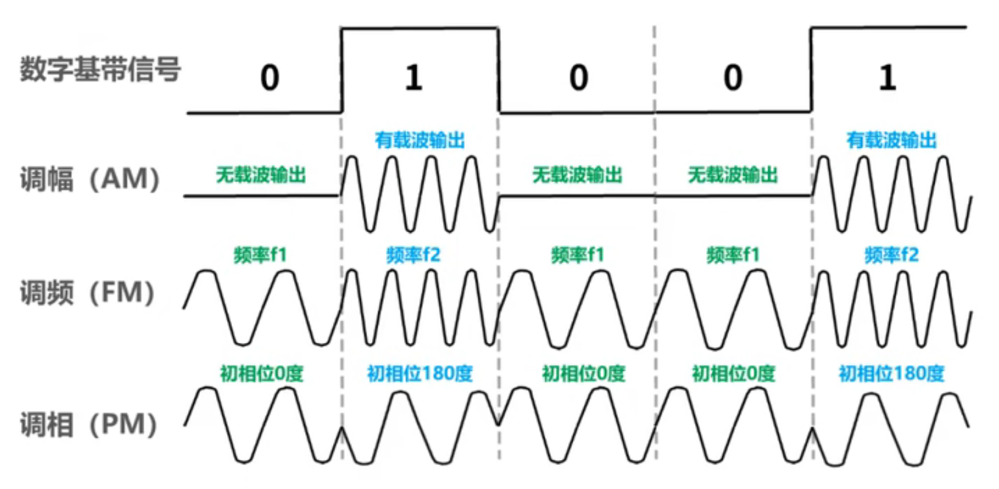
- ==使用基本调制方法，1个码元只能包含1个比特信息==
#### 混合调制
- 因为==频率和相位是相关==的，即频率是相位随时间的变化率。所以==一次只能调制频率和相位两个中的一个==
- eg.正交振幅调制QAM
	- QAM-16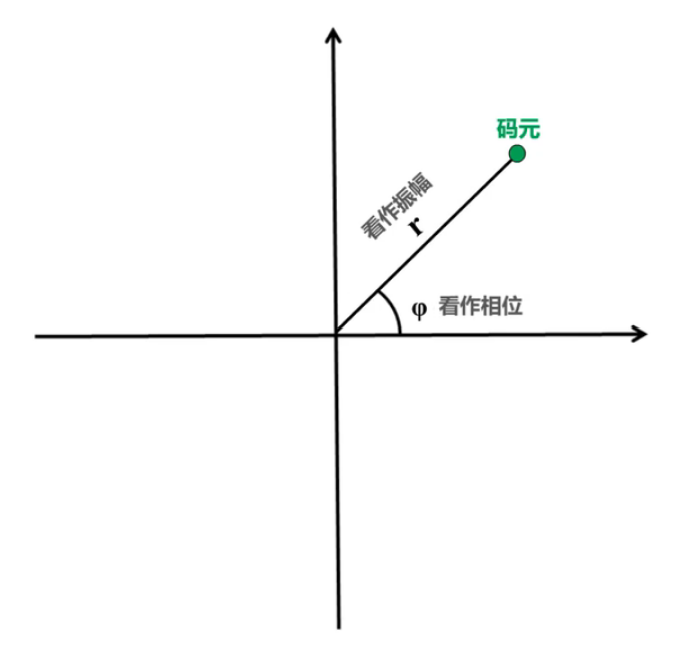
		- 12种相位
		- 每种相位又1或2种振幅可选
		- 可以调制出16种码元（波形），每种码元可以对应表示==4个比特==$$log_216=4$$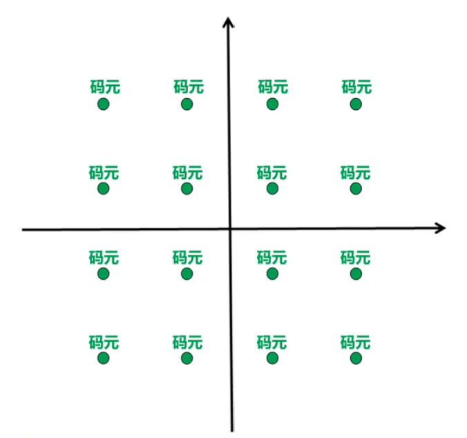
		- 码元与4个比特的对应关系采用==格雷码（任意两个相邻码元只有1个比特不同）==
## 2.5  信道的极限容量
- 失真因素：
	- 码元传输速率
	- 信号传输距离
	- 噪声干扰
	- 传输媒体质量
#### 奈氏准则：
- 奈氏准则：在假定的理想条件下，==为了避免码间串扰，码元传输速率是由上限的==
- 理想低通（==无噪声，带宽受限==）信道的最高码元传输速率=2W Baud=2W码元/秒
- **理想带通信道的最高码元传输速率=W Baud=W码元/秒**
	- W：信道带宽（单位为Hz）
	- Baud：波特，即码元/秒
- 码元传输速率又称为==波特率、调制速率、波形速率或符号速率==。它与比特率有一定关系：
	- 当1个码元只携带1比特的信息量时，则波特率（码元/秒）与比特率（比特/秒）在数值上是相等的
	- 当1个码元携带n比特的信息量时，则波特率转换成比特率时，数值要乘以n
- 要提高信息传输速率（比特率），就必须设法使每一个码元能携带更多个比特的信息量，这需要采用==多元制==
- 实际的信道所能传输的最高码元速率，要明显低于奈氏准则给出的这个上限数值
- ==信道的极限信息传输速率还要受限于实际的信号在信道中传输时的信噪比==
#### 香农公式：
- 带宽首先且有高斯白噪声干扰的信道的极限信息传输速率
$$ 
	C=W×log_2(1+{S \over N})
	$$
- 公式中各个成分的含义：
	- C：信道的极限信息传输速率（单位：b/s）
	- W：信道带宽（单位：Hz）
	- S：信道内所传信号的平均功率
	- N：信道内的高斯噪声功率
	- S/N：信噪比，使用分贝（dB）作为度量单位
		$$
			信噪比（dB）=10×log_{10}({S \over N})（dB）
			$$
- 信道带宽或信道中信噪比越大，信息的极限传输速率越高
- 在实际信道上能够达到的信息传输速率要比该公式的极限传输速率低不少。这是因为在实际信道中，信号还要受到其他一些损伤，如各种脉冲干扰、信号在传输中的衰减和失真等，这些因素在香农公式中并未考虑
---
- 在信道带宽一定的情况下，根据奈氏准则和香农公式，想要==提高信息的传输速率==就必须采用==多元制==（更好的调制方法）和努力==提高信道中的信噪比==
- 自从香农公式发表后，各种==新的信号处理和调制方法就不断出现==，其目的都是为了尽可能地==接近香农公式给出的传输速率极限==
---
# 第三章
[计算机网络第三章](计算机网络（第三章）.md)